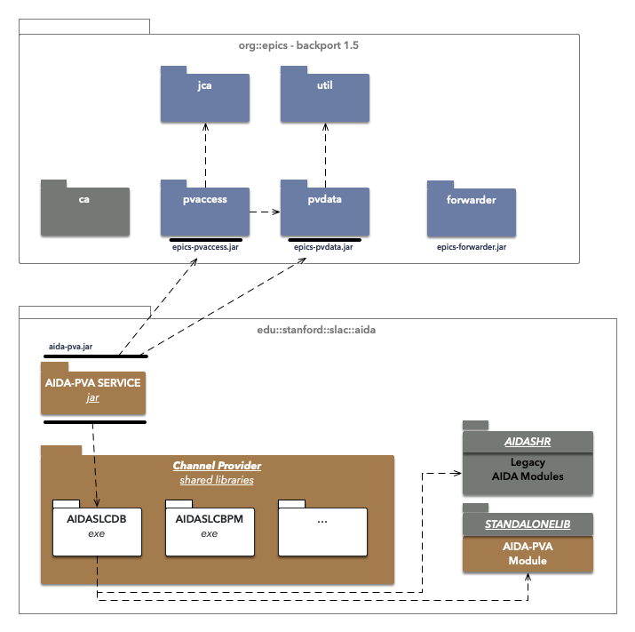

# Aida-PVA

AIDA-PVA is the latest version of the AIDA framework. AIDA-PVA differs from AIDA classic by leveraging EPIC 7's
pv-access communications layer to transport the requests to AIDA-PVA servers and the responses back to AIDA-PVA clients.

This version of AIDA involves a complete rewrite of the AIDA framework from the ground up, and notably includes some changes to the AIDA norms and operations. 

In order for the AIDA-PVA framework to function on legacy system including OpenVMS Alpha V8.3 with Java 1.5 and C98, EPICS 7 had to back-ported to these operating systems and JVM versions.

Finally the AIDA service providers have been reimplemented into this new framework and there are significant changes in the way they integrate and are deployed.

For more information:
* [AIDA-PVA User Guide](docs/UserGuide.md)
* [Writing an AIDA-PVA Service - Programmer's Reference Manual](docs/ProviderReference.md)
* [AIDA-PVA Internals - Technical Reference Manual](docs/Reference.md)
* [Deploying AIDA-PVA - A DevOps Guide](docs/DevOps.md)
