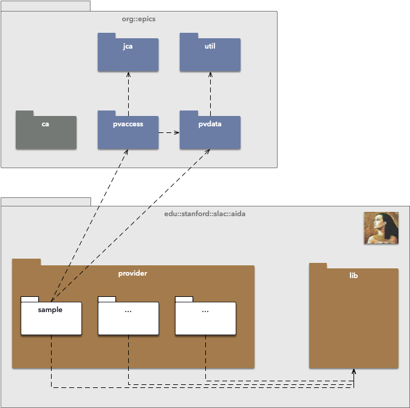

# Aida-PVA

AIDA-PVA is the latest version of the AIDA framework. AIDA-PVA differs from AIDA classic by leveraging EPIC 7's
pv-access communications layer to transport the requests to AIDA-PVA servers and the responses back to AIDA-PVA clients.

## Topology

EPICS pvaccess and pvdata libraries are used to provide the protocol and transport as well as normative types used for
data



## Normative Types

Normative Types are a set of software designs for high-level composite data types
suitable for the application-level data exchange between EPICS V4 network endpoints. In particular, they are intended
for use in online scientific data services. The intention is that where the endpoints in an EPICS V4 network use only
Normative Types, each peer in the network should be able to understand all the data transmitted to it, at least
syntactically, and be able to take processing steps appropriate to that data.

AIDA-PVA uses `NTScalar`, `NTScalarArray` and `NTTable` to represent its data types

See [EPICS V4 Normative Types](http://epics-pvdata.sourceforge.net/alpha/normativeTypes/normativeTypes.html#:~:text=time_t%20timeStamp%20%3A%20opt-,Description%20of%20Normative%20Types,include%20descriptor%2C%20alarm%20and%20timestamp.) for more information

## Supported Data Types

AIDA-PVA supports the same range of data types as classic AIDA except that it uses `NTScalar`, `NTScalarArray` and `NTTable`.

### Scalar Types

Scalar types represent simple C types which are converted to their equivalent boxed Java types in consuming
applications.

#### Boolean

In the service this is represented as a simple `int`.

#### Byte

In the service this is represented by an `unsigned char`

#### Short

In the service this is represented by a `short`

#### Integer

In the service this is represented by an `int`

#### Long

In the service this is represented by a `long`

#### Float

In the service this is represented by a `float`

#### Double

In the service this is represented by a `double`

#### String

In the service this is represented by an `char *`.  Note that you will allocate space for this string before returning it.  The framework will take care of freeing up any memory you allocate.

### Scalar Array Types
For all array types you need to allocate space for the array and, if it is an array of strings you also need to allocate space for each of the strings.  The framework will take care of freeing up the memory for you.

The scalar array types mirror the scalar types except that they are arrays.

### NTTable

The NTTable is a special type that contains an array of arrays.  The arrays can be either `COLUMN_MAJOR` (default) or `ROW_MAJOR` indicating whether it contains set of columns each containing rows or a set of rows each containing columns.  

In the implementation you will simply allocate the space for the data and fill it as per the scheme, and the framework will use the channel configuration to extract the data and populate the NTTable appropriately.

# Implementation

To implement a service simply copy the sample code from (github ref) and implement methods in reference_server.c as
appropriate to your service.

You will also need to provide a yaml file containing the channel definition.

Compile up the service using the build script or makefile and deploy the library (EXE file).

Start the service by using the following commandline

```shell
 java -jar "-Djava.library.path=." aida-pva.jar
 
       db         88  88888888ba,           db
      d88b        88  88      `"8b         d88b
     d8'`8b       88  88        `8b       d8'`8b
    d8'  `8b      88  88         88      d8'  `8b                8b,dPPYba,   8b       d8  ,adPPYYba,
   d8YaaaaY8b     88  88         88     d8YaaaaY8b     aaaaaaaa  88P'    "8a  `8b     d8'  ""     `Y8
  d8""""""""8b    88  88         8P    d8""""""""8b    """"""""  88       d8   `8b   d8'   ,adPPPPP88
 d8'        `8b   88  88      .a8P    d8'        `8b             88b,   ,a8"    `8b,d8'    88,    ,88
d8'          `8b  88  88888888Y"'    d8'          `8b            88`YbbdP"'       "8"      `"8bbdP"Y8
                                                                 88
                                                                 88
AIDA-pva Channel Provider : Sample
Channels hosted:
  [AIDA:SAMPLE:DEVICE01:attribute04, AIDA:SAMPLE:DEVICE01//attribute14, AIDA:SAMPLE:DEVICE01:attribute15, AIDA:SAMPLE:DEVICE01//attribute03
, AIDA:SAMPLE:DEVICE01:attribute18, AIDA:SAMPLE:DEVICE01:attribute20, AIDA:SAMPLE:DEVICE01:attribute02, AIDA:SAMPLE:DEVICE01//attribute18,
AIDA:SAMPLE:DEVICE01//attribute06, ...]

```

Note that this assumes the library (EXE) is deployed in the current working directory and that the aida-pva jar is also
deployed there.

## Deployment

Deployment is very simple.

- aida-pva.jar
- service
- epics forwarder

### AIDA-PVA library

A shaded jar has been created (aida-pva) to implement AIDA-PVA. This jar contains all the EPICS and other libraries that
are required, and it is also runnable. The only thing that you need to make sure is that your native service library is
available on the java library path (specified with `-Djava.library.path=<path_where_service_library_resides>` on the
commandline). You also need to make sure that a `channels.yaml` file, is found in the working directory of the service.

### Service

### EPICS Forwarder

This component will be required for EPICS on Open-VMS to workaround an issue related to multi-cast sockets in Java 1.5.
It simply listens for any EPICS requests and forwards them to any listening AIDA-PVA services.

## Framework


# Running

To run AIDA-PVA and tests you'll need to start the service and also use some tool to test it

## Required Service Files

- `aida-pva.jar` - anywhere in the java classpath
- `channels.yml` - in current working directory where you start service
- `AIDA-PVA.EXE` - anywhere in the java load library path

## Start the forwarder once

On any site (networking terminology for a host) one EPICS Forwarder must be running.  
It must be started before any AIDA-PVA services are started on that site. One, and only one, must be running.

To start the EPICS forwarded:

```shell
MCCDEV> java -jar epics-forwarder.jar
Jun 30, 2021 9:16:27 AM org.epics.forwarder.PVAForwarder main
INFO: EPICS Request Forwarder started: 1824 milliseconds
16:16 > .....

```

Note: You will see a '.' show for each request that is forwarded by the EPICS Forwarder, and a new line will start for
each hour that there is at least one request. You can use this display to get an idea of the request rates.

## Start the service

You can start the service by executing the following command.

```shell
MCCDEV> java -jar "-Djava.library.path=." aida-pva.jar
```

The foregoing assumes that all required files are in the current working directory

## Reference Service

AIDA-PVA provides a reference service implementation. You can use this to verify your configuration before deploying
your service. The reference implementation provides the following channels:

- `AIDA:SAMPLE:DEVICE01:attribute01` - simple boolean
- `AIDA:SAMPLE:DEVICE01:attribute02` - simple byte
- `AIDA:SAMPLE:DEVICE01:attribute03` - simple short
- `AIDA:SAMPLE:DEVICE01:attribute04` - simple integer
- `AIDA:SAMPLE:DEVICE01:attribute05` - simple long
- `AIDA:SAMPLE:DEVICE01:attribute06` - simple float
- `AIDA:SAMPLE:DEVICE01:attribute07` - simple double
- `AIDA:SAMPLE:DEVICE01:attribute08` - simple string
- `AIDA:SAMPLE:DEVICE01:attribute11` - array of booleans
- `AIDA:SAMPLE:DEVICE01:attribute12` - array of bytes
- `AIDA:SAMPLE:DEVICE01:attribute13` - array of shorts
- `AIDA:SAMPLE:DEVICE01:attribute14` - array of integers
- `AIDA:SAMPLE:DEVICE01:attribute15` - array of longs
- `AIDA:SAMPLE:DEVICE01:attribute16` - array of floats
- `AIDA:SAMPLE:DEVICE01:attribute17` - array of doubles
- `AIDA:SAMPLE:DEVICE01:attribute18` - array of strings
- `AIDA:SAMPLE:DEVICE01:attribute20` - NT-TABLE : table normative-type

Each simple scalar channel additionally takes an optional parameter to showcase how parameters are parsed and used.

## Testing your service

To test the service you can use some of the EPICS utils already deployed in SLAC.

### Using pvcall

From a different host ...

```shell
bash-4.1$ source /afs/slac/g/lcls/epics/setup/epicsenv-7.0.2-1.1.bash
bash-4.1$ export EPICS_PVA_ADDR_LIST=mccdev.slac.stanford.edu
bash-4.1$ pvcall 'AIDA:SAMPLE:DEVICE01:attribute01'
true
bash-4.1$ pvcall 'AIDA:SAMPLE:DEVICE01:attribute02'
2
bash-4.1$ pvcall 'AIDA:SAMPLE:DEVICE01:attribute03'
3
bash-4.1$ pvcall 'AIDA:SAMPLE:DEVICE01:attribute04'
4
bash-4.1$ pvcall 'AIDA:SAMPLE:DEVICE01:attribute05'
5
bash-4.1$ pvcall 'AIDA:SAMPLE:DEVICE01:attribute06'
6.6
bash-4.1$ pvcall 'AIDA:SAMPLE:DEVICE01:attribute07'
7.7
bash-4.1$ pvcall 'AIDA:SAMPLE:DEVICE01:attribute08'
eight
bash-4.1$ pvcall 'AIDA:SAMPLE:DEVICE01:attribute10'
Timeout
bash-4.1$ pvcall 'AIDA:SAMPLE:DEVICE01:attribute11'
[true]
bash-4.1$ pvcall 'AIDA:SAMPLE:DEVICE01:attribute12'
[12]
bash-4.1$ pvcall 'AIDA:SAMPLE:DEVICE01:attribute13'
[13]
bash-4.1$ pvcall 'AIDA:SAMPLE:DEVICE01:attribute14'
[14]
bash-4.1$ pvcall 'AIDA:SAMPLE:DEVICE01:attribute15'
[15]
bash-4.1$ pvcall 'AIDA:SAMPLE:DEVICE01:attribute16'
[16.6]
bash-4.1$ pvcall 'AIDA:SAMPLE:DEVICE01:attribute17'
[17.7]
bash-4.1$ pvcall 'AIDA:SAMPLE:DEVICE01:attribute18'
["eighteen"]
bash-4.1$ pvcall 'AIDA:SAMPLE:DEVICE01:attribute20'

isActive mode status nbufs memory sensor hisensor message
    true    2      3     4      5    6.6      7.7   eight
bash-4.1$
```

An example of using parameters follows. Note that for all the scalar types in the reference implementation an optional
argument `x` is available. If present it will have the following effects on the results.

- `AIDA:SAMPLE:DEVICE01:attribute01` - simple boolean.  `x` will be combined by logical `AND` with default value
- `AIDA:SAMPLE:DEVICE01:attribute02` - simple byte.  `x` will be combined by bitwise-or `|` with default value
- `AIDA:SAMPLE:DEVICE01:attribute03` - simple short.  `x` will be combined by sum `+` with default value
- `AIDA:SAMPLE:DEVICE01:attribute04` - simple integer.  `x` will be combined by sum `+` with default value
- `AIDA:SAMPLE:DEVICE01:attribute05` - simple long.  `x` will be combined by sum `+` with default value
- `AIDA:SAMPLE:DEVICE01:attribute06` - simple float.  `x` will be combined by multiplication `*` with default value
- `AIDA:SAMPLE:DEVICE01:attribute07` - simple double.  `x` will be combined by multiplication `*` with default value
- `AIDA:SAMPLE:DEVICE01:attribute08` - simple string.  `x` will be combined by concatenation with default value

```shell
bash-4.1$ source /afs/slac/g/lcls/epics/setup/epicsenv-7.0.2-1.1.bash
bash-4.1$ export EPICS_PVA_ADDR_LIST=mccdev.slac.stanford.edu
bash-4.1$ pvcall 'AIDA:SAMPLE:DEVICE01:attribute01' x=true
true
bash-4.1$ pvcall 'AIDA:SAMPLE:DEVICE01:attribute01' x=false
false
bash-4.1$ pvcall 'AIDA:SAMPLE:DEVICE01:attribute01' x=1
true
bash-4.1$ pvcall 'AIDA:SAMPLE:DEVICE01:attribute02' x=0x0f
2
bash-4.1$ pvcall 'AIDA:SAMPLE:DEVICE01:attribute02' x=0x00
0
bash-4.1$ pvcall 'AIDA:SAMPLE:DEVICE01:attribute02' x=6
2
bash-4.1$ pvcall 'AIDA:SAMPLE:DEVICE01:attribute03' x=3
6
bash-4.1$ pvcall 'AIDA:SAMPLE:DEVICE01:attribute04' x=4
8
bash-4.1$ pvcall 'AIDA:SAMPLE:DEVICE01:attribute05' x=5
10
bash-4.1$ pvcall 'AIDA:SAMPLE:DEVICE01:attribute06' x=2
13.2
bash-4.1$ pvcall 'AIDA:SAMPLE:DEVICE01:attribute07' x=0.5
3.85
bash-4.1$ pvcall 'AIDA:SAMPLE:DEVICE01:attribute08' x=Value
Value: eight

```
