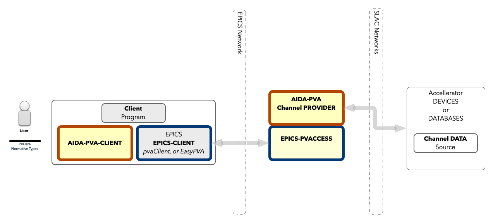

# 1 - User Guide to AIDA-PVA

This is the guide to using the AIDA-PVA system at Stanford National Laboratory. AIDA is the Accelerator Integrated Data
Access framework developed by SLAC in the early 2000s. AIDA-PVA is the latest version developed in the early 20s.

If you are already familiar AIDA you can jump
to [Differences Between AIDA and AIDA-PVA](1_10_User_Guide_for_AIDA_Users.md) without reading all the following
sections. If you are already familiar with EPICS and just want to know how you can use it to access AIDA-PVA data
providers then check out [EPICS and AIDA-PVA](1_11_User_Guide_for_EPICS_Users.md). If you are already familiar
with using AIDA from matlab please go directly to [AIDA-PVA in matlab](1_12_Matlab_Code.md).
If you're new to AIDA, Matlab, and EPICS then grab a coffee, and strap in, this may take some time :)

## Overview

`AIDA-PVA` is the successor to AIDA a system for providing programmatic access to SLC Control System devices, data and
services.  
Since its introduction in 2002 it has been used in other laboratories in the US and around the world. It provides a
naming convention to address all devices and their attributes, a way of specifying arguments for remote procedure calls
and obtaining results in any format, including rich formats with including metadata. Finally, it provides security,
logging and reliability to allow it to be used in a variety of applications from logging, and monitoring, to modeling
and control.

AIDA-PVA supersedes AIDA, but both AIDA and AIDA-PVA now co-exist, sharing many of the low level AIDA Modules from
AIDASHR, so results obtained by using either version remain consistent.

Legacy AIDA uses CORBA to transport requests to the Data Providers, while AIDA-PVA uses EPICS-7's `PVAccess`
mechanism.  
EPICS has become a staple for laboratories around the world, and leveraging its features allows scientists, and
engineers who are already familiar with programming on EPICS, to access AIDA-PVA data providers with very little effort.

For the client AIDA-PVA comes with a client library aida-pva-client which can aid client-side programmers.  For more
information see [aida-pva-client documentation](1_01_Aida_Pva_Client.md).

## Components

As you can see below, clients using AIDA-PVA will look like any other EPICS client. AIDA-PVA data providers are
implemented inside the EPICS framework and so will appear to EPICs clients as just another EPICS service.  
In order to access an AIDA-PVA Channel Provider you'll select a Channel Name that the Channel Provider has published. The EPICS
framework will find the service that serves requests for that Channel and will direct your request to it.



## Naming conventions

In AIDA-PVA, channel name parts are all separated by colons e.g.,`PRIM:MICR:UNIT:ATTR`.  
AIDA-PVA allows accessing services with the same naming conventions as EPICS.

Even though AIDA-PVA has an updated naming scheme to align with EPICs it is backwards compatible with AIDA and allows
legacy style names to be used.

@note In AIDA, names consist of `INSTANCE//ATTRIBUTE` where `INSTANCE` can have other sub-parts typically delimited by
colons. Though the `ATTRIBUTE` part is typically a single name, in rare cases it is also made up of parts, delimited by
colons.

## Service identifier

In some cases there are name clashes that can exist between channels supported by one Channel Provider and another.  
AIDA-PVA offers Channel Providers the possibility of prefixing a service identifier to the clashing channel names to
disambiguate them for clients. These prefixes are delimited by double colons. e.g.,
`SLC::KLYS:LI15:61:ACON` disambiguates the SLC Database Channel Provider channel from the Klystron Channel Provider
channel (`KLYS:LI15:61:ACON`) of the same name.

## Call semantics

### Get Requests

AIDA-PVA allows you to `get` values associated with channels. These requests are known as Getters.  
Any request that does not have a `VALUE` argument will be interpreted as a Getter request by AIDA-PVA.

### Set Requests and the VALUE argument

AIDA-PVA allows you to `set` values associated with channels. These special requests are known as Setters. To select a
Setter request simply add an argument called `VALUE`. All Setters have a `VALUE` which is used by the Channel Provider
to set a value in the Channel Data Source.

### Arguments

Getter and Setter can take optional arguments which are simple name/value pairs. The value can be either a simple
string, a scalar value, or some json that allows specifying arrays, and objects.

The value can be set programmatically to any type of complex PVField structure, to allow complex types and arrays to be
specified in any way required.

### Deferred interpretation of Arguments

The interpretation of these arguments is deferred until the Channel Provider reads them - except `TYPE` and `VALUE`
explained below.  
This means that each Channel Provider can have its own interpretation of an argument. Each provider publishes the names
of the arguments they accept for each of Channels/Operations they support, and describe the names, formats,
requirements, defaults, and acceptable values of the parameters they support.

### Acceptable EPICs protocols and call types

EPICS allows synchronous and asynchronous call semantics so either can be used with AIDA-PVA.

The only EPICS protocol AIDA-PVA implements is RPC.

### Configuring EPICS

The configuration of EPICS is important to make sure that your client application will connect to the correct Channel
Provider. The full documentation
is [available here](https://epics.anl.gov/EpicsDocumentation/AppDevManuals/ChannelAccess/cadoc_4.htm) but the main
things to set to get you going are:

- `EPICS_PVA_ADDR_LIST` - this is the list of addresses to search for Channel Providers. Set it
  to `mccdev.slac.stanford.edu` for testing against the development environment.
- `EPICS_PVA_AUTO_ADDR_LIST` - set this to `FALSE` so that EPICS won't try to automatically create your address list

## Setting the return type of the request

When you need to specify the type of the response you can set the `TYPE` argument to one of the available types.  
e.g. `TYPE=FLOAT`

* Scalar types
    * `BOOLEAN`            to return a boolean : NTScalar
    * `BYTE`               to return a byte : NTScalar
    * `SHORT`              to return a short : NTScalar
    * `INTEGER`            to return an integer : NTScalar
    * `LONG`               to return a long : NTScalar
    * `FLOAT`              to return a float : NTScalar
    * `DOUBLE`             to return a double : NTScalar
    * `STRING`             to return a string : NTScalar
* Scalar array types
    * `BOOLEAN_ARRAY`      to return a boolean array  : NTScalarArray
    * `BYTE_ARRAY`         to return a byte array  : NTScalarArray
    * `SHORT_ARRAY`        to return a short array  : NTScalarArray
    * `INTEGER_ARRAY`      to return an integer array  : NTScalarArray
    * `LONG_ARRAY`         to return a long array  : NTScalarArray
    * `FLOAT_ARRAY`        to return a float array  : NTScalarArray
    * `DOUBLE_ARRAY`       to return a double array  : NTScalarArray
    * `STRING_ARRAY`       to return a string array : NTScalarArray
* Tables
    * `TABLE`              to return a table : NTTable

### TABLE_TYPE

If supported you can specify the type for rows in a table by providing the `TABLE_TYPE` argument. The value can be any
Scalar or Scalar Array type. eg. `TABLE_TYPE=FLOAT` so the SLC Channel Provider will select a float for the single row
in the single column table returned from a request.

### Exception Handling

If an exception occurs in the Channel Provider the Exception will be propagated back up to the client, and logged using
the configured logger.

## Using AIDA-PVA

### EPICS Environment variables

All EPICS environment variables work in the same way they do for EPICS, under AIDA-PVA.  
For more information on EPICS variables see
[EPICS Config Documentation](https://epics.anl.gov/EpicsDocumentation/AppDevManuals/ChannelAccess/cadoc_4.htm)

### From the command line

You can access data in AIDA-PVA using the commandline.

#### pvcall

```shell
pvcall 'NDRFACET:BUFFACQ' BPMD=57 NRPOS=180 BPMS='["BPMS:LI11:501","BPMS:LI11:601","BPMS:LI11:701","BPMS:LI11:801"]'
```

This will access the Buffered Acquisition Channel Provider requesting information on 4 BPMs with the specified
parameters.

#### eget

```shell
eget -s NDRFACET:BUFFACQ -a BPMD 57 -a NRPOS 180 -a BPMS '["BPMS:LI11:501","BPMS:LI11:601","BPMS:LI11:701","BPMS:LI11:801"]'
```

### From Java (PvAccess Java example)

From Java you can have more control over the data types sent and received.

```java
import org.epics.pvaccess.ClientFactory;
import org.epics.pvaccess.client.rpc.RPCClientImpl;
import org.epics.pvaccess.server.rpc.RPCRequestException;
import org.epics.pvdata.factory.FieldFactory;
import org.epics.pvdata.factory.PVDataFactory;
import org.epics.pvdata.pv.*;

public class AidaPvaRunner {
    public static void main(String[] args) {
        ClientFactory.start();
        RPCClientImpl client = new RPCClientImpl("NDRFACET:BUFFACQ");

        // Create the arguments structure that will host the fields
        String[] names = {"BPMD", "NRPOS", "BPMS"};
        Field[] fields = {new Field(), new Field(), new Field()};
        Structure arguments = FieldFactory.getFieldCreate().createStructure(names, fields);

        // Build the uri structure
        Structure uriStructure =
                FieldFactory.getFieldCreate().createStructure("epics:nt/NTURI:1.0",
                        new String[]{"path", "scheme", "query"},
                        new Field[]{
                                FieldFactory.getFieldCreate().createScalar(ScalarType.pvString),
                                FieldFactory.getFieldCreate().createScalar(ScalarType.pvString), arguments}
                );

        // Make the query (contains the uri and arguments
        PVStructure request = PVDataFactory.getPVDataCreate().createPVStructure(uriStructure);
        request.getStringField("scheme").put("pva");

        // Set the request path
        request.getStringField("path").put("NDRFACET:BUFFACQ");

        // Set the request query values
        PVStructure query = request.getStructureField("query");
        ((PVInt) (query.getSubField("BPMD"))).put(57);
        ((PVInt) (query.getSubField("NRPOS"))).put(180);
        String[] bpms = {"BPMS:LI11:501", "BPMS:LI11:601", "BPMS:LI11:701", "BPMS:LI11:801"};
        ((PVStringArray) (query.getSubField("BPMS"))).put(0, 3, bpms, 0);

        // Execute the query with a timeout of 3 seconds
        try {
            PVStructure result = client.request(request, 3.0);

            // Use result ...
        } catch (RPCRequestException e) {
            // Do something with error
        }
        client.destroy();
        ClientFactory.stop();
    }
}
```

### From Matlab
The java libraries available to matlab have been updated and the `aidainit()` and other functions (`aidaget()`, `ezrpc()`, `pvarpc()`, and `nturi()`) 
have been modified to allow interoperability with AIDA-PVA. Here are examples of 
accessing AIDA-PVA Channel Providers from matlab.  To see what has changed in malab please see 
the [AIDA-PVA matlab documentation](1_12_Matlab_Code.md).

There are four ways to access AIDA-PVA Channel Providers from matlab.  The 
preferred way is using PvaClient, but aida-pva-client is the simplest.

#### aida-pva-client
```matlab
    aidainit
    try
        floatResponse = request('XCOR:LI03:120:LEFF').returning(FLOAT).get();
    catch ME
       % do something when errors occur or just show ME.identifier
    end
```
#### using aidaget
```matlab
    aidainit
    floatResponse = aidaget('XCOR:LI03:120:LEFF','FLOAT')
```
#### EasyPVA
```matlab
    aidainit
    response = ezrpc(nturi('XCOR:LI03:120:LEFF', 'type', 'FLOAT'))    
    floatResponse = response.getSubField(PVFloat.class, "value")
```
#### PvaClient
```matlab
    aidainit
    response = pvarpc(nturi('XCOR:LI03:120:LEFF', 'type', 'FLOAT'))    
    floatResponse = response.getSubField(PVFloat.class, "value")
```

## AIDA-PVA Channel Providers

Here is the documentation for all the implemented AIDA-PVA channel providers.

- [SLC Database Channel Provider](1_02_Users_Guide_SLC_Controls_Database_Channel_Provider.md)
- [SLC BPM Orbit Data Channel Provider](1_03_Users_Guide_SLC_BPM_Channel_Provider.md)
- [SLC Buffered Acquisition Channel Provider](1_04_Users_Guide_SLC_Bufferred_Acquisition_Channel_Provider.md)
- [SLC Klystron Channel Provider](1_05_Users_Guide_SLC_Klystron_Channel_Provider.md)
- [SLC Magnet Channel Provider](1_06_Users_Guide_SLC_Magnet_Channel_Provider.md)
- [SLC Master Oscillator Channel Provider](1_07_Users_Guide_SLC_Master_Oscillator_Channel_Provider.md)
- [SLC Utilities Channel Provider](1_08_Users_Guide_SLC_Utility_Channel_Provider.md)
- [Reference Data Provider for testing](1_09_Users_Guide_Reference_Channel_Provider.md)


