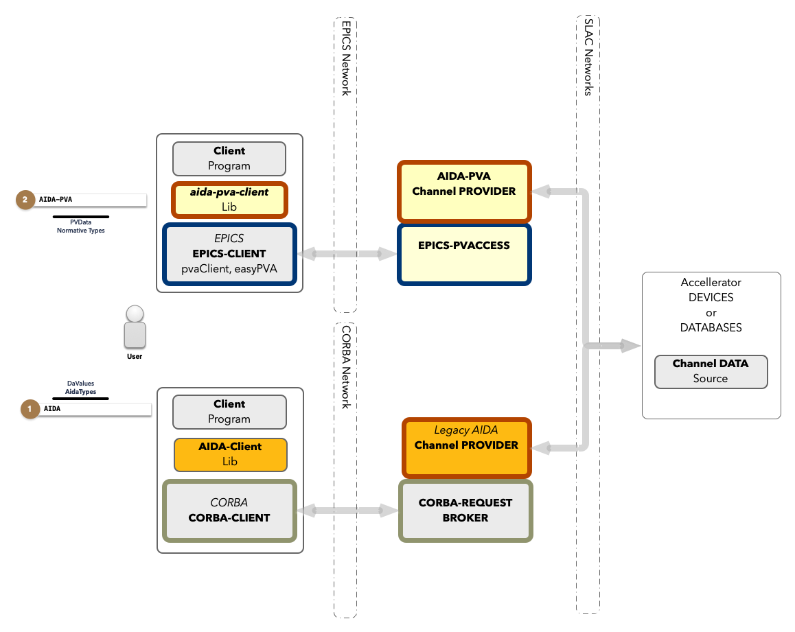

# 1.9 - User Guide for AIDA Users

## Overview

AIDA-PVA is the successor to AIDA a system for providing programmatic access to SLC Control System devices, data and
services. Since its introduction in 2002 it has been used in other laboratories in the US and around the world. It
provides a naming convention to address all devices and their attributes, a way of specifying arguments for remote
procedure calls and obtaining results in any format, including rich formats with including metadata. Finally, it
provides security, logging and reliability to allow it to be used in a variety of applications from logging, and
monitoring, to modeling and control.

AIDA-PVA supersedes AIDA, but both AIDA and AIDA-PVA now co-exist, sharing many of the Legacy AIDA
Modules from AIDASHR, so results obtained by using either version remain consistent.

Legacy AIDA uses CORBA to transport requests to the Data Providers, while AIDA-PVA uses EPICS-7's PVAccess mechanism.
EPICS has become a staple for laboratories around the world, and leveraging its features allows scientists, and
engineers who are already familiar with programming on EPICS, to access AIDA-PVA data providers with very little effort.

## Components

AIDA-PVA differs from AIDA as shown below.



## Client Library

In AIDA there was a client library that helped programmers write code to access the AIDA framework. In AIDA-PVA there is
no need for such a library because EPICS provides the access to the network. There are many client libraries in a
variety of different languages available for EPICS. e.g., EasyPVA, pvaClientJava, etc. You can also use the code from
our test suite framework as a library to help you write your frontend code.
- edu.stanford.slac.aida.test.utils.AidaPvaTestUtils - Utility class to facilitate running all the AIDA-PVA tests 
- edu.stanford.slac.aida.test.utils.AidaPvaRequest  - Class to create and execute AIDA-PVA requests
- edu.stanford.slac.aida.test.utils.AidaType - Enumerated type representing an AIDA-PVA data type 

## CORBA vs EPICS

In AIDA, CORBA was used to shuttle requests around the network but that has been replaced with EPICS in AIDA-PVA. This
means that all of the configuration that needed to be done for CORBA is no longer required.

Instead, you need to configure EPICS to allow access to the services you need.

### Configuring EPICS

The configuration of EPICS is important to make sure that your client application will connect to the correct Channel
Provider. The full documentation
is [available here](https://epics.anl.gov/EpicsDocumentation/AppDevManuals/ChannelAccess/cadoc_4.htm) but the main
things to set to get you going are:

- `EPICS_PVA_ADDR_LIST` - this is the list of addresses to search for Channel Providers. Set it
  to `mccdev.slac.stanford.edu` for testing against the development environment.
- `EPICS_PVA_AUTO_ADDR_LIST` - set this to `FALSE` so that EPICS won't try to automatically create your address list

## Naming conventions

In AIDA-PVA, channel name parts are all separated by colons e.g.,`PRIM:MICR:UNIT:ATTR`. AIDA-PVA allows accessing services with the same naming conventions as EPICS.

Even though AIDA-PVA has an updated naming scheme to align with EPICs it is backwards compatible with AIDA and allows
legacy style names to be used.

@note In AIDA, names consist of `INSTANCE//ATTRIBUTE` where `INSTANCE` can have other sub-parts typically delimited by
colons. Though the `ATTRIBUTE` part is typically a single name, in rare cases it is also made up of parts, delimited by
colons.

## Changes to call semantics

### Getter vs Setter

In AIDA there was a separate api for %getValue() and %setValue(). 
```java
DaValue v = da.getDaValue(query);  /* Get value*/

da.setDaValue(query, inData);      /* Set Value. */
```

In AIDA-PVA the call is always the same - an RPC
request, but it is the presence of the argument called `VALUE` that determines whether the call is a getter or setter.

```java
import org.epics.pvaccess.ClientFactory;
import org.epics.pvaccess.client.rpc.RPCClientImpl;
import org.epics.pvaccess.server.rpc.RPCRequestException;
import org.epics.pvdata.pv.*;
 
public class AidaPvaRunner {
    public static void main(String[] args) {
        ClientFactory.start();
        RPCClientImpl client = new RPCClientImpl("CHANNEL");
        
        // ...
      
        // Only do this if the request is to set a value
        PVStructure query = request.getStructureField("query");
        ((PVString) (query.getSubField("VALUE"))).put("A Value");
        
        // Execute the query with a timeout of 3 seconds
        try {
            PVStructure result = client.request(request, 3.0);
 
            // Use result ...
        } catch (RPCRequestException e) {
            // Do something with error
        }
        client.destroy();
        ClientFactory.stop();
    }
}
```

### Return type

In AIDA there was an optional extra parameter to the %getValue() api that could specify the type (DaValue.Type): 
```java
String query = "XCOR:LI03:120//LEFF";
DaReference r = new DaReference(query, da);
r.setType(DaValue.Type.FLOAT);
r.compile(da);
DaValue v = da.getDaValue(query);
```
In AIDA-PVA the type is determined by an argument called `TYPE`. Set it to any [supported AIDA-PVA Type](2_4_Supported_Types.md) to get data back in that format.
```java
// Set the request query return type
PVStructure query = request.getStructureField("query");
((PVString) (query.getSubField("TYPE"))).put("FLOAT");

// Execute the query with a timeout of 3 seconds
try {
    PVStructure result = client.request(request, 3.0);

    // Use result ...
} catch (RPCRequestException e) {
    // Do something with error
}
```
## Types

AIDA => AIDA-PVA mapping - only differences:

- `Any` = `TABLE`
- `Char` => not available in AIDA-PVA use `BYTE`
- `WChar` => not available in AIDA-PVA use `BYTE`
- `WString` => not available in AIDA-PVA use `STRING`

## Compatibility

The underlying Channel Data is the same whether accessed via AIDA or AIDA-PVA. So there will be no difference between
them.

## Tools

It is expected that `aida-list` will eventually be updated to get data from AIDA-PVA, however until that work is done it will continue
to work as before.
