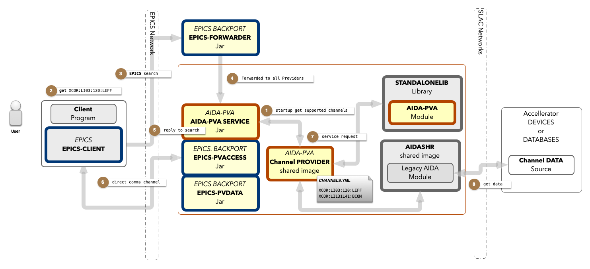
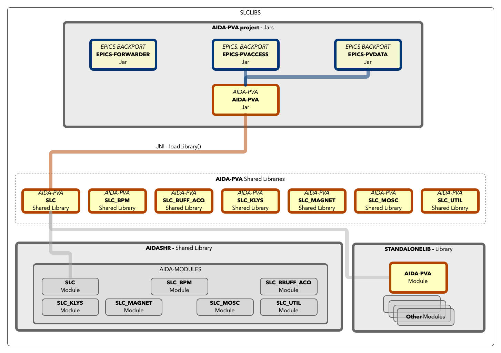

# 2 - Channel Provider Programmers Reference

## Overview

AIDA-PVA provides a framework for Channel Providers to service requests for Channels that they support. A Channel is an
EPICS term, co-opted by AIDA-PVA, to mean _any identifiable source of data in any Channel Data Source on the SLAC
Network_.

All AIDA-PVA Channels use a standard notation:

    channel := part ':' second_part [ ':' other_part ... ]

a set of at least two parts separated by colons.

_The framework has five main features._

* **Routing** client Channel Requests using EPICS' PVAccess, through the AIDA-PVA Service to the registered Channel
  Provider endpoints.
* Bi-directionally **Marshalling, Transporting, and Converting** arguments and data.
* Raising, and **Propagating Exceptions** throughout the framework, back to clients, and on to logging services
* Providing access to the **AIDA-PVA Module** in **STANDALONELIB** that implements the boilerplate functions required to
  service channel requests
* Providing access to **AIDASHR**, to allow Channel Provider code to leverage legacy **AIDA Modules** for accessing
  devices, databases and other services from Channel Data Sources on the SLAC Network.

## How it works

1. When your Channel Provider starts up, the AIDA-PVA Service that started it will read the [Channel Configuration File](2_3_CHANNELS_YML_file.md) that
   you've provided to determine which EPICS search requests it should respond to.
2. Subsequently, when clients send requests containing references to one of those **Channels**,
3. and EPICS search request is propagated across the EPICS network
4. The **EPICS Forwarder**, that is constantly listening for requests, will forward it to all the AIDA-PVA Services
   running in VMS.
5. When your AIDA-PVA Service recognizes the channel and the request, it will respond positively to the search request on your
   behalf,
6. opening a direct communications channel to the client once the client accepts the response.
7. Now the AIDA-PVA Service will ask your Channel Provider to service the request and will return the results you give it.
8. By leveraging services in the AIDA-PVA Module in `STANDALONELIB` and legacy AIDA Modules in `AIDASHR` to access the
   Channel Data source, you can service those requests.



As an AIDA-PVA Channel Provider writer you will be responsible for:

* Creating the AIDA-PVA Channel Provider Shared Library.
* Creating the initial Channel Configuration File that identifies and describes all the AIDA-PVA `Channels` that your Channel
  Provider will support.

### Components

* Your **Channel Provider Code** => produces `AIDASLC<provider_name>.EXE` shared Library.  e.g.:
  * `AIDASLCDB.EXE`
  * `AIDASLCBPM.EXE`
  * `AIDASLCBPMBUFF.EXE`
  * `AIDASLCKLYS.EXE`
  * `AIDASLCMAGNET.EXE`
  * `AIDASLCMODEL.EXE`
  * `AIDASLCMOSC.EXE`
  * `AIDASLCUTIL.EXE`
* The **STANDALONELIB** - with the following modules collectively known as **AIDA-PVA Module**:
  * `AIDA_PVA_SERVER_HELPER` - **Helper functions for the AIDA-PVA Providers**
  * `AIDA_PVA_JNI_HELPER` - Used by the AIDA-PVA Module to interoperate in a JNI environment
  * `AIDA_PVA_TYPES_HELPER` - Functions that help AIDA-PVA Module marshal and unmarshal JNI types
  * `NATIVECHANNELPROVIDERJNI` - JNI Entry points from AIDA-PVA.JAR
  * `AIDA_PVA_JSON` - Used by AIDA-PVA Module to parse JSON
* The **C_INC** - **AIDA-PVA Module** header files:
  * aida_pva.h - The Header File for the Channel Provider API endpoints and endpoint-stubs MACROS
  * aida_pva_api.h - The Header File for the AIDA-PVA Module functions
  * aida_pva_convert.h - The Header File for the type conversion functions
  * aida_pva_exceptions.h - The Header File for the exception helper MACROS
  * aida_pva_memory.h - The Header File for the memory management functions and macros
  * aida_pva_types.h - The Header File for the type enumerations, unions, and typedefs
  * aida_pva_uri.h - The Header File for uri and channel name manipulation functions
* The **AIDA-PVA SERVICE** - Service that loads the Channel Provider Code
  * `AIDA-PVA.JAR`
* The **back-ported EPICS 7** libraries
  * `EPICS-PVACCESS-bp15.JAR`
  * `EPICS-PVDATA-bp15.JAR`
* The **EPICS forwarder** - the EPICS forwarder
  * `EPICS-FORWARDER.jar`

## Topology

As a Channel Provider programmer you will be primarily concerned with creating a shared library for SLCLIBS. Each
Channel Provider is a distinct library in SLCLIBS. The procedure to create one will compile up your C source file(s) and
link them with STANDALONELIB to resolve the calls you make to functions in the AIDA-PVA Module, and to AIDASHR for any
AIDA Modules that you need to implement your service.

AIDA-PVA SERVICE is the process that will launch your shared library, calling the entry-points you implement, as required.



## Normative Types

The clients will be expecting data that corresponds to the Normative Type standard.  
The framework does all the work representing your data as Normative Types. You don't have to know, or do, anything for
this. For reference see [Normative Types](2_2_Normative_Types.md)

## Supported Data Types

What you will do is use primitive data types in most cases and some simple AIDA-PVA typedefs where required. In all
cases there are helper functions to help you marshall and unmarshal your data if the type is not a primitive type.

see [Supported Data Types](2_4_Supported_Types.md)

### primitive scalar types example
This example calls a legacy AIDA Module function -  JNI_DBGETINT() - in `AIDASHR`, to get an integer, and return it.
The AIDA-PVA framework does all the work of converting the integer to a PVInt to send back to the client.

```c
int aidaRequestInteger(JNIEnv* env, const char* uri, Arguments arguments)
{
	int val = 0;
	TO_SLC_NAME(uri, slcName)
	vmsstat_t status = JNI_DBGETINT(slcName, &val);

	if (!SUCCESS(status)) {
		aidaThrow(env, status, UNABLE_TO_GET_DATA_EXCEPTION, "getting SLC db integer device data");
	}

	return val;
}
```

### primitive scalar_array example
This example calls a legacy AIDA Module function -  JNI_DBGETSHORTA() - in `AIDASHR`, to get an array of shorts, and return it.
The AIDA-PVA framework does all the work of converting the short array, to a PVShortArray, to send back to the client.  
@note memory tracking MACROs are used to allocate and keep track of memory, and free it when required.

@warning the framework expects the array returned to be allocated memory that it needs to free.  Don't set Array#items unless it points to an allocated array.

```c
Array aidaRequestShortArray(JNIEnv* env, const char* uri, Arguments arguments)
{
	TRACK_ALLOCATED_MEMORY
	Array shortArray;
	shortArray.count = 0;
	shortArray.items = NULL;

	TO_SLC_NAME(uri, slcName)
	vmsstat_t status = JNI_DBGETSHORTA(slcName, (short**)(&shortArray.items));
	TRACK_MEMORY(shortArray.items)

	if (!SUCCESS(status)) {
		FREE_MEMORY
		aidaThrow(env, status, UNABLE_TO_GET_DATA_EXCEPTION, "getting SLC db short array device data");
	}

	// First item is the count
	shortArray.count = (int)*((short*)shortArray.items);

	// Copy shorts to new short array and free up returned short array
	short* shortData;
	ALLOCATE_COPY_AND_TRACK_MEMORY_AND_ON_ERROR_RETURN_(env, shortData, &((short*)shortArray.items)[1],
			shortArray.count * sizeof(short),
			"SLC db short array device data", shortArray)
	FREE_TRACKED_MEMORY(shortArray.items)
	shortArray.items = shortData;
	return shortArray;
}
```

### Table example
This example shows how tables are returned leveraging functions in AIDA-PVA Modules.
The AIDA-PVA framework does all the work of converting the returned Table to a PVStructure conforming to NTTable to send back to the client.  

@note the framework expects all strings in the table to be be allocated memory, and all columns of scalar arrays too.  It will free the memory for you.  
The AIDA-PVA Module functions allocate memory for you.

```c 
Table aidaRequestTable(JNIEnv* env, const char* uri, Arguments arguments)
{
	// Get arguments
	int bpmd, navg = NAVG, cnfnum = BPMD_ROGUE, sortOrder = SORTORDER_DISPLAY, cnftype = CNFTYPE_NONE;
	char* cfnTypeString = NULL;

	if (ascanf(env, &arguments, "%d %od %od %od %os",
			"bpmd", &bpmd,
			"n", &navg,
			"cnfnum", &cnfnum,
			"sortOrder", &sortOrder,
			"cnftype", &cfnTypeString
	)) {
		RETURN_NULL_TABLE
	}

	// ...

	// Acquire BPM Data ...

	// To hold data
	char namesData[rows + 1][NAME_SIZE];
	float xData[rows + 1], yData[rows + 1], tmitData[rows + 1], zData[rows + 1];
	unsigned long hstasData[rows + 1], statsData[rows + 1];

	// Get BPM data into these variables ...

	// Make and output table
	Table table = tableCreate(env, rows, 7);
	ON_EXCEPTION_RETURN_(table)
	tableAddFixedWidthStringColumn(env, &table, (char*)namesData, NAME_SIZE);
	ON_EXCEPTION_RETURN_(table)
	tableAddColumn(env, &table, AIDA_FLOAT_TYPE, xData, false);
	ON_EXCEPTION_RETURN_(table)
	tableAddColumn(env, &table, AIDA_FLOAT_TYPE, yData, false);
	ON_EXCEPTION_RETURN_(table)
	tableAddColumn(env, &table, AIDA_FLOAT_TYPE, tmitData, false);
	ON_EXCEPTION_RETURN_(table)
	tableAddColumn(env, &table, AIDA_FLOAT_TYPE, zData, false);
	ON_EXCEPTION_RETURN_(table)
	tableAddColumn(env, &table, AIDA_INTEGER_TYPE, hstasData, false);
	ON_EXCEPTION_RETURN_(table)
	tableAddColumn(env, &table, AIDA_INTEGER_TYPE, statsData, false);

	endAcquireBpmData(env);

	// All read successfully
	return table;
}
```
For step by step details of how to implement your Channel Provider see [Channel Provider Implementation Reference](2_1_Channel_Provider_Implementation_Reference.md).
