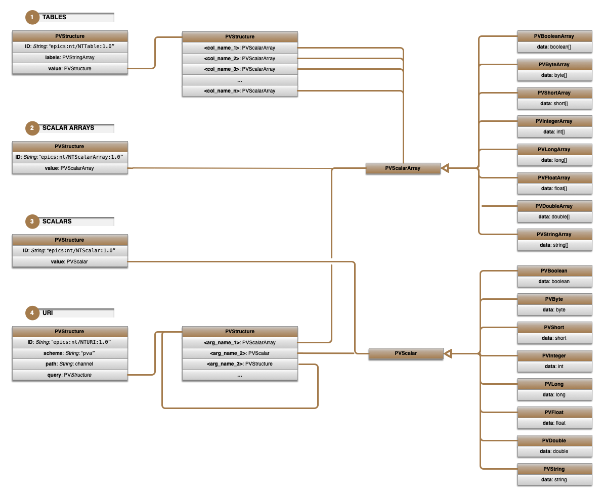

# 2.2 - Normative Types

EPICS PVAccess is used to provide the protocol and transport for the AIDA-PVA framework. EPICS PVData is used to provide
the Normative Types functionality used for data encapsulation and standardisation.

Normative Types are a set of software designs for high-level composite data types suitable for the application-level
data exchange between EPICS V4+ network endpoints. In particular, they are intended for use in online scientific data
services. The intention is that where the endpoints in an EPICS V4+ network use only Normative Types, each peer in the
network should be able to understand all the data transmitted to it, at least syntactically, and be able to take
processing steps appropriate to that data.

AIDA-PVA uses `NTTable`, `NTScalarArray` and `NTScalar` Normative Types to represent its data.

See [EPICS Normative Types](http://epics-pvdata.sourceforge.net/alpha/normativeTypes/normativeTypes.html#:~:text=time_t_timeStamp_%3A_opt-,Description_of_Normative_Types,include_descriptor%2C_alarm_and_timestamp.)
for more information
