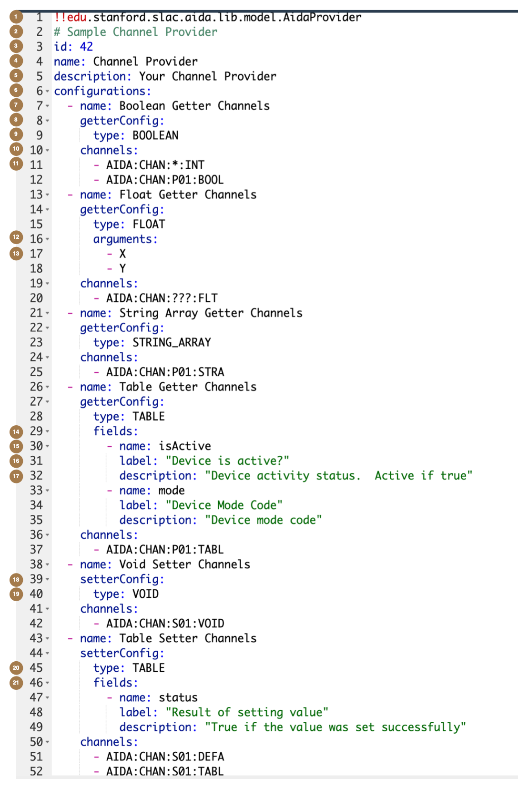

# 2.3 - Anatomy of the Channel Configuration file
1. Always add the annotation `!!edu.stanford.slac.aida.lib.model.AidaProvider` to the beginning of the yaml file so that
   the processor will recognise the type of yaml file you're providing.
2. You can place comments anywhere you want by preceding them by a hash character
3. You must provide an identifier for your Channel Provider. This usually corresponds to the Service ID from the Oracle
   Database for the Channel Provider you are implementing.
4. You must provide a name for the Channel Provider. Note that strings can be entered in yaml files without quotes, but
   if you're including some non-standard characters you may want to surround them with double quotes
5. You **must** add a description but in this version of AIDA-PVA it is not used
6. Configurations are where you list groups of channels that have the same operation. That is, channels that share the
   same getter configuration, and setter configuration.
7. Each configuration has a name, but it is currently not used for anything.
8. The getter configuration describes how this group of channels respond to **get** requests.
9. The type determines what type will be returned. In our example we chose  `BOOLEAN` meaning that the list of channels
   in (10) will return `BOOLEAN`. In addition to the other scalar types, and scalar array types, you could also use the
   following:
    1. **TABLE** - This means that all listed channels will return a table. If you specify `TABLE` you must specify
       fields that the table will contain.
    2. **NONE** - This means that all channels will return an `UnsupportedChannelException` when a **get** operation is
       attempted. You can also just omit the getter configuration for the same effect.
    3. **ANY** - This means that any **get** operation is permitted, and the client will be required to provide a `TYPE`
       argument to determine which one to use. If you will be supporting `TABLE` requests then you must provide
       a `fields` section below to define the fields that the table will contain.
    4. **SCALAR** - This means that any _scalar_ **get** operation or `TABLE` is permitted and the client will be
       required to provide a `TYPE` argument to determine which one to use. If you will be supporting `TABLE` requests
       then you must provide a `fields` section to define the fields that the table will contain.
    5. **SCALAR_ARRAY** - This means that any _scalar array_ **get** operation or `TABLE` is permitted and the client
       will be required to provide a `TYPE` argument to determine which one to use. If you will be supporting `TABLE`
       requests then you must provide a `fields` section to define the fields that the table will contain.
10. The list of channels that will be controlled by this configuration group. List each channel on a different line. A
    channel can be listed out fully, or by employing one or more wildcards.
11. The example given uses wildcards so that it matches all requests that start with "`AIDA:CHAN:`" and end in "`:INT`"
    for example "`AIDA:CHAN:P01:INT`". The possible wildcards are:
    1. `*` - matches any string of characters
    2. `?` - matches a single character
12. You can optionally define a list of arguments that this group of channels can accept. You can specify arguments for
    both getters and setters. You must not list `TYPE` or `VALUE` arguments as these are reserved arguments that you
    can't override.
13. Listing arguments here does not mean that these parameters are mandatory. It simply means that arguments that are
    not listed here will be rejected.
    
14. In our example we have getter configuration as `TABLE` so we need to define a fields section. The fields section
    contains a list of fields which are defined by `name`, `label`, and `description` entries. There are other elements
    that are included in the Normative Type specification such as `units` and `unit label`, but they are not yet
    supported by AIDA-PVA.
15. field **name** - This defines the field name as it will appear in the Normative Type `NTTable` structure returned to
    the user
16. field **label** - This defines the field name as it will appear in the Normative Type `NTTable` structure returned
    to the user
17. field **description** - This defines the field name as it will appear in the Normative Type `NTTable` structure
    returned to the user. This field is currently not passed back to the client side. In future version of AIDA-PVA it
    will so you should enter a value here.
18. If you provide a Setter config, the values can only be one of the following:
    1. **VOID** - This means that the Setter will not return any results
    2. **TABLE** - This means that the Setter will return a table, and you must provide a `fields` section to define the
       fields that the table will contain.
    3. **NONE** - equivalent to not providing a setter configuration at all - means that setters will not be allowed.
19. In the example we show one configuration group with a setter type of VOID,
20. and another with a setter type of TABLE.
21. Similarly to getter configuration, if you specify TABLE you must provide fields configuration.
