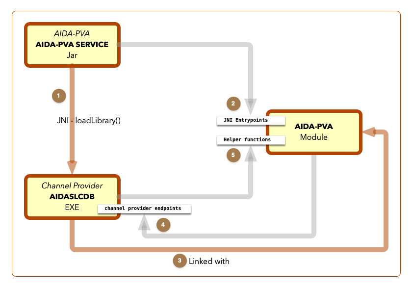

# 3 - Platform Technical Reference

Guide to the implementation of AIDA-PVA in Stanford National Laboratory.

## EPICS Backport 1.5
In order to make AIDA-PVA work on VMS EPICS had to be backported to Java 1.5. This created
the following libraries that were used to build the AIDA-PVA SERVICE Jar and run the EPICS framework on VMS.
- EPICS-PVACCESS-bp15.JAR - Backported version of PVACCESS.JAR.
- EPICS-PVDATA-bp15.JAR - Backported version of PVDATA.JAR.
- EPICS_FORWARDER.JAR - New component of EPICS required for the framework on VMS.

@see [Porting EPICS to Java 1.5 on VMS](5_0_Porting_EPICS_to_Java_1_5_on_VMS.md) for more information

## AIDA-PVA SERVICE
The AIDA-PVA Service is a [shaded jar](https://stackoverflow.com/questions/49810578/what-is-a-shaded-jar-and-what-is-the-difference-similarities-between-uber-jar-a) 
that implements the AIDA-PVA framework.   It is therefore a self-contained executable JAR that when run becomes the Channel Provider Process.   

The AIDA-PVA service uses a plug-and-play architecture for the implementation of the channel provider.  It is configured as follows:
- It checks the value of a property (`java.library.path`) to determine which
path to load the Channel Provider library from.  In our SLAC environment this is always `/SLCLIBS`.
- It checks the value of a property (`aida.pva.lib.name`) or environment variable (`AIDA_PVA_LIB_NAME`) to determine which
Channel Provider library to load.  e.g. `AIDASLCDB` to load `AIDASLCDB.EXE` library.
- It checks the value of a property (`aida.pva.channels.filename`) or environment variable (`AIDA_PVA_CHANNELS_FILENAME`) to determine which
  Channel Configuration File to load. This can be a full path name.  e.g. `/SLCTXT/AIDASLCDB_CHANNELS.YML`
- It reads configuration from the selected channel configuration file.

This determines which channels the Channel Provider will support, and where it will find implementations for the endpoints required to service the supported channels. 
In this way the same JAR can become any Channel Provider simply by modifying these configuration parameters.

The source code is found in the github repository [slaclab/aida-pva](https://github.com/slaclab/aida-pva)
### Class Hierarchy


### Source Code Explanation
- **aida-pva**
  - **edu.stanford.slac**
    - **aida**
      - **impl**
        - @ref edu.stanford.slac.aida.impl.AidaChannelProvider "AidaChannelProvider" 
        - @ref edu.stanford.slac.aida.impl.AidaService "AidaService" 
          - => **The main() Entry point for the AIDA-PVA Service**
          - _Start a timer to measure uptime. Can be obtained at any time by calling static function elapsedTime()_ 
          - _Loads the Channel Provider Library_
          - _Creates a new_ @ref edu.stanford.slac.aida.lib.ChannelProvider "ChannelProvider" _Object_
          - _Run it with_ @ref edu.stanford.slac.aida.lib.AidaProviderRunner "AidaProviderRunner.run()"
      - **lib**
        - @ref edu.stanford.slac.aida.lib.AidaProviderRunner "AidaProviderRunner"
          - One method run().
            - _Create a new_ @ref edu.stanford.slac.aida.lib.AidaRPCServer "AidaRPCServer"
            - _Create a new_ @ref edu.stanford.slac.aida.lib.AidaRPCService "AidaRPCService" _to service requests coming from the EPICS network_
            - _Register all the configured channels_
            - _Start the_ @ref edu.stanford.slac.aida.lib.AidaRPCServer "AidaRPCServer" _with run() method_.
        - @ref edu.stanford.slac.aida.lib.AidaRPCServer "AidaRPCServer"
        - @ref edu.stanford.slac.aida.lib.AidaRPCService "AidaRPCService" 
          - _implements request() which is called whenever the service is called by EPICS_.
        - @ref edu.stanford.slac.aida.lib.ChannelProvider "ChannelProvider"
          - _On creation_ 
            - _prints banner using_ @ref edu.stanford.slac.aida.lib.util.AidaPva "AidaPva.banner()"
            - _Create a_ @ref edu.stanford.slac.aida.lib.model.AidaProvider "AidaProvider" _using_ @ref edu.stanford.slac.aida.lib.ChannelProviderFactory "ChannelProviderFactory.create()" _which will load channels from configuration file._
            - _log the hosted channels to the console_
            - _call the aidaServiceInit() in superclass_ @ref slac.aida.NativeChannelProvider "NativeChannelProvider" _which will call the Native Channel Provider via JNI._
          - _Provides requestScalar(), requestScalarArray(), setValue(), setValueWithScalar() and requestTable() methods to handle all requests and pass them on to the correct_ @ref slac.aida.NativeChannelProvider "NativeChannelProvider" _endpoint for forwarding to the Native Channel Provider via JNI._
        - @ref edu.stanford.slac.aida.lib.ChannelProviderFactory "ChannelProviderFactory"
          - _One static method called create()_
            - _Determines where to load the channel configuration from_
            - _Loads channel configuration from the channel configuration file_
        - **model** - _classes representing various platform objects_: @ref edu.stanford.slac.aida.lib.model.AidaArgument "AidaArgument", @ref edu.stanford.slac.aida.lib.model.AidaArguments "AidaArguments", @ref edu.stanford.slac.aida.lib.model.AidaChannel "AidaChannel", @ref edu.stanford.slac.aida.lib.model.AidaChannelOperationConfig "AidaChannelOperationConfig", @ref edu.stanford.slac.aida.lib.model.AidaConfigGroup "AidaConfigGroup", @ref edu.stanford.slac.aida.lib.model.AidaField "AidaField", @ref edu.stanford.slac.aida.lib.model.AidaProvider "AidaProvider", @ref edu.stanford.slac.aida.lib.model.AidaTable "AidaTable", @ref edu.stanford.slac.aida.lib.model.AidaType "AidaType", @ref edu.stanford.slac.aida.lib.model.DoubleArgument "DoubleArgument", @ref edu.stanford.slac.aida.lib.model.FloatArgument "FloatArgument"
        - **util** - _various utilities_
          - @ref edu.stanford.slac.aida.lib.util.AidaPva "AidaPva"
            - Prints AIDA-PVA banner on console
          - @ref edu.stanford.slac.aida.lib.util.AidaPVHelper "AidaPVHelper"
            - _asScalar() - Convert given scalar object to PVStructure conforming to PVScalar_
            - _asScalarArray() - Convert given List of scalar objects to PVStructure conforming to PVScalarArray_
            - _asNtTable() - Convert List of Lists to PVStructure conforming to NTTable_
            - _conversion functions from PVField, PVArray, and PVStructure to String, List of Strings, and Json String respectively, extracting out any Floats and Doubles to be sent in ieee format._
          - @ref edu.stanford.slac.aida.lib.util.AidaStringUtils "AidaStringUtils"
            - _boring string manipulation functions_
    - **except** - _exception classes_: @ref edu.stanford.slac.except.AidaInternalException "AidaInternalException", @ref edu.stanford.slac.except.MissingRequiredArgumentException "MissingRequiredArgumentException", @ref edu.stanford.slac.except.ServerInitialisationException "ServerInitialisationException", @ref edu.stanford.slac.except.UnableToGetDataException "UnableToGetDataException", @ref edu.stanford.slac.except.UnableToSetDataException "UnableToSetDataException", @ref edu.stanford.slac.except.UnsupportedChannelException "UnsupportedChannelException", @ref edu.stanford.slac.except.UnsupportedChannelTypeException "UnsupportedChannelTypeException"
- **slac.aida**
  - @ref slac.aida.NativeChannelProvider "NativeChannelProvider"
    - _The native endpoints that link to the JNI entry-points in the Channel Provider C code, implemented in AIDA-PVA Module in `STANDALONELIB`_.

### AIDA-PVA is Strangely Linked :)

1. The AIDA-PVA Service loads the Channel Provider shared image but it does not call any functions in the image that it loads.
2. The AIDA-PVA Service calls JNI Entry points implemented in the AIDA-PVA Module in `STANDALONELIB`
3. It has access to them because the Channel Provider is linked with the AIDA-PVA Module to resolve those JNI references.
4. AIDA-PVA Module calls the Channel Provider entrypoints when it is called by the AIDA-PVA Service.
5. Whenever the Channel Provider needs help it calls the Helper functions in AIDA-PVA Module
 
Though it could look like it would be impossible to build the AIDA-PVA Module because it would have unresolved references 
to an as-yet-undefined Channel Provider's entrypoints, it does work because unless the Module that makes those calls is referenced
by an image being linked it, won't try to resolve the references.

@note
When linking the Channel Provider to the AIDA-PVA Module you need to explicitly request the Modules with the JNI Entry points
because even though the Channel Provider code doesn't reference them, the AIDA-PVA Service will need to have them available
when it loads the Channel Provider image.

Use the following snippet to reference the JNI Entry points and force them to be included in the Channel Provider image during linking. (excerpt from GENERAL OPT file)
```text
SLCLIBS:STANDALONELIB.OLB/INCLUDE=( -
 NATIVECHANNELPROVIDERJNI, -
 AIDA_PVA_SERVER_HELPER, -
 AIDA_PVA_JNI_HELPER, -
 AIDA_PVA_TYPES_HELPER, -
 AIDA_PVA_JSON) / LIB
```

This means, pull out the **NATIVECHANNELPROVIDERJNI** module (among others) even though it is not referenced.  That module contains
the JNI entrypoints that the AIDA-PVA Service will call.

### AIDA-PVA Service Execution Flow

1. Process is started by calling main() in @ref edu.stanford.slac.aida.impl.AidaService "AidaService".  This starts the three motors of AIDA-PVA Service.  @ref edu.stanford.slac.aida.lib.AidaRPCServer "AidaRPCServer", @ref edu.stanford.slac.aida.impl.AidaService "AidaService", and @ref edu.stanford.slac.aida.lib.ChannelProvider "ChannelProvider".
2. The @ref edu.stanford.slac.aida.lib.AidaRPCServer "AidaRPCServer" will listen for requests on the EPICs network
3. The @ref edu.stanford.slac.aida.impl.AidaService "AidaService" will be called to handle requests for any supported channel
4. The @ref edu.stanford.slac.aida.lib.ChannelProvider "ChannelProvider" will:
   * Check that the request is valid and what return type is expected
   * Get the arguments and put them in the format that AIDA-PVA Module is expecting
   * Determine if the request is a Getter or Setter request.
   * Forward the request to the appropriate AIDA-PVA Module endpoint.
   * Intercept Exceptions thrown by the AIDA-PVA Module and forward them to the EPICs network
   * Convert any return values to Normative Types and return data back to EPICs network via @ref edu.stanford.slac.aida.impl.AidaService "AidaService"
5. AIDA-PVA Module endpoints are called and will return results from the Channel Providers

## AIDA-PVA Module
The AIDA-PVA module is a set of C files compiled into Modules and inserted into `STANDALONELIB`, as well as a set of 
header files that are used to reference the functions declared in the Modules and to define types that they use.  
Module header files are used internally by the AIDA-PVA Module.

- C Files
  - aida_pva_jni_helper.c
  - aida_pva_server_helper.c
  - aida_pva_types_helper.c
  - NativeChannelProviderJni.c
- Module Header Files
  - aida_pva_jni_helper.h
  - aida_pva_server_helper.h
  - aida_pva_types_helper.h
  - slac_aida_NativeChannelProvider.h
- AIDA-PVA Module header files
  - aida_pva.h
  - aida_pva_api.h
  - aida_pva_convert.h
  - aida_pva_exceptions.h
  - aida_pva_json.h
  - aida_pva_memory.h
  - aida_pva_types.h
  - aida_pva_uri.h

The files are all committed to CMS and in STANDALONELIB.  The headers are all committed into C_INC.

For an explanation of the functions provided by AIDA-PVA Module see [AIDA-PVA Module Documentation](2_5_1_AIDA-PVA_Module_Functions.md)

### AIDA-PVA Module Execution Flow


1. Following on from AIDA-PVA SERVICE step 5 the AIDA-PVA Module endpoint is called.
   * The arguments are unpacked from JNI into sensible structures and validated
   * Floating point numbers passed in ieee format are unpacked 
   * The corresponding Channel Provider endpoint is called
   * The results are converted to JNI types for return
   * Memory is freed up
   * Exceptions are trapped and converted to JNI Exceptions
   * Results are returned to AIDA-PVA SERVICE
2. The corresponding Channel Provider endpoint is called
   * The Channel Provider calls the appropriate Legacy AIDA implementation to return appropriate results. 
3. The Channel Provider may call back into AIDA-PVA Module to use the many [Helper Functions](2_5_1_AIDA-PVA_Module_Functions.md).

## AIDA-PVA Channel Provider

Native Providers are coded to implement the AIDA-PVA API defined in aida_pva_api.h.

For an explanation of how the Channel Providers are coded see [The Channel Provider Programmers Reference](2_0_Channel_Provider_Programmers_Reference)

### Channel Provider Execution Flow


Internally each Channel Provider is coded differently, but they typically have the following form:

1. Validating and get arguments they need using ascanf() and avscanf() from AIDA-PVA Module.
2. Call the appropriate legacy AIDA Module in `AIDASHR` to access the Device or Database that they support.
3. They may also call back in to AIDA-PVA Module to use some of the [Helper Functions](2_5_1_AIDA-PVA_Module_Functions.md)

## Legacy AIDA Modules

AIDA Modules are legacy modules that were created for AIDA. They are used in AIDA-PVA as the low level modules that
access the SLAC Network devices. They are implemented as Modules in `AIDASHR` and are linked with the AIDA-PVA Channel
Provider in the build process.


General Documentation for these AIDA Modules can be [found here](https://www.slac.stanford.edu/grp/cd/soft/aida/)

_Specific Code for each legacy module_:

* [SLC Control Database Module](http://www-mcc.slac.stanford.edu/ref_0/AIDASHR/DPSLC_JNI_HELPER.C)
* [SLC Bpm Module](http://www-mcc.slac.stanford.edu/ref_0/AIDASHR/DPSLCBPM_JNI_HELPER.C)
* [SLC Buffered Data Module](http://www-mcc.slac.stanford.edu/ref_0/AIDASHR/DPSLCBUFF_JNI_HELPER.C)
* [SLC Klystron Module](http://www-mcc.slac.stanford.edu/ref_0/AIDASHR/DPSLCKLYS_JNI_HELPER.C)
* [SLC Magnet Module](http://www-mcc.slac.stanford.edu/ref_0/AIDASHR/DPSLCMAGNET_JNI_HELPER.C)
* [LCLS Model Module](http://www-mcc.slac.stanford.edu/ref_0/AIDASHR/DPSLCMODEL_JNI_HELPER.C)
* [SLC Master Oscillator](http://www-mcc.slac.stanford.edu/ref_0/AIDASHR/DPSLCMOSC_JNI_HELPER.C)
* [SLC Util](http://www-mcc.slac.stanford.edu/ref_0/AIDASHR/DPSLCUTIL_JNI_HELPER.C)

## Deployment


For a full description of how to deploy AIDA-PVA in SLAC see [A DevOps Guide to AIDA-PVA](4_0_A_DevOps_Guide_to_AIDA_PVA.md)

## Building AIDA-PVA SERVICE
see [Building AIDA-PVA SERVICE](3_1_Building_AIDA_PVA_Service.md)
## Building AIDA-PVA Module
see [Building AIDA-PVA Module](3_2_Building_AIDA_PVA_into_STANDALONELIB.md)
## Building AIDA-PVA a Channel Provider
see [Building AIDA-PVA a Channel Provider](3_3_Building_AIDA_PVA_Channel_Provider.md)

## Test Framework
see [Test Framework Documentation](2_5_4_Testing_Framework.md) for more information on testing framework

## Useful Stuff
### Documentation production
Most of the documentation is a set of Markdown files.  They are rooted at [/docs](https://github.com/slaclab/aida-pva/tree/master/docs) in the source tree.

Huge swathes of documentation are generated using [Doxygen](https://www.doxygen.nl/manual) a source code documentation generator.  
For this reason you will see documentation in source code comments that follows the Doxygen format.  Even documentation in the Markdown
files follows this format. 

The configuration file for Doxygen [doxygenConfig](https://github.com/slaclab/aida-pva/blob/master/docs/doxygenConfig) is in the
/docs directory also.
A images are stored in /docs/images, included there are also [Photoshop](https://www.adobe.com/products/photoshop.html) files 
and [Omnigraffle](https://www.omnigroup.com/omnigraffle) image source files so that modifications can be made.

To enhance the look of the documentation [doxygen-awesome css](https://jothepro.github.io/doxygen-awesome-css/) was included.
This is added as a git submodule under /docs.  You won't have to do this again:
```shell
git submodule add https://github.com/jothepro/doxygen-awesome-css.git
```

To get the documentation to read like a book with sections ordered sequentially, the Markdown files are numbered 
with their section numbers.

#### Generating Documentation
In order to generate documentation you'll need to [get Doxygen](https://www.doxygen.nl/download.html).

Also, as the source is spread out over Java and C and in multiple repositories a some pre-processing steps are required.

1. De-Lombok the Java Source Code
The source relies heavily on the [Lombok](https://projectlombok.org/) to simplify POJO generation and other tasks in Java.But this hides many methods and properties from the doxygen documentation processor.  To unpack all the Lombok annotations into plain old Java we need to run a De-Lombok process.
2. Source needs to be merged into one tree so that doxygen can make references to any code in any of the repositories.  This is handled by the script included below.

```shell
java -jar ~/.m2/repository/org/projectlombok/lombok/1.18.20/lombok-1.18.20.jar delombok <source-dir> -d <target-dir>
```

A script to generate the entire documentation including that for the Test Suite is shown below.  The script requires that the source
for the test is checked out. 

```shell
# To Generate documentation for AIDA-PVA

## Go to source root
cd $DEV_HOME/aida-pva

## Clean directory where we'll process the combined source files
rm -rf root

# De-lombok test source into /root/test
java -jar ~/.m2/repository/org/projectlombok/lombok/1.18.20/lombok-1.18.20.jar delombok $DEV_HOME/aida-pva-tests/src/main/java -d root/test/java

# De-lombok main source into /root
java -jar ~/.m2/repository/org/projectlombok/lombok/1.18.20/lombok-1.18.20.jar delombok src -d root

## Generate documentation using doxygen using the doxygen configuration file into /docGen/html
doxygen docs/doxygenConfig

## Upload the documentation to the SLAC documentation website
rsync -avz docGen/html/* sly@rhel6-64a.slac.stanford.edu:/afs/slac/www/grp/cd/soft/aida/aida-pva

```

#### Generating and Deploying Documentation automatically
GitHub Actions have been created that will automatically regenerate the documentation each time any change is made.  This allows 
Markdown files to be edited directly in github and this documentation to be updated automatically.  It also means that any
source file comment that is changed will automatically be updated in the documentation.

At the time of writing the last step - pushing generated documentation to the web service in SLAC - is failing due to a
permissions problem - Greg needs to fix this :)

The workflows are defined [here for aida-pva](https://github.com/slaclab/aida-pva/blob/master/.github/workflows/ci-docs.yml) and
[here for aida-pva-tests](https://github.com/slaclab/aida-pva-tests/blob/main/.github/workflows/ci-docs.yml).

### SSH setup
#### ssh config file
```text
StrictHostKeyChecking no

HashKnownHosts no

Host github.com
	AddKeysToAgent yes
	UseKeychain yes
	IdentityFile ~/.ssh/github_rsa

Host *.slac.stanford.edu
	User sly
	GSSAPIAuthentication yes
	GSSAPIDelegateCredentials yes

Host mccdev.slac.stanford.edu mcc.slac.stanford.edu mcca2.slac.stanford.edu
	User <your_user_name>
	HostkeyAlgorithms +ssh-dss
	PasswordAuthentication no
	GSSAPIAuthentication yes
	GSSAPIDelegateCredentials yes
```

You need to have an identify file for github (you'll probably already have one).  If not, [try this](https://gist.github.com/jexchan/2351996).

This also sets up access without password to any slac unix machine by ssh.   The access to VMS should work when you're
connected via VPN, although I found the VPN unsatisfactory because it forces all traffic through the SLAC network.

#### Kerberos
First time out just type the following to store your password in your keychain so that it is used automatically from then on.

```shell
kinit --keychain --renewable --forwardable <YOUR_USERNAME>@SLAC.STANFORD.EDU
```

### Proxy Configuration
```text
// This file configures the hosts that must be accessed via the proxy

function FindProxyForURL(url, host)
{
   proxy_yes = "SOCKS5 127.0.0.1:1080; SOCKS 127.0.0.1:1080";
   proxy_no = "DIRECT";

   if (shExpMatch(url, "http*://www*.slac.stanford.edu*")          ||
       shExpMatch(url, "http*://physics-elog.slac.stanford.edu*")  ||
       shExpMatch(url, "http*://ad-ops.slac.stanford.edu*")        ||
       shExpMatch(url, "http*://aosd.slac.stanford.edu*")          ||
       shExpMatch(url, "http*://intranet.slac.stanford.edu*")      ||
       shExpMatch(url, "http*://lcls-archapp.slac.stanford.edu*")  ||
       shExpMatch(url, "http*://slacspace.slac.stanford.edu*")     ||
       shExpMatch(url, "http*://mccas0.slac.stanford.edu*")        ||
       shExpMatch(url, "http*://mccelog.slac.stanford.edu*")       ||
       shExpMatch(url, "http*://oraweb.slac.stanford.edu*")        ||
       shExpMatch(url, "http*://erp-fsprd.erp.slac.stanford.edu*") ||
       shExpMatch(url, "http*://lcls-dev3.slac.stanford.edu*")     ||
       shExpMatch(url, "http://www-mcc.slac.stanford.edu*")        ||
       shExpMatch(url, "http*://webmcc.slac.stanford.edu*")        ||
       shExpMatch(url, "http*://portal.slac.stanford.edu*")        ||
       shExpMatch(url, "https://www.apple.com")        ||
       shExpMatch(url, "https://www-public.slac.stanford.edu*")) {
	       return proxy_yes;
       }

   else {
       return proxy_no;
   }
}
```

Then in your **Network Configuration/Advanced/Proxies/Automatic Proxy Configuration**  set URL = `http://localhost/proxy.pac`

You have to enable a web server on your local machine running on port 80 that serves the proxy configuration file.

### Script for Kerberos and proxy configuration

```shell
# Get a kerberos ticket if we don't already have one
kinit sly@SLAC.STANFORD.EDU

# Ket a token
aklog

#
# establish a proxy to stanford so that we can access protected pages as per proxy.pac configuration file
# Note: it always uses a specific host rhel6-64a, if you use rhel6 it will choose a random host and the token won't work half the time.
#
ps -e | sed 's/^.........................//' | grep -e '^ssh -N -D 1080' > /dev/null || ssh -N -D 1080 -g <your_username>@rhel6-64a.slac.stanford.edu &

```

### Git Configuration
```shell
cat ~/.gitconfig
[user]
	name = <git_username>
	email = <git-email>
[filter "media"]
	clean = git-media-clean %f
	smudge = git-media-smudge %f
[push]
	default = matching
[credential]
	helper = osxkeychain
[diff "zip"]
	textconv = unzip -c -a
[filter "lfs"]
	clean = git-lfs clean -- %f
	smudge = git-lfs smudge -- %f
	process = git-lfs filter-process
	required = true
[core]
	autocrlf = input
[merge "ours"]
	driver = false
[merge "theirs"]
	driver = false
```

### JDK Versions on Linux 
Two utilities to list and also set jdk version on Linux.   Add to your .bashrc on RHEL.

```shell
function jdk-versions() {
	ls -d /afs/slac/g/lcls/package/java/jdk* | sed 's/[^0-9._]*//g'
}

function jdk() {
        local new_version=$1
        if [[ "$1" == "" ]]
        then
                java -version
        else
                vstring=$(ls -ld /afs/slac/g/lcls/package/java/*${new_version} | sed 's/.*jdk//')
                export PATH="/afs/slac/g/lcls/package/java/jdk${vstring}/bin:$(echo ${PATH} | sed -e 's/[^:]*jdk[^:]*://g')"
                export JAVA_VERSION=${new_version}
        fi
}

```

### To set environment for running EPICS 
```shell 
source /afs/slac/g/lcls/epics/setup/epicsenv-7.0.2-1.1.bash
export EPICS_PVA_ADDR_LIST=mccdev.slac.stanford.edu
```
## References
@see
- [Connecting to SLAC Networks ](https://sites.slac.stanford.edu/remote-tool-kit/connecting-slac-networks-remotely)
- [Unix to VMS cheatsheet](https://www3.physnet.uni-hamburg.de/physnet/vms-unix-commands.html)
