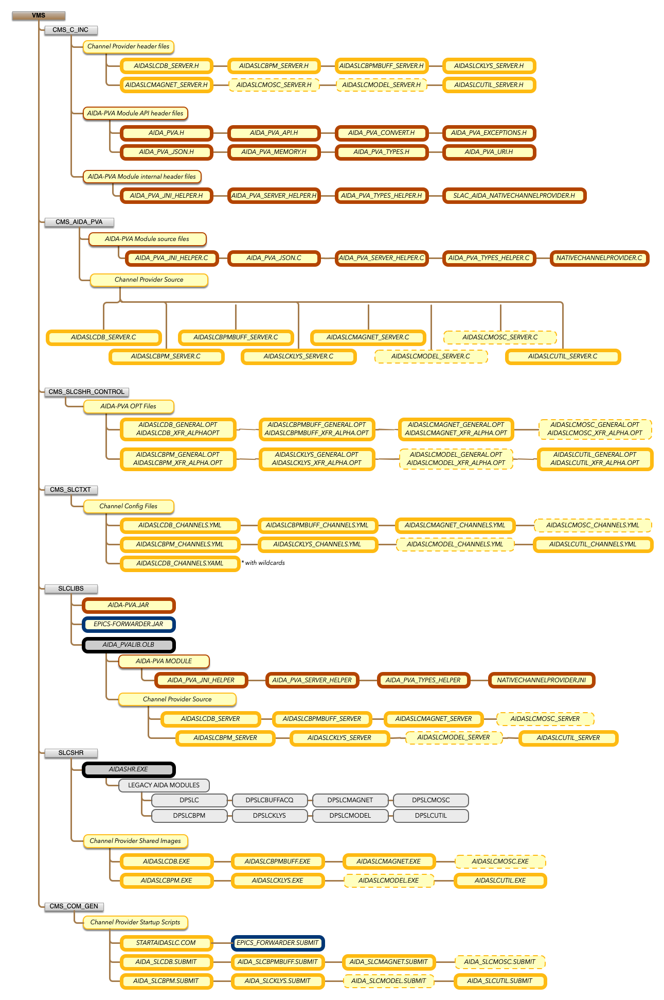

# 3.2 - Building AIDA-PVA into AIDA_PVALIB

Whenever you make changes to any of the following files you need to rebuild `AIDA_PVALIB` and deploy all shareable
images that
are affected by your change. First you need to verify that the code runs **before** committing it to CMS.

## Files in AIDA_PVALIB

If any of these files change follow the procedures below to rebuild and deploy `AIDA_PVALIB` dependent shareables.

- AIDA-PVA Module Header Files (Group 1)
    - `aida_pva_jni_helper.h` (_**C header file** for AIDA-PVA Module implementation_)
    - `aida_pva_server_helper.h` (_**C header file** for AIDA-PVA Module implementation_)
    - `aida_pva_types_helper.h` (_**C header file** for AIDA-PVA Module implementation_)
    - `slac_aida_NativeChannelProvider.h` (_**C header file** for AIDA-PVA Module implementation_)
- AIDA-PVA Module source files (Group 2)
    - `aida_pva_json.c` (_**C source file** for AIDA-PVA Module implementation_)
    - `aida_pva_server_helper.c` (_**C source file** for AIDA-PVA Module implementation_)
    - `aida_pva_types_helper.c` (_**C source file** for AIDA-PVA Module implementation_)
    - `NativeChannelProviderJni.c` (_**C source file** for AIDA-PVA Module implementation_)
- AIDA-PVA Common Header Files (Group 3)
    - `aida_pva.h` (_Common **C header file** for AIDA-PVA Module and provider implementation_)
    - `aida_pva_api.h` (_Common **C header file** for AIDA-PVA Module and provider implementation_)
    - `aida_pva_convert.h` (_Common **C header file** for AIDA-PVA Module and provider implementation_)
    - `aida_pva_exceptions.h` (_Common **C header file** for AIDA-PVA Module and provider implementation_)
    - `aida_pva_json.h` (_Common **C header file** for AIDA-PVA Module and provider implementation_)
    - `aida_pva_memory.h` (_Common **C header file** for AIDA-PVA Module and provider implementation_)
    - `aida_pva_types.h` (_Common **C header file** for AIDA-PVA Module and provider implementation_)
    - `aida_pva_uri.h` (_Common **C header file** for AIDA-PVA Module and provider implementation_)
- AIDA-PVA Provider Common Files (Group 4)
    - `AIDASHR_XFR_ALPHA.OPT` (_**Transfer vectors** for `AIDASHR` library_)
- AIDA-PVA BPM Provider Files (Group 5)
    - `AIDASLCBPM_CHANNELS.YML` (_Yaml **Channel Config** File_)
    - `AIDASLCBPM_GENERAL.OPT` (_**Linker options** file_)
    - `AIDASLCBPM_SERVER.c` (_**C source file** for this provider implementation_)
    - `AIDASLCBPM_SERVER.h` (_**C header file** for this provider implementation_)
    - `AIDASLCBPM_XFR_ALPHA.OPT` (_**Transfer vectors** for use in `AIDA_PVALIB`_)
- AIDA-PVA BPM Buffered Acquisition Provider Files (Group 6)
    - `AIDASLCBPMBUFF_CHANNELS.YML` (_Yaml **Channel Config** File_)
    - `AIDASLCBPMBUFF_GENERAL.OPT` (_**Linker options** file_)
    - `AIDASLCBPMBUFF_SERVER.c` (_**C source file** for this provider implementation_)
    - `AIDASLCBPMBUFF_SERVER.h` (_**C header file** for this provider implementation_)
    - `AIDASLCBPMBUFF_XFR_ALPHA.OPT` (_**Transfer vectors** for use in `AIDA_PVALIB`_)
- AIDA-PVA SLC Database Provider Files (Group 7)
    - `AIDASLCDB_CHANNELS.YAML` (_Yaml **Channel Config** File_)
    - `AIDASLCDB_CHANNELS.YML` (Very large _Yaml **Channel Config** File_)
    - `AIDASLCDB_GENERAL.OPT` (_**Linker options** file_)
    - `AIDASLCDB_SERVER.c` (_**C source file** for this provider implementation_)
    - `AIDASLCDB_SERVER.h` (_**C header file** for this provider implementation_)
    - `AIDASLCDB_XFR_ALPHA.OPT` (_**Transfer vectors** for use in `AIDA_PVALIB`_)
- AIDA-PVA Klystron Provider Files (Group 8)
    - `AIDASLCKLYS_CHANNELS.YML` (_Yaml **Channel Config** File_)
    - `AIDASLCKLYS_GENERAL.OPT` (_**Linker options** file_)
    - `AIDASLCKLYS_SERVER.c` (_**C source file** for this provider implementation_)
    - `AIDASLCKLYS_SERVER.h` (_**C header file** for this provider implementation_)
    - `AIDASLCKLYS_XFR_ALPHA.OPT` (_**Transfer vectors** for use in `AIDA_PVALIB`_)
- AIDA-PVA Magnet Provider Files (Group 9)
    - `AIDASLCMAGNET_CHANNELS.YML` (_Yaml **Channel Config** File_)
    - `AIDASLCMAGNET_GENERAL.OPT` (_**Linker options** file_)
    - `AIDASLCMAGNET_SERVER.c` (_**C source file** for this provider implementation_)
    - `AIDASLCMAGNET_SERVER.h` (_**C header file** for this provider implementation_)
    - `AIDASLCMAGNET_XFR_ALPHA.OPT` (_**Transfer vectors** for use in `AIDA_PVALIB`_)
- AIDA-PVA Utilities Provider Files (Group 10)
    - `AIDASLCUTIL_CHANNELS.YML` (_Yaml **Channel Config** File_)
    - `AIDASLCUTIL_GENERAL.OPT` (_**Linker options** file_)
    - `AIDASLCUTIL_SERVER.c` (_**C source file** for this provider implementation_)
    - `AIDASLCUTIL_SERVER.h` (_**C header file** for this provider implementation_)
    - `AIDASLCUTIL_XFR_ALPHA.OPT` (_**Transfer vectors** for use in `AIDA_PVALIB`_)

@note These files are also stored in the SLAC git repository for use with modern IDEs via git. The master version is in
CMS.

```shell
git clone  git@github.com:slaclab/aida-pva.git
```

### Graphical representation of files in APDA-PVA



## Preparation

### Verify Source Code has correct CARDS

CARDS are comments that are placed at the top of files that are recognised by the SLAC build tools.

- All **C header files** regardless of group:

```c
/*   **CMS**=C_INC   */
```

- All **Transfer vectors** and **Linker options** files regardless of group:

```c
! **CMS**=SLCSHR_CONTROL
```

- All **Channel Config** files regardless of group:

```yaml
#       **CMS**=SLCTXT
```

- Group 2

```c
/*   **MEMBER**=SLCLIBS:AIDA_PVALIB
     **ATTRIBUTES**=JNI   */
```

- Any other **C source files** files regardless of group:

```c
/*     **MEMBER**=SLCLIBS:AIDA_PVALIB
       **ATTRIBUTES**=JNI,LIBR_NOGLOBAL */
```

### Copy changed files to a clean directory in VMS

To build a new version for test and subsequent deployment you need to copy changed
files to a clean directory on MCCDEV. The build tools will combine the changed files with the
remaining files that are in CMS to build the libraries and shared libraries required.

## Procedures for Building, Testing and Deploying

- Groups 1, 2, & 3
    - For each _channel-provider_ in [`SLCBPM`, `SLCBPMBUFF`, `SLCDB`, `SLCKLYS`, `SLCMAGNET`, `SLCUTIL`]
        - Build the `AIDA-PVA` _channel-provider_ module in a private object library
        - Build and Test the `AIDA-PVA` _channel-provider_ shareable image privately
    - For each _channel-provider_ in [`SLCBPM`, `SLCBPMBUFF`, `SLCDB`, `SLCKLYS`, `SLCMAGNET`, `SLCUTIL`]
        - Commit and Rebuild the `AIDA-PVA` _channel-provider_ module in `AIDA_PVALIB` object library
        - Rebuild and Test the `AIDA-PVA` _channel-provider_ shareable image in DEV
        - Move the `AIDA-PVA` _channel-provider_ shareable image to PROD
- Group 4
    - Build `AIDASHR` shared library privately
    - For each _channel-provider_ in [`SLCBPM`, `SLCBPMBUFF`, `SLCDB`, `SLCKLYS`, `SLCMAGNET`, `SLCUTIL`]
        - Build and Test the `AIDA-PVA` _channel-provider_ shareable image privately using private `AIDASHR` library
    - Build and Test all `AIDA` providers privately
    - Commit changes to `AIDASHR` shared library
    - For each _channel-provider_ in [`SLCBPM`, `SLCBPMBUFF`, `SLCDB`, `SLCKLYS`, `SLCMAGNET`, `SLCUTIL`]
        - Rebuild and Test the `AIDA-PVA` _channel-provider_ shareable image in DEV
        - Move the `AIDA-PVA` _channel-provider_ shareable image to PROD
- Groups 5, 6, 7, 8, 9, & 10: _Channel Config files_
    - Deploy appropriate Channel Config file to PROD
- Groups 5, 6, 7, 8, 9, & 10: _All files except Channel Config files_
    - Build the `AIDA-PVA` _channel-provider_ module in a private object library
    - Build and Test the `AIDA-PVA` _channel-provider_ shareable image privately
    - Commit and Rebuild the `AIDA-PVA` _channel-provider_ module in `AIDA_PVALIB` object library
    - Rebuild and Test the `AIDA-PVA` _channel-provider_ shareable image in DEV
    - Move the `AIDA-PVA` _channel-provider_ shareable image to PROD

## Channel Provider Build Procedures

### Build an AIDA-PVA channel provider module in a private object library

- Create DEV library

```shell
MCCDEV> LIBRARY /CREATE DEVLIB
```

- Compile all changed C files including local header files

```shell
MCCDEV> CINC *.C
```

### Build and Test an AIDA-PVA channel provider shareable image privately

- Build shareable image
    - edit `GENERAL.OPT` file (either checkout or change updated) to comment out line ending
      in `! copy to DEV direct and remove this line for BUILDTEST /DEF`
    - build by running one of the following commands:
    ```shell
    MCCDEV> BUILDTEST AIDASLCBPM /ALL /DEFAULT
    MCCDEV> BUILDTEST AIDASLCBPMBUFF /ALL /DEFAULT
    MCCDEV> BUILDTEST AIDASLCDB /ALL /DEFAULT
    MCCDEV> BUILDTEST AIDASLCKLYS /ALL /DEFAULT
    MCCDEV> BUILDTEST AIDSLCMAGNET /ALL /DEFAULT
    MCCDEV> BUILDTEST AIDASLCUTIL /ALL /DEFAULT
    ```

  @note `/DEFAULT` means use the files in the local directory

- Test shareable image
    - log into dev machine using `SLCSHR` account
    ```shell
    MCCDEV> ssh MCCDEV /user=slcshr
    ```
    - shutdown running provider on dev, one of:
    ```shell
    MCCDEV::SLCSHR> WARMSLC AIDA_SLCBPM /KILL
    MCCDEV::SLCSHR> WARMSLC AIDA_SLCBPMBUFF /KILL
    MCCDEV::SLCSHR> WARMSLC AIDA_SLCDB /KILL
    MCCDEV::SLCSHR> WARMSLC AIDA_SLCKLYS /KILL
    MCCDEV::SLCSHR> WARMSLC AIDS_LCMAGNET /KILL
    MCCDEV::SLCSHR> WARMSLC AIDA_SLCUTIL /KILL
    ```
    - log out of `SLCSHR` account
    ```shell
    MCCDEV> logout
    ```
    - run private shareable, one of:
    ```shell
    MCCDEV> @AIDA_ASLCBPM.SUBMIT
    MCCDEV> @AIDA_ASLCBPMBUFF.SUBMIT
    MCCDEV> @AIDA_ASLCDB.SUBMIT
    MCCDEV> @AIDA_ASLCKLYS.SUBMIT
    MCCDEV> @AIDA_SLCMAGNET.SUBMIT
    MCCDEV> @AIDA_ASLCUTIL.SUBMIT
    ```

### Commit and Rebuild an AIDA-PVA channel provider module in the AIDA_PVALIB object library

- Build and Test locally first (see above)
- Reserve changed files in CMS
    - Enter CMS cli
    ```shell
    MCCDEV> slccms
    ```
    - Select library based on type of changed file, one of:
    ```shell
    SlcCMS> set libr CMS_AIDA_PVA
    SlcCMS> set libr CMS_C_INC
    SlcCMS> set libr CMS_SLCSHR_CONTROL  
    SlcCMS> set libr CMS_SLCTXT  
    ```
    - Reserve changed file, one of:
    ```shell
    SlcCMS> reserve AIDAASLCBPM_SERVER.C /nooutput 
    SlcCMS> reserve AIDAASLCBPM_SERVER.h /nooutput 
    SlcCMS> reserve AIDAASLCBPM_GENERAL.OPT /nooutput 
  
    SlcCMS> reserve AIDASLCBPMBUFF_SERVER.C /nooutput 
    SlcCMS> reserve AIDASLCBPMBUFF_SERVER.h /nooutput 
    SlcCMS> reserve AIDASLCBPMBUFF_GENERAL.OPT /nooutput 
  
    SlcCMS> reserve AIDASLCDB_SERVER.C /nooutput 
    SlcCMS> reserve AIDASLCDB_SERVER.h /nooutput 
    SlcCMS> reserve AIDASLCDB_GENERAL.OPT /nooutput 
  
    SlcCMS> reserve AIDASLCKLYS_SERVER.C /nooutput 
    SlcCMS> reserve AIDASLCKLYS_SERVER.h /nooutput 
    SlcCMS> reserve AIDASLCKLYS_GENERAL.OPT /nooutput 
  
    SlcCMS> reserve AIDASLCMAGNET_SERVER.C /nooutput 
    SlcCMS> reserve AIDASLCMAGNET_SERVER.h /nooutput 
    SlcCMS> reserve AIDASLCMAGNET_GENERAL.OPT /nooutput 
  
    SlcCMS> reserve AIDASLCUTIL_SERVER.C /nooutput 
    SlcCMS> reserve AIDASLCUTIL_SERVER.h /nooutput 
    SlcCMS> reserve AIDASLCUTIL_GENERAL.OPT /nooutput 
    ```
    - Exit CMS cli
    ```shell
    SlcCMS> exit 
    ```
- Commit changed files, one of:

```shell
MCCDEV>  cmp AIDAASLCBPM_SERVER.C  
MCCDEV>  cmp AIDAASLCBPM_SERVER.h  
MCCDEV>  cmp AIDAASLCBPM_GENERAL.OPT  

MCCDEV>  cmp AIDASLCBPMBUFF_SERVER.C  
MCCDEV>  cmp AIDASLCBPMBUFF_SERVER.h  
MCCDEV>  cmp AIDASLCBPMBUFF_GENERAL.OPT  

MCCDEV>  cmp AIDASLCDB_SERVER.C  
MCCDEV>  cmp AIDASLCDB_SERVER.h  
MCCDEV>  cmp AIDASLCDB_GENERAL.OPT  

MCCDEV>  cmp AIDASLCKLYS_SERVER.C  
MCCDEV>  cmp AIDASLCKLYS_SERVER.h  
MCCDEV>  cmp AIDASLCKLYS_GENERAL.OPT  

MCCDEV>  cmp AIDASLCMAGNET_SERVER.C  
MCCDEV>  cmp AIDASLCMAGNET_SERVER.h  
MCCDEV>  cmp AIDASLCMAGNET_GENERAL.OPT  

MCCDEV>  cmp AIDASLCUTIL_SERVER.C  
MCCDEV>  cmp AIDASLCUTIL_SERVER.h  
MCCDEV>  cmp AIDASLCUTIL_GENERAL.OPT  
```

### Rebuild and Test an AIDA-PVA channel provider shareable image in DEV

- Must have committed changes to CMS prior to executing this step
- Rebuild a new shareable on DEV
    - log into dev machine using `SLCSHR` account
  ```shell
  MCCDEV> ssh MCCDEV /user=slcshr
  ```
    - Build new shareable, one of:
  ```shell
  MCCDEV::SLCSHR> BUILDSHR AIDASLCBPMBUFF
  MCCDEV::SLCSHR> BUILDSHR AIDASLCDB
  MCCDEV::SLCSHR> BUILDSHR AIDASLCKLYS
  MCCDEV::SLCSHR> BUILDSHR AIDSLCMAGNET
  MCCDEV::SLCSHR> BUILDSHR AIDASLCUTIL
  ```
    - Present share on DEV server, one of:
  ```shell
  MCCDEV::SLCSHR> DEVSHR AIDASLCBPMBUFF
  MCCDEV::SLCSHR> DEVSHR AIDASLCDB
  MCCDEV::SLCSHR> DEVSHR AIDASLCKLYS
  MCCDEV::SLCSHR> DEVSHR AIDSLCMAGNET
  MCCDEV::SLCSHR> DEVSHR AIDASLCUTIL
  ```
    - start new provider on dev, one of:
  ```shell
  MCCDEV::SLCSHR> WARMSLC AIDASLCBPM /RESTART
  MCCDEV::SLCSHR> WARMSLC AIDASLCBPMBUFF /RESTART
  MCCDEV::SLCSHR> WARMSLC AIDASLCDB /RESTART
  MCCDEV::SLCSHR> WARMSLC AIDASLCKLYS /RESTART
  MCCDEV::SLCSHR> WARMSLC AIDSLCMAGNET /RESTART
  MCCDEV::SLCSHR> WARMSLC AIDASLCUTIL /RESTART
  ```
    - log out of `SLCSHR` account
  ```shell
  MCCDEV::SLCSHR> logout
  ```
- test for a number of days

### Move an AIDA-PVA channel provider shareable image to PROD

- log into dev machine using `SLCSHR` account
```shell
MCCDEV> ssh MCCDEV /user=slcshr
```
- Copy Dev share to PROD, one of:
```shell
MCCDEV::SLCSHR> NEWSHR AIDASLCBPMBUFF
MCCDEV::SLCSHR> NEWSHR AIDASLCDB
MCCDEV::SLCSHR> NEWSHR AIDASLCKLYS
MCCDEV::SLCSHR> NEWSHR AIDSLCMAGNET
MCCDEV::SLCSHR> NEWSHR AIDASLCUTIL
```
- start new provider on dev, one of:
```shell
MCCDEV::SLCSHR> WARMSLC AIDA_SLCBPM /RESTART
MCCDEV::SLCSHR> WARMSLC AIDA_SLCBPMBUFF /RESTART
MCCDEV::SLCSHR> WARMSLC AIDA_SLCDB /RESTART
MCCDEV::SLCSHR> WARMSLC AIDA_SLCKLYS /RESTART
MCCDEV::SLCSHR> WARMSLC AIDS_LCMAGNET /RESTART
MCCDEV::SLCSHR> WARMSLC AIDA_SLCUTIL /RESTART
```
- log into prod machine using `SLCSHR` account
```shell
MCCDEV::SLCSHR> ssh MCC /user=slcshr
```
- start new provider on prod, one of:
```shell
MCC::SLCSHR> WARMSLC AIDASLCBPM /RESTART
MCC::SLCSHR> WARMSLC AIDASLCBPMBUFF /RESTART
MCC::SLCSHR> WARMSLC AIDASLCDB /RESTART
MCC::SLCSHR> WARMSLC AIDASLCKLYS /RESTART
MCC::SLCSHR> WARMSLC AIDSLCMAGNET /RESTART
MCC::SLCSHR> WARMSLC AIDASLCUTIL /RESTART
```
- log out of `SLCSHR` account on prod
```shell
MCC::SLCSHR> logout
```
- log out of `SLCSHR` account on dev
```shell
MCCDEV::SLCSHR> logout
```

## AIDASHR Build Procedures

### Build AIDASHR shared library privately

- see [legacy AIDA documentation](https://www.slac.stanford.edu/grp/cd/soft/aida/) for instructions

### Build and Test an AIDA-PVA channel provider shareable image privately using private AIDASHR library
- Build shareable image
    - edit `GENERAL.OPT` file (checkout first) to comment out line ending
      in `! copy to DEV direct and remove this line for BUILDTEST /DEF`
    - build by running one of the following commands:
    ```shell
    MCCDEV> BUILDTEST AIDASLCBPM /ALL /DEFAULT
    MCCDEV> BUILDTEST AIDASLCBPMBUFF /ALL /DEFAULT
    MCCDEV> BUILDTEST AIDASLCDB /ALL /DEFAULT
    MCCDEV> BUILDTEST AIDASLCKLYS /ALL /DEFAULT
    MCCDEV> BUILDTEST AIDSLCMAGNET /ALL /DEFAULT
    MCCDEV> BUILDTEST AIDASLCUTIL /ALL /DEFAULT
    ```

  @note `/DEFAULT` means use the files in the local directory

- Test shareable image
    - log into dev machine using `SLCSHR` account
    ```shell
    MCCDEV> ssh MCCDEV /user=slcshr
    ```
    - shutdown running provider on dev, one of:
    ```shell
    MCCDEV::SLCSHR> WARMSLC AIDASLCBPM /KILL
    MCCDEV::SLCSHR> WARMSLC AIDASLCBPMBUFF /KILL
    MCCDEV::SLCSHR> WARMSLC AIDASLCDB /KILL
    MCCDEV::SLCSHR> WARMSLC AIDASLCKLYS /KILL
    MCCDEV::SLCSHR> WARMSLC AIDSLCMAGNET /KILL
    MCCDEV::SLCSHR> WARMSLC AIDASLCUTIL /KILL
    ```
    - log out of `SLCSHR` account
    ```shell
    MCCDEV> logout
    ```
    - run private shareable, one of:
    ```shell
    MCCDEV> @AIDA_ASLCBPM.SUBMIT
    MCCDEV> @AIDA_ASLCBPMBUFF.SUBMIT
    MCCDEV> @AIDA_ASLCDB.SUBMIT
    MCCDEV> @AIDA_ASLCKLYS.SUBMIT
    MCCDEV> @AIDA_SLCMAGNET.SUBMIT
    MCCDEV> @AIDA_ASLCUTIL.SUBMIT
    ```

### Build and Test all AIDA providers privately

- see [legacy AIDA documentation](https://www.slac.stanford.edu/grp/cd/soft/aida/) for instructions

### Commit changes to AIDASHR shared library

- see [legacy AIDA documentation](https://www.slac.stanford.edu/grp/cd/soft/aida/) for instructions

