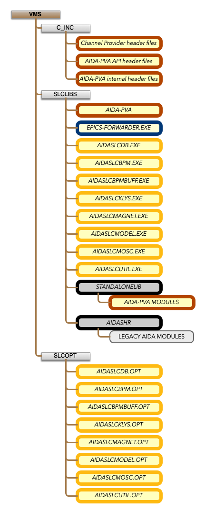
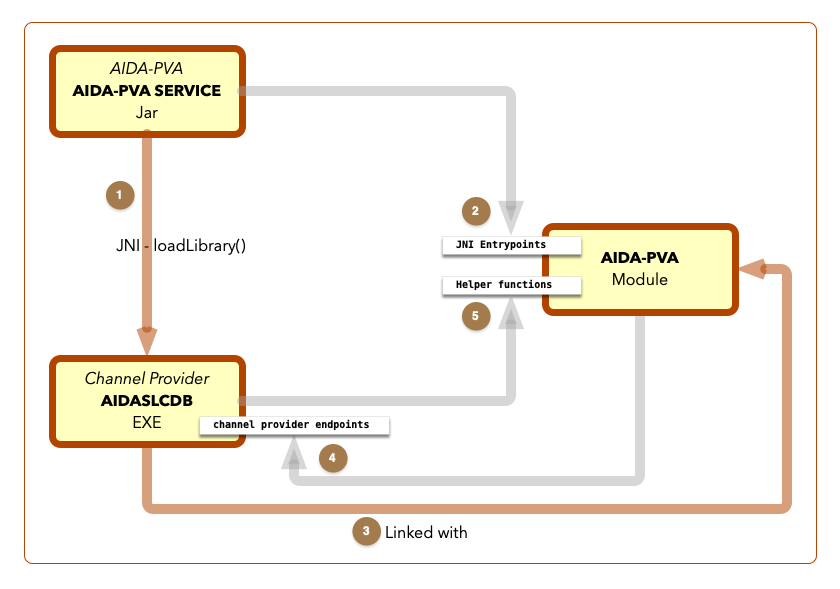
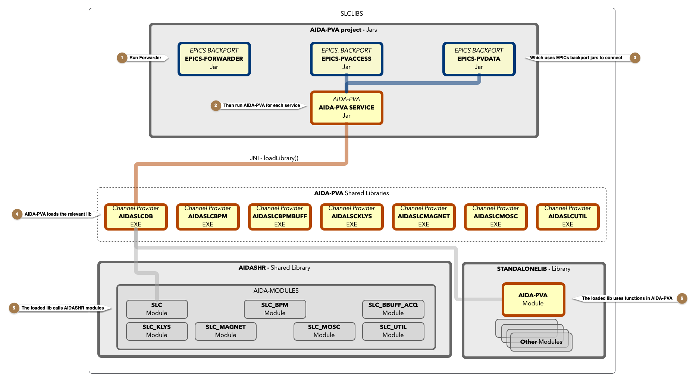

# 4 - A DevOps Guide to AIDA-PVA

## Components

AIDA-PVA is made up of the following components:



@note 
The Model and Master Oscillator Channel Providers have been mostly implemented but have not been deployed.  The code is only in the github repository.  [AIDASLCMOSC code](https://github.com/slaclab/aida-pva/tree/master/src/cpp/providers/SLCMosc), [AIDASLCMODEL code](https://github.com/slaclab/aida-pva/tree/master/src/cpp/providers/SLCModel).  Documentation: [MOSC](1_06_Users_Guide_SLC_Master_Oscillator_Channel_Provider.md), Tests: [MOSC](https://www.slac.stanford.edu/grp/cd/soft/aida/aida-pva/classedu_1_1stanford_1_1slac_1_1aida_1_1test_1_1_slc_mosc_test.html) 

### AIDA-PVA SERVICE (AIDA-PVA.JAR)
* launches the Channel Provider Shared Images integrating them into the EPICS PV-Access network
* Built from [AIDA-PVA Github Repo](https://github.com/slaclab/aida-pva) on Linux and copied to SLCLIBS

@see [Building AIDA-PVA Service](3_1_Building_AIDA_PVA_Service.md) for instructions on how to build it.

### EPICS 7 
EPICS 7 that run on VMS (specially ported for AIDA-PVA).  These Jars are not in VMS SLCLIBS.  They exist only in Linux for building AIDA-PVA.JAR
* `EPICS-PVACCESS-bp15.JAR`
* `EPICS-PVDATA-bp15.JAR`
* Built from [EPICS Backport GitHub Repo](https://github.com/slaclab/epics-server-java-backport-1.5) on Linux.

@see [Porting EPICS to Java 1.5](5_0_Porting_EPICS_to_Java_1_5_on_VMS.md) for instructions on how to build it.

### EPICS-7 Forwarder (specially built for AIDA-PVA)
* `EPICS_FORWARDER.JAR`
* Built from [EPICS Backport GitHub Repo](https://github.com/slaclab/epics-server-java-backport-1.5) on Linux and copied to SLCLIBS.

@see [Porting EPICS to Java 1.5](5_0_Porting_EPICS_to_Java_1_5_on_VMS.md) for instructions on how to build it.

### Channel Provider Shared Images loaded by the AIDA-PVA SERVICE
* Shared Images (CMS Library):
    * `AIDASLCDB.EXE` - (CMS_AIDASLCDB)
    * `AIDASLCBPM.EXE` - (CMS_AIDASLCBPM)
    * `AIDASLCBPMBUFF.EXE` - (CMS_AIDASLCBPMBUFF)
    * `AIDASLCKLYS.EXE` - (CMS_AIDASLCKLYS)
    * `AIDASLCMAGNET.EXE` - (CMS_AIDASLCMAGNET)
    * `AIDASLCMODEL.EXE` - (CMS_AIDASLCMODEL)
    * `AIDASLCMOSC.EXE` - (CMS_AIDASLCMOSC)
    * `AIDASLCUTIL.EXE` - (CMS_AIDASLCUTIL)
* Built from CMS but original source code [AIDA-PVA Github repo](https://github.com/slaclab/aida-pva/tree/master/src/cpp/providers)

@see [Building an AIDA-PVA Channel Provider](3_3_Building_AIDA_PVA_Channel_Provider.md) for instructions on how to build one.

### AIDA-PVA Module in STANDALONELIB.OLB
* Modules:
    * `AIDA_PVA_SERVER_HELPER` - **Helper functions for the AIDA-PVA Providers**
    * `AIDA_PVA_JNI_HELPER` - Used by the AIDA-PVA Module to interoperate in a JNI environment
    * `AIDA_PVA_TYPES_HELPER` - Functions that help AIDA-PVA Module marshal and unmarshal JNI types
    * `NATIVECHANNELPROVIDERJNI` - JNI Entry points from AIDA-PVA.JAR
    * `AIDA_PVA_JSON` - Used by AIDA-PVA Module to parse JSON
* Build from CMS_STANDALONE but original code from [AIDA-PVA Github repo](https://github.com/slaclab/aida-pva/tree/master/src/cpp/aida-pva)

@see [Building AIDA-PVA Service](3_2_Building_AIDA_PVA_into_STANDALONELIB.md) for instructions on how to build it.

### AIDA-PVA Header Files
* Channel Provider header files in CMS_C_INC
  * AIDASLCDB_SERVER.H
  * AIDASLCBPM_SERVER.H
  * AIDASLCBPMBUFF_SERVER.H
  * AIDASLCKLYS_SERVER.H
  * AIDASLCMAGNET_SERVER.H
  * AIDASLCMODEL_SERVER.H
  * AIDASLCMOSC_SERVER.H
  * AIDASLCUTIL_SERVER.H
  * AIDASLCREF_SERVER.H
* AIDA-PVA Module API header files in CMS_C_INC
  * aida_pva.h
  * aida_pva_api.h
  * aida_pva_convert.h 
  * aida_pva_exceptions.h 
  * aida_pva_json.h 
  * aida_pva_memory.h 
  * aida_pva_types.h 
  * aida_pva_uri.h
* AIDA-PVA Module internal header files in CMS_C_INC
  * aida_pva_jni_helper.h
  * aida_pva_server_helper.h
  * aida_pva_types_helper.h
  * slac_aida_NativeChannelProvider.h
* Maintained in CMS in CMS_C_INC but original code from [AIDA-PVA github repo](https://github.com/slaclab/aida-pva/tree/master/src/cpp)
### AIDA-PVA Option Files
* For Channel Provider linking in CMS_SLCSHR_CONTROL
    * AIDASLCDB_GENERAL.OPT, AIDASLCDB_XFR_ALPHA.OPT
    * AIDASLCBPM_GENERAL.OPT, AIDASLCBPM_XFR_ALPHA.OPT
    * AIDASLCBPMBUFF_GENERAL.OPT, AIDASLCBPMBUFF_XFR_ALPHA.OPT
    * AIDASLCKLYS_GENERAL.OPT, AIDASLCKLYS_XFR_ALPHA.OPT
    * AIDASLCMAGNET_GENERAL.OPT, AIDASLCMAGNET_XFR_ALPHA.OPT
    * AIDASLCMODEL_GENERAL.OPT, AIDASLCMODEL_XFR_ALPHA.OPT
    * AIDASLCMOSC_GENERAL.OPT, AIDASLCMOSC_XFR_ALPHA.OPT
    * AIDASLCUTIL_GENERAL.OPT, AIDASLCUTIL_XFR_ALPHA.OPT
### AIDA-PVA Channel Configuration Files
* For Supported Channel Definition and Configuration in CMS_SLCTXT
    * AIDASLCDB_CHANNELS.YML - Full channel listing
    * AIDASLCDB_CHANNELS.YAML - Uses wildcards to keep file size small
    * AIDASLCBPM_CHANNELS.YML
    * AIDASLCBPMBUFF_CHANNELS.YML
    * AIDASLCKLYS_CHANNELS.YML
    * AIDASLCMAGNET_CHANNELS.YML
    * AIDASLCMODEL_CHANNELS.YML
    * AIDASLCMOSC_CHANNELS.YML
    * AIDASLCUTIL_CHANNELS.YML

@note 
Use `AIDASLCDB_CHANNELS.YML` in any utilities created for channel discovery not `AIDASLCDB_CHANNELS.YAML`.  e.g. `aidalist`
 
@warning
Use `AIDASLCDB_CHANNELS.YAML` to start `AIDASLCDB.EXE` because VMS machine is too slow to process the millions of 
entries in `AIDASLCDB_CHANNELS.YML`.

#### An example configuration file
```yaml
!!edu.stanford.slac.aida.lib.model.AidaProvider
# @file
# @brief Channels definition file for AIDA-PVA: SLC BPM orbit data provider
#       **CMS**=SLCTXT
#
# @section DML
#     SELECT CONCAT('      - ', CONCAT(names.INSTANCE, CONCAT(':', names.ATTRIBUTE))) pv
#     FROM AIDA_DIRECTORY dir
#     INNER JOIN AIDA_SERVICES service ON dir.SERVICE_ID = service.ID
#     INNER JOIN AIDA_NAMES names ON dir.NAME_ID = names.ID
#     WHERE service.NAME = 'SLCBpm'
#     ORDER BY names.ATTRIBUTE, names.INSTANCE
id: 102
name: SLCBpm
description: SLC BPM orbit data under a given measurement definition
configurations:
  - name: Standard Configuration
    getterConfig:
      # Heterogeneous vector of 7 homogenous congruent vectors
      type: TABLE
      arguments:
        - BPMD
        - CNFNUM
        - CNFTYPE
        - N
        - SORTORDER
      fields:
        - label: BPM Name
          name: name
          description: Name of BPM
        - label: x offset
          name: x
          units: mm
          description: BPM x offset
        - label: y offset
          name: y
          units: mm
          description: BPM y offset
        - label: num particles
          name: tmits
          units: coulomb
          description: Number of particles
        - label: z position
          name: z
          units: meters
          description: BPM z position
        - label: HSTA
          name: HSTA
          description: 32 bit field
        - label: STATS
          name: STATS
          description: 32 bit field
    channels:
      - E163BMLN:BPMS
      - ELECEP01:BPMS
      - FACET-II:BPMS
      - INJ_ELEC:BPMS
      - INJ_POSI:BPMS
      - LCLS_SL2:BPMS
      - NDRFACET:BPMS
      - P2BPMHER:BPMS
      - P2BPMLER:BPMS
      - PEP2INJF:BPMS
      - SCAVPOSI:BPMS
      - SDRFACET:BPMS
      - TAXXALL:BPMS
```
## A note on linking

1. The AIDA-PVA Service loads the Channel Provider shared image but it does not call any functions in the image that it loads.
2. The AIDA-PVA Service calls JNI Entry points implemented in the AIDA-PVA Module in `STANDALONELIB`
3. It has access to them because the Channel Provider is linked with the AIDA-PVA Module to resolve those JNI references.
4. AIDA-PVA Module calls the Channel Provider entrypoints when it is called by the AIDA-PVA Service.
5. Whenever the Channel Provider needs help it calls the Helper functions in AIDA-PVA Module
 
Though it could look like it would be impossible to build the AIDA-PVA Module because it would have unresolved references 
to an as-yet-undefined Channel Provider's entrypoints, it does work because unless the Module that makes those calls is referenced
by an image being linked it, won't try to resolve the references.

@note
When linking the Channel Provider to the AIDA-PVA Module you need to explicitly request the Modules with the JNI Entry points
because even though the Channel Provider code doesn't reference them, the AIDA-PVA Service will need to have them available
when it loads the Channel Provider image.

Use the following snippet to reference the JNI Entry points and force them to be included in the Channel Provider image during linking. (excerpt from GENERAL OPT file)
```text
SLCLIBS:STANDALONELIB.OLB/INCLUDE=( -
 NATIVECHANNELPROVIDERJNI, -
 AIDA_PVA_SERVER_HELPER, -
 AIDA_PVA_JNI_HELPER, -
 AIDA_PVA_TYPES_HELPER, -
 AIDA_PVA_JSON) / LIB
```

This means, pull out the **NATIVECHANNELPROVIDERJNI** module (among others) even though it is not referenced.  That module contains
the JNI entrypoints that the AIDA-PVA Service will call.


## Running AIDA-PVA



### 1 - Run the Forwarder
* startup with the following command:
```shell
MCCDEV> java -jar SLCLIBS:EPICS_FORWARDER.JAR
Oct 24, 2021 2:35:33 AM org.epics.forwarder.PVAForwarder main
INFO: EPICS Request Forwarder started: 2344 milliseconds
9:35 > 
```
* You can also run it using `java -jar /SLCLIBS/EPICS_FORWARDER.JAR`
@warning 
It is imperative that the Forwarder is started before any Channel Provider service. If the Forwarder dies then all the Channel Provider services must be shutdown and only restarted after starting the Forwarder. This is because of a port contention that exists if the Forwarder finds any Channel Provider service running when it starts up.

### 2 - Run the AIDA-PVA SERVICE for each Channel Provider
* startup with a command similar to the following:
```shell
java -jar "-Daida.pva.channels.filename=/SLCTXT/AIDASLCDB_CHANNELS.YAML" "-Djava.library.path=/SLCLIBS" "-Daida.pva.lib.name=AIDASLCDB" SLCLIBS:AIDA-PVA.JAR
Oct 24, 2021 12:58:50 PM edu.stanford.slac.aida.impl.AidaService <clinit>
INFO: Loading Channel Provider Shared Library: AIDASLCDB

       db         88  88888888ba,           db
      d88b        88  88      `"8b         d88b
     d8'`8b       88  88        `8b       d8'`8b
    d8'  `8b      88  88         88      d8'  `8b                8b,dPPYba,   8b       d8  ,adPPYYba,
   d8YaaaaY8b     88  88         88     d8YaaaaY8b     aaaaaaaa  88P'    "8a  `8b     d8'  ""     `Y8
  d8""""""""8b    88  88         8P    d8""""""""8b    """"""""  88       d8   `8b   d8'   ,adPPPPP88
 d8'        `8b   88  88      .a8P    d8'        `8b             88b,   ,a8"    `8b,d8'    88,    ,88
d8'          `8b  88  88888888Y"'    d8'          `8b            88`YbbdP"'       "8"      `"8bbdP"Y8
                                                                 88
                                                                 88
Oct 24, 2021 12:58:51 PM edu.stanford.slac.aida.lib.ChannelProviderFactory create
INFO: Loading channel configuration from: /SLCTXT/AIDASLCDB_CHANNELS.YAML
Oct 24, 2021 12:59:02 PM edu.stanford.slac.aida.lib.ChannelProvider logHostedChannels
INFO:
AIDA-pva Channel Provider : SLC
Oct 24, 2021 12:59:02 PM edu.stanford.slac.aida.lib.ChannelProvider logHostedChannels
INFO: Channels hosted:
  [LEMG:????:*//EEND, RADS:????:*//MTIM, WIRE:????:*:SK2P, FDBK:????:*//CDEL, SOLN:????:*//BMAX, PTGM:????:*:RSOF, MPSI:????:*:CGID, FDBK:????:*:ULBL,
LENS:????:*//DVIC, ...]
```

### 3 - AIDA-PVA SERVICE is linked with EPICS BACKPORT jars prior to installing in SLCLIBS

### 4 -  AIDA-PVA SERVICE loads the Channel Provider
* _Selection of Channel Provider_
  * Channel Provider shared library location selection:
    1. A property set on the launch commandline with the `-D` option named `java.library.path`
        * fully qualified path name or
        * relative path
        * e.g. `-Djava.library.path=/SLCLIBS`
    2. * By default, the standard library locations and working directory are searched
  * Channel Provider shared library name selection:
    1. An Environment Variable `AIDA_PVA_LIB_NAME`
        * fully qualified path name of library (without the .EXE) or
        * library name (without the .EXE) to search in the working directory and standard library locations
        * e.g. `AIDA_PVA_LIB_NAME :== AIDASLCDB` 
    2. A property set on the launch commandline with the `-D` option named `aida.pva.lib.name`
        * fully qualified path name (without the .EXE) of library or
        * library name (without the .EXE) which will search in the working directory and standard library locations
        * e.g. `-Daida.pva.lib.name=AIDASLCDB`
    3. A file called `AIDA.EXE`
    4. Note that the file extension is assumed to be `.EXE` and is always omitted.
* _Specifying the Supported Channels_.  [Channels YAML file](2_3_CHANNELS_YML_file.md) selection: 
  1. An Environment Variable `AIDA_PVA_CHANNELS_FILENAME`
      * fully qualified path name of channels file or
      * channels file name to search for in the working directory
      * e.g. `AIDA_PVA_CHANNELS_FILENAME :== SLCTXT:AIDASLCDB_CHANNELS.YML`
  2. A property set on the launch commandline with the `-D` option named `aida.pva.channels.filename`
      * fully qualified path name of channels file or
      * channels file name to search in the working directory
      * e.g. `-Daida.pva.channels.filename=/SLCTXT/AIDASLCDB_CHANNELS.YML`
      * A file in the working directory called `CHANNELS.YML`

### 5 - The Channel Provider will load Legacy AIDA Modules in AIDASHR

### 6 - The Channel Provider will have also been linked with AIDA-PVA Modules in STANDALONELIB

## Submitting jobs

## Restarting

## Verification of service status

