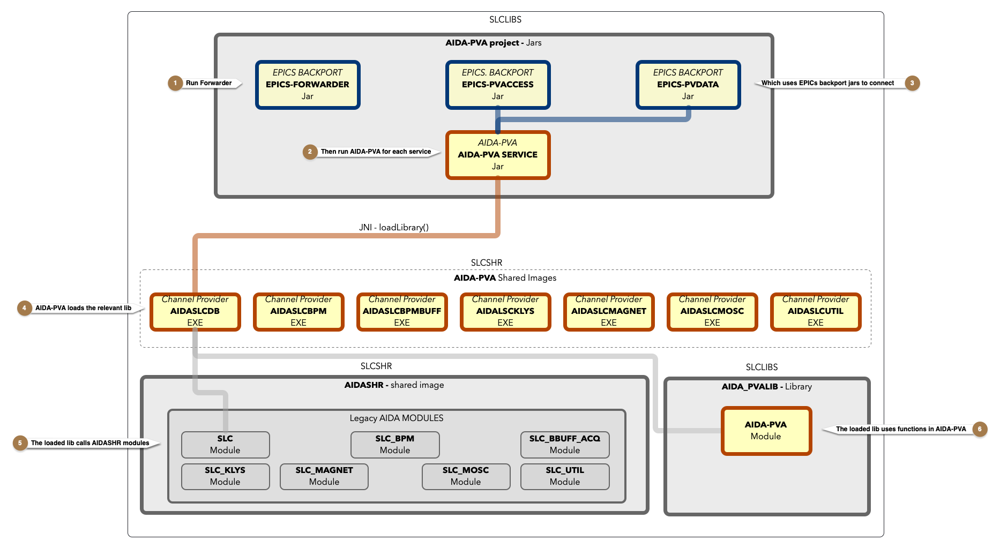
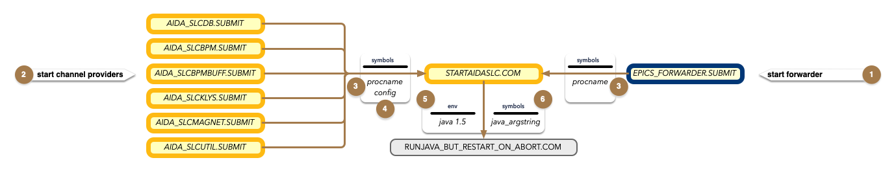

# 4 - A DevOps Guide to AIDA-PVA

## Quick Reference
### Synopsis
```shell
    WARMSLC AIDA_SLC<service> [ /KILL | /RESTART ]
    EPICS_FWD_RESTART [ /KILL | /RESTART ]
```
 
@note To use any of these commands, login as SLCSHR, to MCC for production, or MCCDEV for development.  e.g. `ssh mcc /user=slcshr` 

### SLCSHR Login
```shell
MCCDEV> ssh mcc /user=slcshr
slcshr's password:
Authentication successful.
MCC::SLCSHR>
```

### WARMSLC
Start, Stop, or Restart the specified service.
* service - One of **BPM**, **BPMBUFF**, **DB**, HISTORY, **KLYS**, **MAGNET**, MOSC, REF, **UTIL**

#### e.g: To Stop the AIDASLCBPMBUFF service 
```shell
WARMSLC AIDA_SLCBPMBUFF /KILL
```

#### e.g: To start the AIDASLCKLYS service 
```shell
WARMSLC AIDA_SLCKLYS
```

#### e.g: To restart the AIDASLCDB service 
```shell
WARMSLC AIDA_SLCDB /RESTART
```

### EPICS_FWD_RESTART
Restart all AIDA-PVA services together.

This command will restart the EPICS-FORWARDER process properly (if it has
died or needs to be restarted for some other reason).  A special sequence is
needed because the EPICS-FORWARDER cannot be started if any of the channel providers
are still running.

#### e.g: To restart the AIDA-PVA services 
```shell
EPICS_FWD_RESTART
```

## Components

AIDA-PVA is made up of the following components:


@note 
The Model and Master Oscillator Channel Providers have been mostly implemented but have not been deployed.  The code is only in the github repository.  [AIDASLCMOSC code](https://github.com/slaclab/aida-pva/tree/master/src/cpp/providers/SLCMosc), [AIDASLCMODEL code](https://github.com/slaclab/aida-pva/tree/master/src/cpp/providers/SLCModel).  Documentation: [MOSC](1_07_Users_Guide_SLC_Master_Oscillator_Channel_Provider.md), Tests: [MOSC](https://www.slac.stanford.edu/grp/cd/soft/aida/aida-pva/classedu_1_1stanford_1_1slac_1_1aida_1_1test_1_1_slc_mosc_test.html) 

### AIDA-PVA SERVICE (AIDA-PVA.JAR)
* launches the Channel Provider Shared Images integrating them into the EPICS PV-Access network
* Built from [AIDA-PVA Github Repo](https://github.com/slaclab/aida-pva) on Linux and copied to SLCIMAGE.
* SLCIMAGE:AIDA-PVA.JAR has been added to the java classpath

@see [Building AIDA-PVA Service](3_1_Building_AIDA_PVA_Service.md) for instructions on how to build it.

### EPICS 7 
EPICS 7 that run on VMS (specially ported for AIDA-PVA).  These Jars are not in VMS SLCIMAGE.  They exist only in Linux for building AIDA-PVA.JAR
* `EPICS-PVACCESS-bp15.JAR`
* `EPICS-PVDATA-bp15.JAR`
* Built from [EPICS Backport GitHub Repo](https://github.com/slaclab/epics-server-java-backport-1.5) on Linux.

@see [Porting EPICS to Java 1.5](5_0_Porting_EPICS_to_Java_1_5_on_VMS.md) for instructions on how to build it.

### EPICS-7 Forwarder (specially built for AIDA-PVA)
* `EPICS_FORWARDER.JAR`
* Built from [EPICS Backport GitHub Repo](https://github.com/slaclab/epics-server-java-backport-1.5) on Linux and copied to SLCIMAGE.

@see [Porting EPICS to Java 1.5](5_0_Porting_EPICS_to_Java_1_5_on_VMS.md) for instructions on how to build it.

### Channel Provider Shared Images loaded by the AIDA-PVA SERVICE
* Shared Images (CMS Library):
    * `AIDASLCDB.EXE` - (CMS_AIDAPVA)
    * `AIDASLCBPM.EXE` - (CMS_AIDAPVA)
    * `AIDASLCBPMBUFF.EXE` - (CMS_AIDAPVA)
    * `AIDASLCKLYS.EXE` - (CMS_AIDAPVA)
    * `AIDASLCMAGNET.EXE` - (CMS_AIDAPVA)
    * `AIDASLCMODEL.EXE` - (CMS_AIDAPVA)
    * `AIDASLCMOSC.EXE` - (CMS_AIDAPVA)
    * `AIDASLCUTIL.EXE` - (CMS_AIDAPVA)
* Built from CMS but original source code [AIDA-PVA Github repo](https://github.com/slaclab/aida-pva/tree/master/src/cpp/providers)

@see [Building AIDA-PVA Channel Providers](3_2_Building_AIDA_PVA_Channel_Providers.md) for instructions on how to build them.

### AIDA-PVA Module in AIDA_PVALIB.OLB
* Modules:
    * `AIDA_PVA_SERVER_HELPER` - **Helper functions for the AIDA-PVA Providers**
    * `AIDA_PVA_JNI_HELPER` - Used by the AIDA-PVA Module to interoperate in a JNI environment
    * `AIDA_PVA_TYPES_HELPER` - Functions that help AIDA-PVA Module marshal and unmarshal JNI types
    * `NATIVECHANNELPROVIDERJNI` - JNI Entry points from AIDA-PVA.JAR
    * `AIDA_PVA_JSON` - Used by AIDA-PVA Module to parse JSON
* Provider Modules:
    * `AIDASLCDB` - Source code for SLC Database Provider
    * `AIDASLCBPM` - Source code for SLC BPM Provider
    * `AIDASLCBPMBUFF` - Source code for SLC Buffered Acquisition Provider
    * `AIDASLCKLYS` - Source code for SLC Klystron Provider
    * `AIDASLCMAGNET` - Source code for SLC Magnet Provider
    * `AIDASLCMODEL` - Source code for SLC Model Provider
    * `AIDASLCMOSC` - Source code for SLC Master Oscilloscope Provider
    * `AIDASLCUTIL` - Source code for SLC Util Provider
* Build from CMS_AIDA_PVA but original code from [AIDA-PVA Github repo](https://github.com/slaclab/aida-pva/tree/master/src/cpp/aida-pva)

### AIDA-PVA Header Files
* Channel Provider header files in CMS_C_INC
  * AIDASLCDB_SERVER.H
  * AIDASLCBPM_SERVER.H
  * AIDASLCBPMBUFF_SERVER.H
  * AIDASLCKLYS_SERVER.H
  * AIDASLCMAGNET_SERVER.H
  * AIDASLCMODEL_SERVER.H
  * AIDASLCMOSC_SERVER.H
  * AIDASLCUTIL_SERVER.H
  * AIDASLCREF_SERVER.H
* AIDA-PVA Module API header files in CMS_C_INC
  * aida_pva.h
  * aida_pva_api.h
  * aida_pva_convert.h 
  * aida_pva_exceptions.h 
  * aida_pva_json.h 
  * aida_pva_memory.h 
  * aida_pva_types.h 
  * aida_pva_uri.h
* AIDA-PVA Module internal header files in CMS_C_INC
  * aida_pva_jni_helper.h
  * aida_pva_server_helper.h
  * aida_pva_types_helper.h
  * slac_aida_NativeChannelProvider.h
* Maintained in CMS in CMS_C_INC but original code from [AIDA-PVA github repo](https://github.com/slaclab/aida-pva/tree/master/src/cpp)
### AIDA-PVA Option Files
* For Channel Provider linking in CMS_SLCSHR_CONTROL
    * AIDASLCDB_GENERAL.OPT, AIDASLCDB_XFR_ALPHA.OPT
    * AIDASLCBPM_GENERAL.OPT, AIDASLCBPM_XFR_ALPHA.OPT
    * AIDASLCBPMBUFF_GENERAL.OPT, AIDASLCBPMBUFF_XFR_ALPHA.OPT
    * AIDASLCKLYS_GENERAL.OPT, AIDASLCKLYS_XFR_ALPHA.OPT
    * AIDASLCMAGNET_GENERAL.OPT, AIDASLCMAGNET_XFR_ALPHA.OPT
    * AIDASLCMODEL_GENERAL.OPT, AIDASLCMODEL_XFR_ALPHA.OPT
    * AIDASLCMOSC_GENERAL.OPT, AIDASLCMOSC_XFR_ALPHA.OPT
    * AIDASLCUTIL_GENERAL.OPT, AIDASLCUTIL_XFR_ALPHA.OPT
### AIDA-PVA Channel Configuration Files
* For Supported Channel Definition and Configuration in CMS_SLCTXT
    * AIDASLCDB_CHANNELS.YML - Full channel listing
    * AIDASLCDB_CHANNELS.YAML - Uses wildcards to keep file size small
    * AIDASLCBPM_CHANNELS.YML
    * AIDASLCBPMBUFF_CHANNELS.YML
    * AIDASLCKLYS_CHANNELS.YML
    * AIDASLCMAGNET_CHANNELS.YML
    * AIDASLCMODEL_CHANNELS.YML
    * AIDASLCMOSC_CHANNELS.YML
    * AIDASLCUTIL_CHANNELS.YML

@note 
Use `AIDASLCDB_CHANNELS.YML` in any utilities created for channel discovery not `AIDASLCDB_CHANNELS.YAML`.  e.g. `aidalist`
 
@warning
Use `AIDASLCDB_CHANNELS.YAML` to start `AIDASLCDB.EXE` because VMS machine is too slow to process the millions of 
entries in `AIDASLCDB_CHANNELS.YML`.

#### An example configuration file
```yaml
!!edu.stanford.slac.aida.lib.model.AidaProvider
# @file
# @brief Channels definition file for AIDA-PVA: SLC BPM orbit data provider
#       **CMS**=SLCTXT
#
# @section DML
#     SELECT CONCAT('      - ', CONCAT(names.INSTANCE, CONCAT(':', names.ATTRIBUTE))) pv
#     FROM AIDA_DIRECTORY dir
#     INNER JOIN AIDA_SERVICES service ON dir.SERVICE_ID = service.ID
#     INNER JOIN AIDA_NAMES names ON dir.NAME_ID = names.ID
#     WHERE service.NAME = 'SLCBpm'
#     ORDER BY names.ATTRIBUTE, names.INSTANCE
id: 102
name: SLCBpm
description: SLC BPM orbit data under a given measurement definition
configurations:
  - name: Standard Configuration
    getterConfig:
      # Heterogeneous vector of 7 homogenous congruent vectors
      type: TABLE
      arguments:
        - BPMD
        - CNFNUM
        - CNFTYPE
        - N
        - SORTORDER
      fields:
        - label: BPM Name
          name: name
          description: Name of BPM
        - label: x offset
          name: x
          units: mm
          description: BPM x offset
        - label: y offset
          name: y
          units: mm
          description: BPM y offset
        - label: num particles
          name: tmits
          units: coulomb
          description: Number of particles
        - label: z position
          name: z
          units: meters
          description: BPM z position
        - label: hsta
          name: hsta
          description: 32 bit field
        - label: stat
          name: stat
          description: 32 bit field
    channels:
      - E163BMLN:BPMS
      - ELECEP01:BPMS
      - FACET-II:BPMS
      - INJ_ELEC:BPMS
      - INJ_POSI:BPMS
      - LCLS_SL2:BPMS
      - NDRFACET:BPMS
      - P2BPMHER:BPMS
      - P2BPMLER:BPMS
      - PEP2INJF:BPMS
      - SCAVPOSI:BPMS
      - SDRFACET:BPMS
      - TAXXALL:BPMS
```
## A note on linking

1. The AIDA-PVA Service loads the Channel Provider shared image, but it does not call any functions declared in the library, `AIDASLCDB.OLB`, that creates that image.
2. The AIDA-PVA Service instead calls JNI entry-points which are actually declared in the AIDA-PVA Module in `AIDA_PVALIB.OLB`.
3. The AIDA-PVA Service has access to them because the Channel Provider is linked using the JNI entry-point transfer vectors file, `AIDASLCDB_XFR_ALPHA.OPT`, to resolve the references in the AIDA-PVA Module.
4. Functions implementing JNI entry-points, declared in the AIDA-PVA Module in `AIDA_PVALIB.OLB`, subsequently call Channel Provider entry-points declared in `AIDASLCDB.OLB`.
5. Whenever the Channel Provider needs help it calls back to Helper functions declared in the AIDA-PVA Module in `AIDA_PVALIB.OLB`.

@note
When linking the Channel Provider, `AIDASLCDB.OLB` with the AIDA-PVA Module in `AIDA_PVALIB.OLB`, to create the Channel Provider shared image, `AIDASLCDB.EXE`, you need to explicitly reference the JNI entry-points because even though the Channel Provider code in `AIDASLCDB.OLB` doesn't reference them, the AIDA-PVA Service, `AIDA-PVA.JAR`, will need to have them available when it loads the Channel Provider image.

This is done using the associated transfer vectors file. (excerpt from AIDASLCDB_XFR_ALPHA.OPT file)
```text
case_sensitive=YES
SYMBOL_VECTOR=(Java_slac_aida_NativeCh1dgccee$=PROCEDURE,-
     Java_slac_aida_NativeCh25dfjd6$=PROCEDURE,-
     Java_slac_aida_NativeCh3nsgvff$=PROCEDURE,-
     Java_slac_aida_NativeCh33ufh3u$=PROCEDURE,-
     Java_slac_aida_NativeCh1d5rrm5$=PROCEDURE,-
     Java_slac_aida_NativeCh14pujn9$=PROCEDURE,-
     Java_slac_aida_NativeCh20mk2i9$=PROCEDURE,-
     Java_slac_aida_NativeCh23sgj69$=PROCEDURE,-
     Java_slac_aida_NativeCh31p234f$=PROCEDURE,-
     Java_slac_aida_NativeCh2a0ae9n$=PROCEDURE,-
     Java_slac_aida_NativeCh39m8dhq$=PROCEDURE,-
     Java_slac_aida_NativeCh0oj95nt$=PROCEDURE,-
     Java_slac_aida_NativeCh2aokrpj$=PROCEDURE,-
     Java_slac_aida_NativeCh0nh9dsf$=PROCEDURE,-
     Java_slac_aida_NativeCh3tmi2oe$=PROCEDURE,-
     Java_slac_aida_NativeCh1s5d4nl$=PROCEDURE,-
     Java_slac_aida_NativeCh31oju0v$=PROCEDURE,-
     Java_slac_aida_NativeCh2vedmsq$=PROCEDURE,-
     Java_slac_aida_NativeCh25vb1ur$=PROCEDURE,-
     Java_slac_aida_NativeCh2sdrgol$=PROCEDURE)

case_sensitive=NO
```

## Running AIDA-PVA



### 1 - Run the Forwarder
* With the forwarder jar in the classpath, 
* startup with the following command:
```shell
MCCDEV> java PVAForwarder
Nov 15, 2021 4:17:05 AM org.epics.forwarder.PVAForwarder main
INFO: EPICS Request Forwarder started: 1530 milliseconds
12:17 >
13:17 > 78 requests/h
```
* You can also run it using `java -jar SLCIMAGE:EPICS_FORWARDER.JAR`
@warning 
It is imperative that the Forwarder is started before any Channel Provider service. If the Forwarder dies then all the Channel Provider services must be shutdown and only restarted after starting the Forwarder. This is because of a port contention that exists if the Forwarder finds any Channel Provider service running when it starts up.

### 2 - Run the AIDA-PVA SERVICE for each Channel Provider
* startup with a command similar to the following:
```shell
java "-Daida.pva.channels.filename=/SLCTXT/AIDASLCDB_CHANNELS.YAML" "-Djava.library.path=/SLCSHR" "-Daida.pva.lib.name=AIDASLCDB" AidaService
Oct 24, 2021 12:58:50 PM edu.stanford.slac.aida.impl.AidaService <clinit>
INFO: Loading Channel Provider Shared Library: AIDASLCDB

       db         88  88888888ba,           db
      d88b        88  88      `"8b         d88b
     d8'`8b       88  88        `8b       d8'`8b
    d8'  `8b      88  88         88      d8'  `8b                8b,dPPYba,   8b       d8  ,adPPYYba,
   d8YaaaaY8b     88  88         88     d8YaaaaY8b     aaaaaaaa  88P'    "8a  `8b     d8'  ""     `Y8
  d8""""""""8b    88  88         8P    d8""""""""8b    """"""""  88       d8   `8b   d8'   ,adPPPPP88
 d8'        `8b   88  88      .a8P    d8'        `8b             88b,   ,a8"    `8b,d8'    88,    ,88
d8'          `8b  88  88888888Y"'    d8'          `8b            88`YbbdP"'       "8"      `"8bbdP"Y8
                                                                 88
                                                                 88
Oct 24, 2021 12:58:51 PM edu.stanford.slac.aida.lib.ChannelProviderFactory create
INFO: Loading channel configuration from: /SLCTXT/AIDASLCDB_CHANNELS.YAML
Oct 24, 2021 12:59:02 PM edu.stanford.slac.aida.lib.ChannelProvider logHostedChannels
INFO:
AIDA-pva Channel Provider : SLC
Oct 24, 2021 12:59:02 PM edu.stanford.slac.aida.lib.ChannelProvider logHostedChannels
INFO: Channels hosted:
  [LEMG:????:*//EEND, RADS:????:*//MTIM, WIRE:????:*:SK2P, FDBK:????:*//CDEL, SOLN:????:*//BMAX, PTGM:????:*:RSOF, MPSI:????:*:CGID, FDBK:????:*:ULBL,
LENS:????:*//DVIC, ...]
```

### 3 - AIDA-PVA SERVICE is linked with EPICS BACKPORT jars prior to installing in SLCIMAGE

### 4 -  AIDA-PVA SERVICE loads the Channel Provider
* _Selection of Channel Provider_
  * Channel Provider shared image location selection:
    1. A property set on the launch commandline with the `-D` option named `java.library.path`
        * fully qualified path name or
        * relative path
        * e.g. `-Djava.library.path=/SLCSHR`
    2. * By default, the standard library locations and working directory are searched
  * Channel Provider shared image name selection:
    1. An Environment Variable `AIDA_PVA_LIB_NAME` - (A global symbol in VMS terminology)
        * fully qualified path name of image (without the .EXE) or
        * image name (without the .EXE) to search in the working directory and standard library locations
        * e.g. `$ AIDA_PVA_LIB_NAME == AIDASLCDB` 
    2. A property set on the launch commandline with the `-D` option named `aida.pva.lib.name`
        * fully qualified path name (without the .EXE) of the image or
        * image name (without the .EXE) which will search in the working directory and standard library locations
        * e.g. `-Daida.pva.lib.name=AIDASLCDB`
    3. A file called `AIDA.EXE`
    4. Note that the file extension is assumed to be `.EXE` and is always omitted.
* _Specifying the Supported Channels_.  [Channels YAML file](2_3_CHANNELS_YML_file.md) selection: 
  1. An Environment Variable `AIDA_PVA_CHANNELS_FILENAME` - (A global symbol in VMS terminology)
      * fully qualified path name of channels file or
      * channels file name to search for in the working directory
      * e.g. `$ AIDA_PVA_CHANNELS_FILENAME == SLCTXT:AIDASLCDB_CHANNELS.YML`
  2. A property set on the launch commandline with the `-D` option named `aida.pva.channels.filename`
      * fully qualified path name of channels file or
      * channels file name to search in the working directory
      * e.g. `-Daida.pva.channels.filename=/SLCTXT/AIDASLCDB_CHANNELS.YML`
      * A file in the working directory called `CHANNELS.YML`

### 5 - The Channel Provider will load Legacy AIDA Modules in AIDASHR

### 6 - The Channel Provider will have also been linked with AIDA-PVA Modules in AIDA_PVALIB

## Starting Processes
To enable AIDA-PVA to be fully integrated into control system startup, submit files have been provided to start the processes.
- General Startup script called by all other startup scripts
  - STARTAIDASLC.COM
- Channel Provider Submit Files
  - AIDA_SLCDB.SUBMIT
  - AIDA_SLCBPM.SUBMIT
  - AIDA_SLCBPMBUFF.SUBMIT
  - AIDA_SLCKLYS.SUBMIT
  - AIDA_SLCMAGNET.SUBMIT
  - AIDA_SLCUTIL.SUBMIT
- EPICS Forwarder Submit File
  - EPICS_FORWARDER.SUBMIT



1. Start the forwarder first.  If it fails then you need to stop all other services then restart it before restarting them.
2. Start the other services last.
3. The Channel Provider and EPICS-FORWARDER submit files set symbols to indicate the process name to start
4. The Channel Provider submit files also set symbols to indicate the configuration file to use
5. The `STARTAIDASLC.COM` script will set the correct Java 1.5 environment
6. It will also construct a symbol called `java_argstring` that is used as commandline parameters to the JVM.

