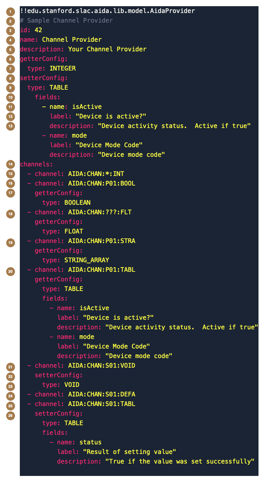

# Anatomy of our CHANNELS.YML file

1. Always add the annotation `!!edu.stanford.slac.aida.lib.model.AidaProvider` to the beginning of the yaml file so that the processor will recognise the type of yaml file you're providing.
2. You can place comments anywhere you want by preceding them by a hash character 
3. You must provide an identifier for your `Channel Provider`.  This usually corresponds to the Service ID from the Oracle Database for the `Channel Provider` you are implementing.
4. You must provide a name for the `Channel Provider`.  Note that strings can be entered in yaml files without quotes, but if you're including some non-standard characters you may want to surround them with double quotes
5. You **must** add a description but in this version of AIDA-PVA it is not used 
6. You **must** add a default `Getter` configuration.  `Getter` configurations control how `get` requests to a channel are handled i.e. what data will they return.  So specifying a default `Getter` configuration means that any `Channel` that does not provide a `Getter` configuration will be assumed to return this default configuration.
7. In our example we set the default `Getter` configuration to `INTEGER`.  This means that any `Channel` that does not provide a specific `Getter` configuration will return `INTEGER`.  In addition to the other scalar types, and scalar array types, you could also use the following:
   1. **TABLE** - This means that by default all channels will return a table.  If you specify `TABLE` you must specify fields that the table will contain.
   2. **NONE** - This means that by default all channels will return an `UnsupportedChannelException` when a `get` operation is attempted.
   3. **ANY** - This means that any `get` operation is permitted, and the client will be required to provide a `TYPE` argument to determine which one to use. If you will be supporting `TABLE` requests then you must provide a `fields` section below to define the fields that the table will contain.
   4. **SCALAR** - This means that any _scalar_ `get` operation or `TABLE` is permitted and the client will be required to provide a `TYPE` argument to determine which one to use. If you will be supporting `TABLE` requests then you must provide a `fields` section to define the fields that the table will contain.
   5. **SCALAR_ARRAY** - This means that any _scalar array_ `get` operation or `TABLE` is permitted and the client will be required to provide a `TYPE` argument to determine which one to use.  If you will be supporting `TABLE` requests then you must provide a `fields` section to define the fields that the table will contain.
8. The default `Setter` config is optional.  By default, if it is not included, it means that no setter operations will be permitted.  
9. If you provide a `Setter` config, the values can only be one of the following:
   1. **VOID** - This means that the `Setter` will not return any results
   2. **TABLE** - This means that the `Setter` will return a table, and you must provide a `fields` section to define the fields that the table will contain.
   3. **NONE** - equivalent to the default
10. In our example we have defined a default setter configuration as TABLE so we need to define a fields section.  The fields section contains a list of fields which are defined by `name`, `label`, and `description` entries.  There are other elements that are included in the Normative Type specification such as `units` and `unit label`, but they are not yet supported by AIDA-PVA. 
11. field **name** - This defines the field name as it will appear in the `Normative Type` `NTTable` structure returned to the user
12. field **label** - This defines the field name as it will appear in the `Normative Type` `NTTable` structure returned to the user
13. field **description** - This defines the field name as it will appear in the `Normative Type` `NTTable` structure returned to the user.  This field is currently not passed back to the client side.  In future version of AIDA-PVA it will so you should enter a value here.
14. The channels section lists the `Channels` that the `Channel Provider` supports.  You can list the `Channels` exhaustively or by using wildcards.  **Very Important Note**: The `Channels` listed here should be distinct from `Channels` supported by other `Channel Provider` implementations.  If there is overlap then the EPICS framework will choose the first `Channel Provider` to respond to the first request to this channel until that `Channel Provider` no longer responds.  For example, the SLC Orbit Database `Channel Provider` supports many channel names that are supported by other Channel Providers.  This means that some times the SLC Orbit Database `Channel Provider` will respond and sometimes the other `Channel Provider` will respond, leading to unreliable responses.  It is expected that future versions of AIDA-PVA will differentiate requests based on the `Getter` and `Setter` configurations, so that, for example, the SLC Orbit Database `Channel Provider` could support `get` requests on a channel while another `Channel Provider` supports `set` the requests.  For the moment the AIDA-PVA framework uses only the channel name to route requests.  
15. In this example the channel does not provide a `Getter` or `Setter` configuration, so it will use the defaults defined above.  A `Channel` must provide a way to identify all requests that it references.  It can do this by providing the name verbatim, or by employing one or more wildcards.  The example given uses wildcards so that it matches all requests that start with "`AIDA:CHAN:`" and end in "`:INT`" for example "`AIDA:CHAN:P01:INT`".  The possible wildcards are:
    1. `*` - matches any string of characters
    2. `?` - matches a single character
16. This example lists the `Channel` name verbatim, 
17. but it also provides a `Getter` configuration, overriding the default configuration and specifying that this `Channel` will return booleans.
18. This `Channel` configuration uses the `?` wildcard to specify the requests it will respond to.
19. This `Channel` is configured to respond to requests with string arrays 
20. And this `Channel` is configured to respond with a table
21. Note that a `get` request will return integers for this `Channel` as per the default configuration.
22. You can define or override `Setter` configuration for channels like this.
23. Here it is defined to return nothing instead of a table that was configured as a default.
24. This `Channel` will use defaults for both `Getter` and `Setter`
25. And finally this `Channel` will override the default configuration and return a different table.
