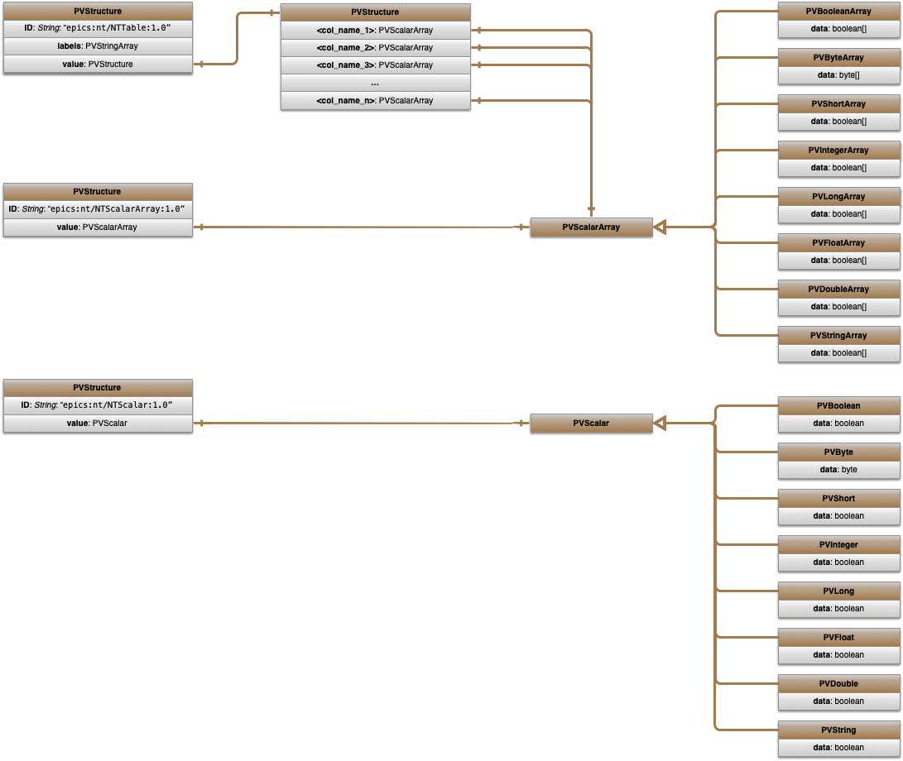

# Writing an AIDA-PVA Service - Programmers Reference Manual
## Overview 

`AIDA-PVA` provides a framework for `Channel Providers` to service requests for `Channels` that they support.  A `Channel` is an EPICS term, co-opted by AIDA-PVA, to mean _any identifiable source of data in any `Channel Data Source` on the `SLAC Network`_.  All AIDA-PVA Channels use a standard notation. 

The framework has five main features.
* **Routing** client `Channel Requests` using EPICS' `PVAccess`, through the `AIDA-PVA Service` to the registered `Channel Provider` endpoints.
* Bi-directionally **Marshalling, Transporting, and Converting** arguments and data.
* Raising, and **Propagating Exceptions** throughout the framework, back to clients, and on to logging services
* Providing **AIDA-PVA utilities** that implement the boilerplate functions required to service channel requests
* Providing access to `AIDASHR`, to allow `Channel Provider` code to leverage legacy **Channel Provider Modules** for accessing devices, databases and other services from `Channel Data Sources` on the `SLAC Network`.

## How it works
1. When your `Channel Provider` starts up, the `AIDA-PVA` process that started it will read the `CHANNELS.YML` file that you've provided to determine which EPICS search requests it should respond to.
2. Subsequently, when clients send requests containing references to one of those **Channels**, 
3. and EPICS seach request is propagated across the EPICS network 
4. The `EPICS Forwarder` that is constantly listening for requests will forward it to all the AIDA-PVA processes running in VMS. 
5. When your AIDA-PVA recognizes the channel and the request it will respond positively to the search request on your behalf,
6. Opening a direct communications channel to the client once the client accepts the response.
7. Now the AIDA-PVA will ask your `Channel Provider` to service the request and will return the results you give it.
8. By leveraging services in the AIDA-PVA module and legacy Channel Provider module in AIDASHR to access the Channel Data source, you can service those requests.


As an AIDA-PVA Service Provider writer you will be responsible for:
* Creating the AIDA-PVA `Channel Provider` Shared Library.
* Creating the initial `CHANNELS.YML` file that identifies and describes all the AIDA `Channels` that your `Channel Provider` will support.

### Components
* The **Provider Code** => produces `SLC<provider_name>.EXE` shared Library
* The **AIDA-PVA** - `aida-pva.jar`, that loads the Provider Code
* The **AIDA-PVA Module** - extensions to AIDASHR that provide helper functions for the Provider Code
* The **back-ported EPICS 7** libraries
  * `epics-pvaccess.jar` 
  * `epics-pvdata.jar `
* The **EPICS forwarder** - `epics-forwarder.jar`  

## Topology


## Normative Types
EPICS `PVAccess`is used to provide the protocol and transport for the `AIDA-PVA` framework.
EPICS `PVData` is used to provide the `Normative Types` functionality used for data encapsulation.

`Normative Types` are a set of software designs for high-level composite data types
suitable for the application-level data exchange between EPICS V4+ network endpoints.  In particular, they are intended
for use in online scientific data services. The intention is that where the endpoints in an EPICS V4+ network use only
`Normative Types`, each peer in the network should be able to understand all the data transmitted to it, at least
syntactically, and be able to take processing steps appropriate to that data.

AIDA-PVA uses `NTTable`, `NTScalarArray` and `NTScalar` `Normative Types` to represent its data.



See [EPICS Normative Types](http://epics-pvdata.sourceforge.net/alpha/normativeTypes/normativeTypes.html#:~:text=time_t%20timeStamp%20%3A%20opt-,Description%20of%20Normative%20Types,include%20descriptor%2C%20alarm%20and%20timestamp.) for more information

## Supported Data Types
### Scalar Types
* **BOOLEAN**            - Getter for this Channel returns a `PVStructure` that conforms to the `NTScalar` norm containing a single `PVBoolean`
* **BYTE**               - Getter for this Channel returns a `PVStructure` that conforms to the `NTScalar` norm containing a single `PVByte`.  Note there is no CHAR so clients are required to use BYTE and marshal the results appropriately
* **SHORT**              - Getter for this Channel returns a `PVStructure` that conforms to the `NTScalar` norm containing a single `PVShort`
* **INTEGER**            - Getter for this Channel returns a `PVStructure` that conforms to the `NTScalar` norm containing a single `PVInteger`
* **LONG**               - Getter for this Channel returns a `PVStructure` that conforms to the `NTScalar` norm containing a single `PVLong`
* **FLOAT**              - Getter for this Channel returns a `PVStructure` that conforms to the `NTScalar` norm containing a single `PVFloat`
* **DOUBLE**             - Getter for this Channel returns a `PVStructure` that conforms to the `NTScalar` norm containing a single `PVDouble`
* **STRING**             - Getter for this Channel returns a `PVStructure` that conforms to the `NTScalar` norm containing a single `PVString`
### Scalar Array Types
* **BOOLEAN_ARRAY**      - Getter for this Channel returns a `PVStructure` that conforms to the `NTScalarArray` norm containing a `PVBooleanArray` array
* **BYTE_ARRAY**         - Getter for this Channel returns a `PVStructure` that conforms to the `NTScalarArray` norm containing a `PVByteArray` array.  Note there is no CHAR_ARRAY so clients are required to use BYTE_ARRAY and marshal the results appropriately
* **SHORT_ARRAY**        - Getter for this Channel returns a `PVStructure` that conforms to the `NTScalarArray` norm containing a `PVShortArray` array
* **INTEGER_ARRAY**      - Getter for this Channel returns a `PVStructure` that conforms to the `NTScalarArray` norm containing a `PVIntegerArray` array
* **LONG_ARRAY**         - Getter for this Channel returns a `PVStructure` that conforms to the `NTScalarArray` norm containing a `PVLongArray` array
* **FLOAT_ARRAY**        - Getter for this Channel returns a `PVStructure` that conforms to the `NTScalarArray` norm containing a `PVFloatArray` array
* **DOUBLE_ARRAY**       - Getter for this Channel returns a `PVStructure` that conforms to the `NTScalarArray` norm containing a `PVDoubleArray` array
* **STRING_ARRAY**       - Getter for this Channel returns a `PVStructure` that conforms to the `NTScalarArray` norm containing a `PVStringArray` array
### Structures
* **TABLE**              - Getter or setter returns a `PVStructure` that conforms to the `NTTable` norm containing a set of homogenous congruent vectors which can be any of the `PVScalarArray` types supported under Scalar Array Types above.
### Special configuration only types.
* **NONE**               - Means that this getter or setter is not supported
* **VOID**               - Means that this setter does not return a value (only valid for setters)
* **ANY**                - Getter or setter returns any type defined by the mandatory accompanying `TYPE` argument, for setters this can only be VOID or TABLE
* **SCALAR**             - Constrains the `TYPE` parameter to be set to any scalar type or `TABLE`
* **SCALAR_ARRAY**       - Constrains the `TYPE` parameter to be set to any scalar array type or `TABLE`

# Implementation
## Overview
There are three things to write before you can compile, run, test and deploy your service. Here
* Write a `CHANNELS.YML` file
* Create a `Channel Provider`
* Create some tests
## Creating an `CHANNELS.YML` file
Definition of the `Channels` supported by your `Channel Service Provider` is done in the `CHANNELS.YML` file.  If you're unfamiliar with the the YAML format you can [familiarise yourself with the syntax and format](https://www.redhat.com/sysadmin/yaml-beginners) before reading further.

Please read [documentation on the CHANNELS.YML](Channels.md) file for information on how to create one.  An example configuration file is shown below:

```yaml
!!edu.stanford.slac.aida.lib.model.AidaProvider
# Sample Channel Provider
id: 42
name: Channel Provider
description: Your Channel Provider
getterConfig:
  type: INTEGER
setterConfig:
  type: TABLE
    fields:
      - name: isActive
        label: "Device is active?"
        description: "Device activity status.  Active if true"
      - name: mode
        label: "Device Mode Code"
        description: "Device mode code"
channels:
  - channel: AIDA:CHAN:*:INT
  - channel: AIDA:CHAN:P01:BOOL
    getterConfig:
      type: BOOLEAN
  - channel: AIDA:CHAN:???:FLT
    getterConfig:
      type: FLOAT
  - channel: AIDA:CHAN:P01:STRA
    getterConfig:
      type: STRING_ARRAY
  - channel: AIDA:CHAN:P01:TABL
    getterConfig:
      type: TABLE
      fields:
        - name: isActive
          label: "Device is active?"
          description: "Device activity status.  Active if true"
        - name: mode
          label: "Device Mode Code"
          description: "Device mode code"
  - channel: AIDA:CHAN:S01:VOID
    setterConfig:
      type: VOID
  - channel: AIDA:CHAN:S01:DEFA
  - channel: AIDA:CHAN:S01:TABL
    setterConfig:
      type: TABLE
      fields:
        - name: status
          label: "Result of setting value"
          description: "True if the value was set successfully"
```

## Creating a `Channel Provider`
Thanks to the `AIDA-PVA Module` creating a service provider is easy.  There is only one file to write and here is the code template.

```java
#include <string.h>
#include <stdlib.h>

#include "aida_server_helper.h"
#include "json.h"

#include "slc_macros.h"           /* vmsstat_t, int2u, int4u, etc. */

// API Stubs
REQUEST_STUB_CHANNEL_CONFIG
REQUEST_STUB_BOOLEAN
REQUEST_STUB_BYTE
REQUEST_STUB_SHORT
REQUEST_STUB_INTEGER
REQUEST_STUB_LONG
REQUEST_STUB_FLOAT
REQUEST_STUB_DOUBLE
REQUEST_STUB_STRING
REQUEST_STUB_BOOLEAN_ARRAY
REQUEST_STUB_BYTE_ARRAY
REQUEST_STUB_SHORT_ARRAY
REQUEST_STUB_INTEGER_ARRAY
REQUEST_STUB_LONG_ARRAY
REQUEST_STUB_FLOAT_ARRAY
REQUEST_STUB_DOUBLE_ARRAY
REQUEST_STUB_STRING_ARRAY
REQUEST_STUB_TABLE
SET_STUB_VOID
SET_STUB_TABLE

/**
 * Initialise the service
 * @param env to be used to throw exceptions using aidaThrow() and aidaNonOsExceptionThrow()
 * @throws ServerInitialisationException if the service fails to initialise
 */
void aidaServiceInit(JNIEnv* env)
{
	DO_STANDALONE_INIT_NO_MSG("AIDA-PVA_SLCMMODEL", "Model",
			true,        // db init
			false,       // query init
			false)       // set init
}
```

For any of the types that your `Channel Provider` will support you need to remove the corresponding _STUB_ line and replace it with the implementation.  You'll find the prototypes below:

### AIDA-PVA Module
The `AIDA-PVA Module` is a module contained in the `AIDASHR` shared library that provides all the boilerplate functionality needed to respond to `get` and `set` requests, marshal and unmarshal objects, and simple types across the JNI boundary and between your `Channel Provider` and VMS and the Channel Provider module in `AIDASHR`. 

#### Types
##### Type
```c
typedef enum
{
    AIDA_NO_TYPE,						// Used to indicate that no type was provided as an argument
    AIDA_VOID_TYPE,						// Used when no return value is to be returned from a channel

    AIDA_BOOLEAN_TYPE,					// Represents a boolean
    AIDA_BYTE_TYPE,						// Represents a byte
    AIDA_SHORT_TYPE,					// Represents a short
    AIDA_INTEGER_TYPE,					// Represents an integer
    AIDA_LONG_TYPE,						// Represents a long
    AIDA_FLOAT_TYPE,					// Represents a float
    AIDA_DOUBLE_TYPE,					// Represents a double
    AIDA_STRING_TYPE,					// Represents a string
    AIDA_BOOLEAN_ARRAY_TYPE,			// Represents a boolean array
    AIDA_BYTE_ARRAY_TYPE,				// Represents a byte array
    AIDA_SHORT_ARRAY_TYPE,				// Represents a short array
    AIDA_INTEGER_ARRAY_TYPE,			// Represents an integer array
    AIDA_LONG_ARRAY_TYPE,				// Represents a long array
    AIDA_FLOAT_ARRAY_TYPE,				// Represents a float array
    AIDA_DOUBLE_ARRAY_TYPE,				// Represents a double array
    AIDA_STRING_ARRAY_TYPE,				// Represents a string array
    AIDA_TABLE_TYPE,					// Represents a table
    AIDA_JSON_TYPE,						// Argument was provided as JSON text

    // Internal use only: DO NOT USE IN SERVICE IMPLEMENTATIONS!!
    AIDA_UNSIGNED_SHORT_TYPE,			// Represents an internal type of unsigned short
    AIDA_UNSIGNED_INTEGER_TYPE,			// Represents an internal type of unsigned integer
    AIDA_UNSIGNED_LONG_TYPE,			// Represents an internal type of unsigned long
    AIDA_UNSIGNED_SHORT_ARRAY_TYPE,		// Represents an internal type of unsigned short array
    AIDA_UNSIGNED_INTEGER_ARRAY_TYPE,	// Represents an internal type of unsigned integer array
    AIDA_UNSIGNED_LONG_ARRAY_TYPE		// Represents an internal type of unsigned long array
} Type;
```
###### Layout
###### Field
###### Config
###### Arguments
###### Argument
###### Value
###### Table
###### Array
###### StringArray


#### Macros
#### Functions

## Building your Shared Service
## Writing and running tests 
## Deploying a Service Provider

To implement a service (`yourService`) simply duplicate the `Reference` directories under `src/cpp/build`, `src/cpp/impl`
and `src/cpp/include` and implement your code as appropriate to your service.

You will also need to provide a yaml file (`channels.yaml`) containing the channel definition which you'll place in you
new `src/cpp/build{yourService}` directory.

From the `src/cpp/build{yourService}` directory, compile up the service using the `build` script which will deploy the library (`AIDA.EXE`) in the `lib/{yourService}` directory and copy the `channels.yml` file to the appropriate location.
```shell
MCCDEV> src
Default:= DATA_DISK_SLC:[SCRATCH.SLY.DEV.AIDA-PVA.SRC]
MCCDEV> cd [.build.reference]
MCCDEV> @build
DATA_DISK_SLC:[SCRATCH.SLY.DEV.AIDA-PVA.SRC.BUILD.REFERENCE]AIDA_JNI_HELPER.OBJ;7
DATA_DISK_SLC:[SCRATCH.SLY.DEV.AIDA-PVA.SRC.BUILD.REFERENCE]AIDA_SERVER_HELPER.OBJ;7
DATA_DISK_SLC:[SCRATCH.SLY.DEV.AIDA-PVA.SRC.BUILD.REFERENCE]AIDA_TYPES_HELPER.OBJ;7
DATA_DISK_SLC:[SCRATCH.SLY.DEV.AIDA-PVA.SRC.BUILD.REFERENCE]NATIVECHANNELPROVIDERJNI.OBJ;7
DATA_DISK_SLC:[SCRATCH.SLY.DEV.AIDA-PVA.SRC.BUILD.REFERENCE]REFERENCE_SERVER.OBJ;7
```

From the `lib/{yourlibrary}` directory start the service with `java -jar "-Djava.library.path=./" ../aida-pva.jar` where {yourLibrary} is the name of the library.
`
e.g.

```shell
MCCDEV> lib
Default:= DATA_DISK_SLC:[SCRATCH.SLY.DEV.AIDA-PVA.LIB]
MCCDEV> cd [.reference]
MCCDEV> java -jar "-Djava.library.path=./" ../aida-pva.jar
Aida Service Initialised
 
       db         88  88888888ba,           db
      d88b        88  88      `"8b         d88b
     d8'`8b       88  88        `8b       d8'`8b
    d8'  `8b      88  88         88      d8'  `8b                8b,dPPYba,   8b       d8  ,adPPYYba,
   d8YaaaaY8b     88  88         88     d8YaaaaY8b     aaaaaaaa  88P'    "8a  `8b     d8'  ""     `Y8
  d8""""""""8b    88  88         8P    d8""""""""8b    """"""""  88       d8   `8b   d8'   ,adPPPPP88
 d8'        `8b   88  88      .a8P    d8'        `8b             88b,   ,a8"    `8b,d8'    88,    ,88
d8'          `8b  88  88888888Y"'    d8'          `8b            88`YbbdP"'       "8"      `"8bbdP"Y8
                                                                 88
                                                                 88
AIDA-pva Channel Provider : Sample
Channels hosted:
  [AIDA:SAMPLE:DEVICE01:attribute04, AIDA:SAMPLE:DEVICE01//attribute14, AIDA:SAMPLE:DEVICE01:attribute15, AIDA:SAMPLE:DEVICE01//attribute03
, AIDA:SAMPLE:DEVICE01:attribute18, AIDA:SAMPLE:DEVICE01:attribute20, AIDA:SAMPLE:DEVICE01:attribute02, AIDA:SAMPLE:DEVICE01//attribute18,
AIDA:SAMPLE:DEVICE01//attribute06, ...]

```

Note that this assumes the library (EXE) is deployed in the current working directory and that the aida-pva jar is also
deployed there.

## Deployment

Deployment is very simple.

- aida-pva.jar
- service
- epics forwarder

### AIDA-PVA library

A shaded jar has been created (aida-pva) to implement AIDA-PVA. This jar contains all the EPICS and other libraries that
are required, and it is also runnable. The only thing that you need to make sure is that your native service library is
available on the java library path (specified with `-Djava.library.path=<path_where_service_library_resides>` on the
commandline). You also need to make sure that a `channels.yaml` file, is found in the working directory of the service.

### Service

### EPICS Forwarder

This component will be required for EPICS on Open-VMS to workaround an issue related to multi-cast sockets in Java 1.5.
It simply listens for any EPICS requests and forwards them to any listening AIDA-PVA services.

## Framework


# Running

To run AIDA-PVA and tests you'll need to start the service and also use some tool to test it

## Required Service Files

- `aida-pva.jar` - anywhere in the java classpath
- `channels.yml` - in current working directory where you start service
- `AIDA-PVA.EXE` - anywhere in the java load library path

## Start the forwarder once

On any site (networking terminology for a host) one EPICS Forwarder must be running.  
It must be started before any AIDA-PVA services are started on that site. One, and only one, must be running.

To start the EPICS forwarded:

```shell
MCCDEV> java -jar epics-forwarder.jar
Jun 30, 2021 9:16:27 AM org.epics.forwarder.PVAForwarder main
INFO: EPICS Request Forwarder started: 1824 milliseconds
16:16 > .....

```

Note: You will see a '.' show for each request that is forwarded by the EPICS Forwarder, and a new line will start for
each hour that there is at least one request. You can use this display to get an idea of the request rates.

## Start the service

You can start the service by executing the following command.

```shell
MCCDEV> java -jar "-Djava.library.path=." aida-pva.jar
```

The foregoing assumes that all required files are in the current working directory

## Reference Service

AIDA-PVA provides a reference service implementation. You can use this to verify your configuration before deploying
your service. The reference implementation provides the following channels:

- `AIDA:SAMPLE:DEVICE01:attribute01` - simple boolean
- `AIDA:SAMPLE:DEVICE01:attribute02` - simple byte
- `AIDA:SAMPLE:DEVICE01:attribute03` - simple short
- `AIDA:SAMPLE:DEVICE01:attribute04` - simple integer
- `AIDA:SAMPLE:DEVICE01:attribute05` - simple long
- `AIDA:SAMPLE:DEVICE01:attribute06` - simple float
- `AIDA:SAMPLE:DEVICE01:attribute07` - simple double
- `AIDA:SAMPLE:DEVICE01:attribute08` - simple string
- `AIDA:SAMPLE:DEVICE01:attribute11` - array of booleans
- `AIDA:SAMPLE:DEVICE01:attribute12` - array of bytes
- `AIDA:SAMPLE:DEVICE01:attribute13` - array of shorts
- `AIDA:SAMPLE:DEVICE01:attribute14` - array of integers
- `AIDA:SAMPLE:DEVICE01:attribute15` - array of longs
- `AIDA:SAMPLE:DEVICE01:attribute16` - array of floats
- `AIDA:SAMPLE:DEVICE01:attribute17` - array of doubles
- `AIDA:SAMPLE:DEVICE01:attribute18` - array of strings
- `AIDA:SAMPLE:DEVICE01:attribute20` - NT-TABLE : table normative-type

Each simple scalar channel additionally takes an optional parameter to showcase how parameters are parsed and used.

## Testing your service

To test the service you can use some of the EPICS utils already deployed in SLAC.

### Using pvcall

From a different host ...

```shell
bash-4.1$ source /afs/slac/g/lcls/epics/setup/epicsenv-7.0.2-1.1.bash
bash-4.1$ export EPICS_PVA_ADDR_LIST=mccdev.slac.stanford.edu
bash-4.1$ pvcall 'AIDA:SAMPLE:DEVICE01:attribute01'
true
bash-4.1$ pvcall 'AIDA:SAMPLE:DEVICE01:attribute02'
2
bash-4.1$ pvcall 'AIDA:SAMPLE:DEVICE01:attribute03'
3
bash-4.1$ pvcall 'AIDA:SAMPLE:DEVICE01:attribute04'
4
bash-4.1$ pvcall 'AIDA:SAMPLE:DEVICE01:attribute05'
5
bash-4.1$ pvcall 'AIDA:SAMPLE:DEVICE01:attribute06'
6.6
bash-4.1$ pvcall 'AIDA:SAMPLE:DEVICE01:attribute07'
7.7
bash-4.1$ pvcall 'AIDA:SAMPLE:DEVICE01:attribute08'
eight
bash-4.1$ pvcall 'AIDA:SAMPLE:DEVICE01:attribute10'
Timeout
bash-4.1$ pvcall 'AIDA:SAMPLE:DEVICE01:attribute11'
[true]
bash-4.1$ pvcall 'AIDA:SAMPLE:DEVICE01:attribute12'
[12]
bash-4.1$ pvcall 'AIDA:SAMPLE:DEVICE01:attribute13'
[13]
bash-4.1$ pvcall 'AIDA:SAMPLE:DEVICE01:attribute14'
[14]
bash-4.1$ pvcall 'AIDA:SAMPLE:DEVICE01:attribute15'
[15]
bash-4.1$ pvcall 'AIDA:SAMPLE:DEVICE01:attribute16'
[16.6]
bash-4.1$ pvcall 'AIDA:SAMPLE:DEVICE01:attribute17'
[17.7]
bash-4.1$ pvcall 'AIDA:SAMPLE:DEVICE01:attribute18'
["eighteen"]
bash-4.1$ pvcall 'AIDA:SAMPLE:DEVICE01:attribute20'

isActive mode status nbufs memory sensor hisensor message
    true    2      3     4      5    6.6      7.7   eight
bash-4.1$
```

An example of using parameters follows. Note that for all the scalar types in the reference implementation an optional
argument `x` is available. If present it will have the following effects on the results.

- `AIDA:SAMPLE:DEVICE01:attribute01` - simple boolean.  `x` will be combined by logical `AND` with default value
- `AIDA:SAMPLE:DEVICE01:attribute02` - simple byte.  `x` will be combined by bitwise-or `|` with default value
- `AIDA:SAMPLE:DEVICE01:attribute03` - simple short.  `x` will be combined by sum `+` with default value
- `AIDA:SAMPLE:DEVICE01:attribute04` - simple integer.  `x` will be combined by sum `+` with default value
- `AIDA:SAMPLE:DEVICE01:attribute05` - simple long.  `x` will be combined by sum `+` with default value
- `AIDA:SAMPLE:DEVICE01:attribute06` - simple float.  `x` will be combined by multiplication `*` with default value
- `AIDA:SAMPLE:DEVICE01:attribute07` - simple double.  `x` will be combined by multiplication `*` with default value
- `AIDA:SAMPLE:DEVICE01:attribute08` - simple string.  `x` will be combined by concatenation with default value

```shell
bash-4.1$ source /afs/slac/g/lcls/epics/setup/epicsenv-7.0.2-1.1.bash
bash-4.1$ export EPICS_PVA_ADDR_LIST=mccdev.slac.stanford.edu
bash-4.1$ pvcall 'AIDA:SAMPLE:DEVICE01:attribute01' x=true
true
bash-4.1$ pvcall 'AIDA:SAMPLE:DEVICE01:attribute01' x=false
false
bash-4.1$ pvcall 'AIDA:SAMPLE:DEVICE01:attribute01' x=1
true
bash-4.1$ pvcall 'AIDA:SAMPLE:DEVICE01:attribute02' x=0x0f
2
bash-4.1$ pvcall 'AIDA:SAMPLE:DEVICE01:attribute02' x=0x00
0
bash-4.1$ pvcall 'AIDA:SAMPLE:DEVICE01:attribute02' x=6
2
bash-4.1$ pvcall 'AIDA:SAMPLE:DEVICE01:attribute03' x=3
6
bash-4.1$ pvcall 'AIDA:SAMPLE:DEVICE01:attribute04' x=4
8
bash-4.1$ pvcall 'AIDA:SAMPLE:DEVICE01:attribute05' x=5
10
bash-4.1$ pvcall 'AIDA:SAMPLE:DEVICE01:attribute06' x=2
13.2
bash-4.1$ pvcall 'AIDA:SAMPLE:DEVICE01:attribute07' x=0.5
3.85
bash-4.1$ pvcall 'AIDA:SAMPLE:DEVICE01:attribute08' x=Value
Value: eight

```
