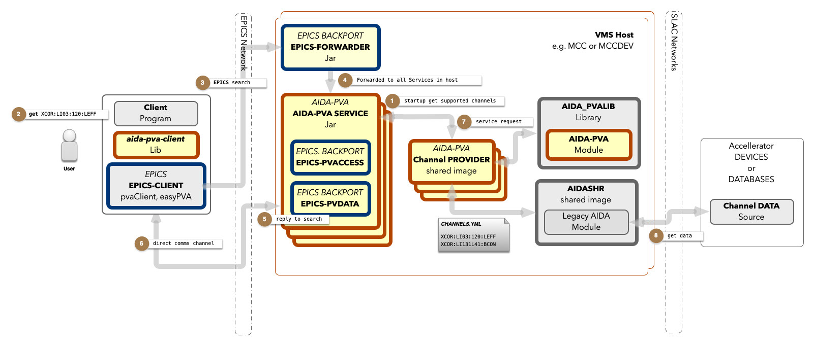

# Writing an AIDA-PVA Service - Programmers Reference Manual

## Overview

`AIDA-PVA` provides a framework for `Channel Providers` to service requests for `Channels` that they support.
A `Channel` is an EPICS term, co-opted by AIDA-PVA, to mean _any identifiable source of data in
any `Channel Data Source` on the `SLAC Network`_. 

All AIDA-PVA Channels use a standard notation: 

    channel := part ':' second_part [ ':' other_part ... ]
a set of at least two parts separated by colons.  

_The framework has five main features._

* **Routing** client `Channel Requests` using EPICS' `PVAccess`, through the `AIDA-PVA Service` to the
  registered Channel Provider endpoints.
* Bi-directionally **Marshalling, Transporting, and Converting** arguments and data.
* Raising, and **Propagating Exceptions** throughout the framework, back to clients, and on to logging services
* Providing **AIDA-PVA utilities** that implement the boilerplate functions required to service channel requests
* Providing access to `AIDASHR`, to allow Channel Provider code to leverage legacy **Channel Provider Modules** for
  accessing devices, databases and other services from `Channel Data Sources` on the `SLAC Network`.

## How it works

1. When your Channel Provider starts up, the `AIDA-PVA` process that started it will read the `CHANNELS.YML` file that
   you've provided to determine which EPICS search requests it should respond to.
2. Subsequently, when clients send requests containing references to one of those **Channels**,
3. and EPICS seach request is propagated across the EPICS network
4. The `EPICS Forwarder` that is constantly listening for requests will forward it to all the AIDA-PVA processes running
   in VMS.
5. When your AIDA-PVA recognizes the channel and the request it will respond positively to the search request on your
   behalf,
6. Opening a direct communications channel to the client once the client accepts the response.
7. Now the AIDA-PVA will ask your Channel Provider to service the request and will return the results you give it.
8. By leveraging services in the AIDA-PVA module and legacy Channel Provider module in AIDASHR to access the Channel
   Data source, you can service those requests.



As an AIDA-PVA Service Provider writer you will be responsible for:

* Creating the AIDA-PVA Channel Provider Shared Library.
* Creating the initial `CHANNELS.YML` file that identifies and describes all the AIDA-PVA `Channels` that
  your Channel Provider will support.

### Components

* The **Provider Code** => produces `SLC<provider_name>.EXE` shared Library
* The **AIDA-PVA** - `aida-pva.jar`, that loads the Provider Code
* The **AIDA-PVA Module** - extensions to AIDASHR that provide helper functions for the Provider Code
* The **back-ported EPICS 7** libraries
    * `epics-pvaccess.jar`
    * `epics-pvdata.jar `
* The **EPICS forwarder** - `epics-forwarder.jar`

## Topology
As a Native Channel Provider programmer you will be primarily concerned with creating a shared library for SLCLIBS.
Each Native Channel Provider is a distinct library in SLCLIBS.  The proceddure to create one will compile up 
your C source file(s) and link them with AIDASHR to resolve the calls you make to functions in AIDA-PVA Module and 
in any AIDA-MODULEs that you need to implement your service. 

AIDA-PVA Jar is the process that will launch your shared library, calling the entrypoints you implement as needed.


## Normative Types
The clients will be expecting data that corresponds to the Normative Type standard.  
The framework does all the work representing your data as Normative Types.  You don't have to know, or do, anything
for this.  For reference only see [Normative Types](NormativeTypes.md)

## Supported Data Types
What you will do is use primitive data types in most cases and some simple AIDA-PVA typedefs where 
required.  In all cases there are helper functions to help you marshall and unmarshal your data.

see [Supported Data Types](SuportedTypes.md)

# Implementation
This section details the steps you need to follow for implementing your Service.

## Overview
There are three things to write before you can compile, run, test and deploy your service. Here

* Write a `CHANNELS.YML` file.
* Create a Channel Provider - one C file and optionally one header file.
* Create some tests using the test framework aida-pva-tests.

## Creating an CHANNELS.YML file

Definition of the channels supported by your Channel Service Provider is done in the `CHANNELS.YML` file. If you're
unfamiliar with the YAML (Yet Another Markup Language) format you
can [familiarise yourself with the syntax and format](https://www.redhat.com/sysadmin/yaml-beginners) before reading
further.

Please read [documentation on the CHANNELS.YML](Channels.md) file for information on how to create one. An example
configuration file is shown below:

```yaml
!!edu.stanford.slac.aida.lib.model.AidaProvider
# Sample Channel Provider
id: 42
name: Channel Provider
description: Your Channel Provider
configurations:
  - name: Boolean Getter Channels
    getterConfig:
      type: BOOLEAN
    channels:
      - AIDA:CHAN:*:INT
      - AIDA:CHAN:P01:BOOL
  - name: Float Getter Channels
    getterConfig:
      type: FLOAT
      arguments:
        - X
        - Y
    channels:
      - AIDA:CHAN:???:FLT
  - name: String Array Getter Channels
    getterConfig:
      type: STRING_ARRAY
    channels:
      - AIDA:CHAN:P01:STRA
  - name: Table Getter Channels
    getterConfig:
      type: TABLE
      fields:
        - name: isActive
          label: "Device is active?"
          description: "Device activity status.  Active if true"
        - name: mode
          label: "Device Mode Code"
          description: "Device mode code"
    channels:
      - AIDA:CHAN:P01:TABL
  - name: Void Setter Channels
    setterConfig:
      type: VOID
    channels:
      - AIDA:CHAN:S01:VOID
  - name: Table Setter Channels
    setterConfig:
      type: TABLE
      fields:
        - name: status
          label: "Result of setting value"
          description: "True if the value was set successfully"
    channels:
      - AIDA:CHAN:S01:DEFA
      - AIDA:CHAN:S01:TABL
```

## Creating a Channel Provider

You have to implement all the endpoints defined in aida_pva_api.h.  
Thanks to the AIDA-PVA Module doing this is easy.  
There is only one file to write and here is the code template that stubs out the endpoints using provided macros.
aida_pva_api.h also defines the "STUB" macros you will use for the endpoints that you don't need to implement.

```c
#include "aida_pva.h"

// API Stubs
REQUEST_STUB_BOOLEAN
REQUEST_STUB_BYTE
REQUEST_STUB_SHORT
REQUEST_STUB_INTEGER
REQUEST_STUB_LONG
REQUEST_STUB_FLOAT
REQUEST_STUB_DOUBLE
REQUEST_STUB_STRING
REQUEST_STUB_BOOLEAN_ARRAY
REQUEST_STUB_BYTE_ARRAY
REQUEST_STUB_SHORT_ARRAY
REQUEST_STUB_INTEGER_ARRAY
REQUEST_STUB_LONG_ARRAY
REQUEST_STUB_FLOAT_ARRAY
REQUEST_STUB_DOUBLE_ARRAY
REQUEST_STUB_STRING_ARRAY
REQUEST_STUB_TABLE
SET_STUB_VOID
SET_STUB_TABLE

/**
 * Initialise the service
 * @param env to be used to throw exceptions using aidaThrow() and aidaNonOsExceptionThrow()
 * @throws ServerInitialisationException if the service fails to initialise
 */
void aidaServiceInit(JNIEnv* env)
{
	printf("My Service Provider Initialised\n");
}
```

For any of the types that your Channel Provider will support you need to remove the corresponding "STUB" line and
replace it with the implementation. Here are the endpoints from which to choose.  For full prototypes click the links or, see aida_pva_api.h. 
- Initialisation
  - aidaServiceInit() - _Called by the AIDA-PVA framework on startup to initialise the Channel Provider._
- Scalar Getters
  - aidaRequestBoolean() - _Called by the AIDA-PVA framework when a boolean value is requested._
  - aidaRequestByte() - _Called by the AIDA-PVA framework when a byte value is requested._
  - aidaRequestShort() - _Called by the AIDA-PVA framework when a short value is requested._
  - aidaRequestInteger() - _Called by the AIDA-PVA framework when a integer value is requested._
  - aidaRequestLong() - _Called by the AIDA-PVA framework when a long value is requested._
  - aidaRequestFloat() - _Called by the AIDA-PVA framework when a float value is requested._
  - aidaRequestDouble() - _Called by the AIDA-PVA framework when a double value is requested._
  - aidaRequestString() - _Called by the AIDA-PVA framework when a string value is requested._
- Scalar Array Getters
  - aidaRequestBooleanArray() - _Called by the AIDA-PVA framework when a boolean array is requested._
  - aidaRequestByteArray() - _Called by the AIDA-PVA framework when a byte array is requested._
  - aidaRequestShortArray() - _Called by the AIDA-PVA framework when a short array is requested._
  - aidaRequestIntegerArray() - _Called by the AIDA-PVA framework when a integer array is requested._ 
  - aidaRequestLongArray() - _Called by the AIDA-PVA framework when a long array is requested._ 
  - aidaRequestFloatArray() - _Called by the AIDA-PVA framework when a float array is requested._ 
  - aidaRequestDoubleArray() - _Called by the AIDA-PVA framework when a double array is requested._ 
  - aidaRequestStringArray() - _Called by the AIDA-PVA framework when a string array is requested._ 
  - aidaRequestTable() - _Called by the AIDA-PVA framework when a table of data is requested._
- Setters
  - aidaSetValue() - _Called by the AIDA-PVA framework when a request to set a value is made._
  - aidaSetValueWithResponse() - _Called by the AIDA-PVA framework when a request to set a value and return a table is made._
  
### AIDA-PVA Module

The AIDA-PVA Module is a module contained in the `AIDASHR` shared library that provides all the boilerplate
functionality needed to respond to **get** and **set** requests, marshal and unmarshal objects, and simple types across the
JNI boundary and between your Channel Provider and VMS and the Channel Provider module in `AIDASHR`.

see [AIDA-PVA Module Functions documentation](AidaPVAModuleFunctions.md) for more information on the available functions.
see [AIDA-PVA Module Macros documentation](AidaPVAModuleMacros.md) for more information on MACROS you can leverage.
see [AIDA-PVA Module Types documentation](AidaPVAModuleMacros.md) for more information on available types.

## Building the AIDA-PVA Module
This does not need to be done for each new Native Channel Provider.  It only needs to be done once.  But if it has not been done 
you will need to do it first.  Follow instructions [here](BuildingAIDAPVAModule.md) to build the AIDA-PVA Module and add it to AIDASHR.

## Building your Shared Service

## Writing and running tests

## Deploying a Service Provider
See [Deploying a Service Provider Documentation](DevOps.md) for imformation on how to deply your newly built Service Provider.


## Reference Service

AIDA-PVA provides a reference service implementation. You can explore this code to help you understand how to implement 
your Service Provider.  The code is available [here](https://github.com/slaclab/aida-pva/tree/master/src/cpp/providers/Reference).
