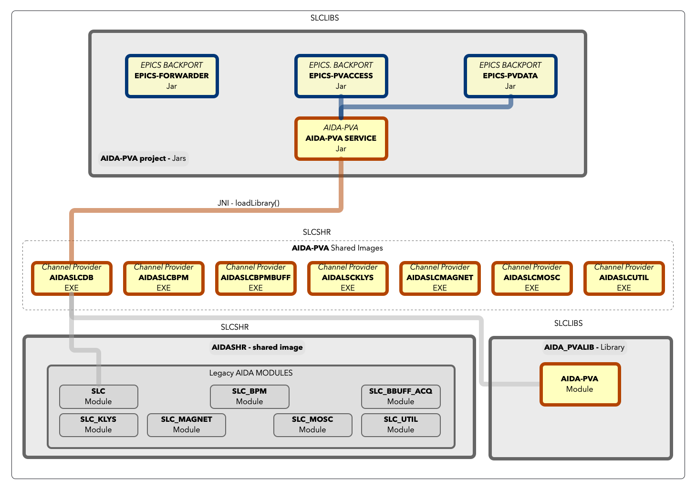

# Writing an AIDA-PVA Service - Programmers Reference Manual

## Overview

`AIDA-PVA` provides a framework for `Channel Providers` to service requests for `Channels` that they support.
A `Channel` is an EPICS term, co-opted by AIDA-PVA, to mean _any identifiable source of data in
any `Channel Data Source` on the `SLAC Network`_. 

All AIDA-PVA Channels use a standard notation: 

    channel := part ':' second_part [ ':' other_part ... ]
a set of at least two parts separated by colons.  

_The framework has five main features._

* **Routing** client `Channel Requests` using EPICS' `PVAccess`, through the `AIDA-PVA Service` to the
  registered Channel Provider endpoints.
* Bi-directionally **Marshalling, Transporting, and Converting** arguments and data.
* Raising, and **Propagating Exceptions** throughout the framework, back to clients, and on to logging services
* Providing **AIDA-PVA utilities** that implement the boilerplate functions required to service channel requests
* Providing access to `AIDASHR`, to allow Channel Provider code to leverage legacy **Channel Provider Modules** for
  accessing devices, databases and other services from `Channel Data Sources` on the `SLAC Network`.

## How it works

1. When your Channel Provider starts up, the `AIDA-PVA` process that started it will read the `CHANNELS.YML` file that
   you've provided to determine which EPICS search requests it should respond to.
2. Subsequently, when clients send requests containing references to one of those **Channels**,
3. and EPICS seach request is propagated across the EPICS network
4. The `EPICS Forwarder` that is constantly listening for requests will forward it to all the AIDA-PVA processes running
   in VMS.
5. When your AIDA-PVA recognizes the channel and the request it will respond positively to the search request on your
   behalf,
6. Opening a direct communications channel to the client once the client accepts the response.
7. Now the AIDA-PVA will ask your Channel Provider to service the request and will return the results you give it.
8. By leveraging services in the AIDA-PVA module and legacy Channel Provider module in AIDASHR to access the Channel
   Data source, you can service those requests.


As an AIDA-PVA Service Provider writer you will be responsible for:

* Creating the AIDA-PVA Channel Provider Shared Library.
* Creating the initial `CHANNELS.YML` file that identifies and describes all the AIDA-PVA `Channels` that
  your Channel Provider will support.

### Components

* The **Provider Code** => produces `SLC<provider_name>.EXE` shared Library
* The **AIDA-PVA** - `aida-pva.jar`, that loads the Provider Code
* The **AIDA-PVA Module** - extensions to AIDASHR that provide helper functions for the Provider Code
* The **back-ported EPICS 7** libraries
    * `epics-pvaccess.jar`
    * `epics-pvdata.jar `
* The **EPICS forwarder** - `epics-forwarder.jar`

## Topology
As a Native Channel Provider programmer you will be primarily concerned with creating a shared library for SLCLIBS.
Each Native Channel Provider is a distinct library in SLCLIBS.  The proceddure to create one will compile up 
your C source file(s) and link them with AIDASHR to resolve the calls you make to functions in AIDA-PVA Module and 
in any AIDA-MODULEs that you need to implement your service. 

AIDA-PVA Jar is the process that will launch your shared library, calling the entrypoints you implement as needed.



## Normative Types
The clients will be expecting data that corresponds to the Normative Type standard.  
The framework does all the work representing your data as Normative Types.  You don't have to know, or do, anything
for this.  For reference only see [Normative Types](NormativeTypes.md)

## Supported Data Types
What you will do is use primitive data types in most cases and some simple AIDA-PVA typedefs where 
required.  In all cases there are helper functions to help you marshall and unmarshal your data.

see [Supported Data Types](SuportedTypes.md)

# Implementation
This section details the steps you need to follow for implementing your Service.

## Overview
There are three things to write before you can compile, run, test and deploy your service. Here

* Write a `CHANNELS.YML` file.
* Create a Channel Provider - one C file and optionally one header file.
* Create some tests using the test framework aida-pva-tests.

## Creating an CHANNELS.YML file

Definition of the channels supported by your Channel Service Provider is done in the `CHANNELS.YML` file. If you're
unfamiliar with the YAML (Yet Another Markup Language) format you
can [familiarise yourself with the syntax and format](https://www.redhat.com/sysadmin/yaml-beginners) before reading
further.

Please read [documentation on the CHANNELS.YML](Channels.md) file for information on how to create one. An example
configuration file is shown below:

```yaml
!!edu.stanford.slac.aida.lib.model.AidaProvider
# Sample Channel Provider
id: 42
name: Channel Provider
description: Your Channel Provider
configurations:
  - name: Boolean Getter Channels
    getterConfig:
      type: BOOLEAN
    channels:
      - AIDA:CHAN:*:INT
      - AIDA:CHAN:P01:BOOL
  - name: Float Getter Channels
    getterConfig:
      type: FLOAT
      arguments:
        - X
        - Y
    channels:
      - AIDA:CHAN:???:FLT
  - name: String Array Getter Channels
    getterConfig:
      type: STRING_ARRAY
    channels:
      - AIDA:CHAN:P01:STRA
  - name: Table Getter Channels
    getterConfig:
      type: TABLE
      fields:
        - name: isActive
          label: "Device is active?"
          description: "Device activity status.  Active if true"
        - name: mode
          label: "Device Mode Code"
          description: "Device mode code"
    channels:
      - AIDA:CHAN:P01:TABL
  - name: Void Setter Channels
    setterConfig:
      type: VOID
    channels:
      - AIDA:CHAN:S01:VOID
  - name: Table Setter Channels
    setterConfig:
      type: TABLE
      fields:
        - name: status
          label: "Result of setting value"
          description: "True if the value was set successfully"
    channels:
      - AIDA:CHAN:S01:DEFA
      - AIDA:CHAN:S01:TABL
```

## Creating a Channel Provider

You have to implement all the endpoints defined in aida_pva_api.h.  
Thanks to the AIDA-PVA Module doing this is easy.  
There is only one file to write and here is the code template that stubs out the endpoints using provided macros.
aida_pva_api.h also defines the "STUB" macros you will use for the endpoints that you don't need to implement.

```c
#include "aida_pva.h"

// API Stubs
REQUEST_STUB_CHANNEL_CONFIG
REQUEST_STUB_BOOLEAN
REQUEST_STUB_BYTE
REQUEST_STUB_SHORT
REQUEST_STUB_INTEGER
REQUEST_STUB_LONG
REQUEST_STUB_FLOAT
REQUEST_STUB_DOUBLE
REQUEST_STUB_STRING
REQUEST_STUB_BOOLEAN_ARRAY
REQUEST_STUB_BYTE_ARRAY
REQUEST_STUB_SHORT_ARRAY
REQUEST_STUB_INTEGER_ARRAY
REQUEST_STUB_LONG_ARRAY
REQUEST_STUB_FLOAT_ARRAY
REQUEST_STUB_DOUBLE_ARRAY
REQUEST_STUB_STRING_ARRAY
REQUEST_STUB_TABLE
SET_STUB_VOID
SET_STUB_TABLE

/**
 * Initialise the service
 * @param env to be used to throw exceptions using aidaThrow() and aidaNonOsExceptionThrow()
 * @throws ServerInitialisationException if the service fails to initialise
 */
void aidaServiceInit(JNIEnv* env)
{
	printf("My Service Provider Initialised\n");
}
```

For any of the types that your Channel Provider will support you need to remove the corresponding "STUB" line and
replace it with the implementation. Here are the endpoints from which to choose.  For full prototypes click the links or, see aida_pva_api.h. 
- Initialisation
  - aidaServiceInit() - _Called by the AIDA-PVA framework on startup to initialise the Channel Provider._
- Scalar Getters
  - aidaRequestBoolean() - _Called by the AIDA-PVA framework when a boolean value is requested._
  - aidaRequestByte() - _Called by the AIDA-PVA framework when a byte value is requested._
  - aidaRequestShort() - _Called by the AIDA-PVA framework when a short value is requested._
  - aidaRequestInteger() - _Called by the AIDA-PVA framework when a integer value is requested._
  - aidaRequestLong() - _Called by the AIDA-PVA framework when a long value is requested._
  - aidaRequestFloat() - _Called by the AIDA-PVA framework when a float value is requested._
  - aidaRequestDouble() - _Called by the AIDA-PVA framework when a double value is requested._
  - aidaRequestString() - _Called by the AIDA-PVA framework when a string value is requested._
- Scalar Array Getters
  - aidaRequestBooleanArray() - _Called by the AIDA-PVA framework when a boolean array is requested._
  - aidaRequestByteArray() - _Called by the AIDA-PVA framework when a byte array is requested._
  - aidaRequestShortArray() - _Called by the AIDA-PVA framework when a short array is requested._
  - aidaRequestIntegerArray() - _Called by the AIDA-PVA framework when a integer array is requested._ 
  - aidaRequestLongArray() - _Called by the AIDA-PVA framework when a long array is requested._ 
  - aidaRequestFloatArray() - _Called by the AIDA-PVA framework when a float array is requested._ 
  - aidaRequestDoubleArray() - _Called by the AIDA-PVA framework when a double array is requested._ 
  - aidaRequestStringArray() - _Called by the AIDA-PVA framework when a string array is requested._ 
  - aidaRequestTable() - _Called by the AIDA-PVA framework when a table of data is requested._
- Setters
  - aidaSetValue() - _Called by the AIDA-PVA framework when a request to set a value is made._
  - aidaSetValueWithResponse() - _Called by the AIDA-PVA framework when a request to set a value and return a table is made._
  
### AIDA-PVA Module

The AIDA-PVA Module is a module contained in the `AIDASHR` shared library that provides all the boilerplate
functionality needed to respond to **get** and **set** requests, marshal and unmarshal objects, and simple types across the
JNI boundary and between your Channel Provider and VMS and the Channel Provider module in `AIDASHR`.

#### Functions provided in AIDA-PVA Module
The AIDA-PVA Module contains the following functions that you should use to process arguments, extract parts of URIs, create tables, allocate memory and raise exceptions:
- Argument Processing
  - ascanf() 
  - avscanf()
- URI and PMU Handling
  - groupNameFromUri() - _Get the Display group name from a URI._
  - pmuFromDeviceName() - _Get primary, micro and unit from a device name._
  - pmuStringFromUri() - _Get the pmu part of a URI._
  - secnFromUri() - _Get secondary from pseudo secondary (containing a colon) number from URI._
  - secondaryFromUri() - _Get secondary from URI._
  - uriLegacyName() - _Convert the given URI to the legacy AIDA name for low level functions that still require it that way._
  - uriToSlcName() - _Convert all URIs to slac names before making queries._
- Table Management
  - tableCreate() - _Make a Table for return to client._
  - tableAddStringColumn() - _Add a String column to the given Table._
  - tableAddFixedWidthStringColumn() - _Add fixed-width string data to a column in the given Table._
  - tableAddSingleRowBooleanColumn() - _Add a boolean column to a Table with only one row._
  - tableAddSingleRowByteColumn() - _Add a byte column to a Table with only one row._
  - tableAddSingleRowShortColumn() - _Add a short column to a Table with only one row._
  - tableAddSingleRowIntegerColumn() - _Add a integer column to a Table with only one row._
  - tableAddSingleRowLongColumn() - _Add a long column to a Table with only one row._
  - tableAddSingleRowFloatColumn() - _Add a float column to a Table with only one row._
  - tableAddSingleRowDoubleColumn() - _Add a double column to a Table with only one row._
  - tableAddSingleRowStringColumn() - _Add a string column to a Table with only one row._
- String Handling
  - endsWith() - _Check if a string ends with another string._
  - startsWith() - _Check if a string starts with another string._
- Memory Management
  - allocateMemory() - _Allocate memory and copy the source to it if specified._
  - releaseArguments() - _Free up any memory allocated for the given Arguments._
  - releaseArray() - _Free up any memory allocated the given scalar Array._
  - releaseStringArray() - _Free up any memory allocated for a StringArray._
  - releaseTable() - _Free up any memory allocated for the given table._
  - releaseValue() - _Release all allocated memory in the given Value._
- Exception Handling:
  - aidaThrow() - _To log any exceptions and throw back to java._
  - aidaThrowNonOsException() - _To log any non-OS exceptions and throw back to java._

#### Macros
There are a bunch of Macros that are provided with the AIDA-PVA Module, in the following header files:
- aida_pva_convert.h
  - CONVERT_TO_VMS_FLOAT() - _Convert a single float or an array of floats from ieee to VMS format._
  - CONVERT_TO_VMS_DOUBLE() - _Convert a single double or an array of doubles from ieee to VMS format._
  - CONVERT_FROM_VMS_FLOAT() - _Convert a single float or an array of floats from VMS to ieee format._
  - CONVERT_FROM_VMS_DOUBLE() - _Convert a single double or an array of doubles from VMS to ieee format._
- aida_pva_exceptions.h
  - ON_EXCEPTION_RETURN_()
    - _check to see if an exception has been raised,_ 
    - _return the given value._
  - ON_EXCEPTION_FREE_MEMORY_AND_RETURN_()
    - _check to see if an exception has been raised,_ 
    - _free local all tracked memory, and_ 
    - _return the given value._
  - ON_EXCEPTION_RETURN_VOID()
    - _check to see if an exception has been raised,_ 
    - _return void._
  - ON_EXCEPTION_FREE_ARGUMENTS_AND_RETURN_()
    - _check to see if an exception has been raised,_ 
    - _free local Arguments variable `arguments`, and_ 
    - _return the given value._
  - ON_EXCEPTION_FREE_ARGUMENTS_AND_RETURN_VOID()
    - _check to see if an exception has been raised,_ 
    - _free local Arguments variable `arguments`, and_ 
    - _return void._
  - ON_EXCEPTION_FREE_STRING_AND_ARGS_AND_RETURN_() 
    - _check to see if an exception has been raised,_ 
    - _free local char * variable `string`,_ 
    - _free local Arguments variable `arguments`, and_ 
    - _return the given value._
  - ON_EXCEPTION_FREE_STRING_AND_RETURN__()
    - _Check to see if an exception has been raised, 
    - free local char * variable `string`,_ 
    - _free local Arguments variable `arguments`, and_ 
    - _return the given value._
  - ON_EXCEPTION_FREE_ARRAY_AND_ARGS_AND_RETURN_()
    - _Check to see if an exception has been raised,_ 
    - _free local Array variable `array`,_ 
    - _free local variable `arguments`, and_ 
    - _return the given value._
  - ON_EXCEPTION_FREE_STRING_ARRAY_AND_ARGS_AND_RETURN_NULL()
    - _Check to see if an exception has been raised,_ 
    - _free local StringArray variable `array`,_ 
    - _free local variable `arguments`, and_ 
    - _return the given value._
  - ON_EXCEPTION_FREE_TABLE_AND_ARGS_AND_RETURN_()
    - _Check to see if an exception has been raised,_ 
    - _free local Table variable `table`,_ 
    - _free local Arguments variable `arguments`, and_ 
    - _return the given value._
  - ON_EXCEPTION_FREE_VALUE_AND_ARGS_AND_RETURN_VOID()
    - _Check to see if an exception has been raised,_ 
    - _free local Value variable `value`,_ 
    - _free local Arguments variable `arguments`, and_ 
    - _return void._
  - ON_EXCEPTION_FREE_VALUE_AND_ARGS_AND_RETURN_()
    - _check to see if an exception has been raised,_ 
    - _local Value variable `value`,_ 
    - _free local Arguments variable `arguments`, and_ 
    - _return the given value._
  - SPRINTF_ERROR_FREE_MEMORY_AND_RETURN_()
    - _Format an error message,_ 
    - _throw it in an exception,_,
    - _free any allocated memory and_ 
    - _return the error code._
  - PRINT_ERROR_FREE_MEMORY_AND_RETURN_()
    - _Throw error message in an exception,_ 
    - _free any allocated memory and_ 
    - _return the error code._
  - UNSUPPORTED_ARRAY_REQUEST() - _Throw unsupported channel exception and return a blank array._
  - UNSUPPORTED_STRING_ARRAY_REQUEST() - _Throw an unsupported channel exception and return an empty string array._
  - UNSUPPORTED_TABLE_REQUEST() - _Throw an unsupported channel exception and return an empty table._
- aida_pva_memory.h
  - TRACK_ALLOCATED_MEMORY() - _Create tracking variables so that memory can be freed with FREE_MEMORY()_.
  - TRACK_MEMORY() - _Register this newly allocated memory so that it will be freed by FREE_MEMORY()_
  - ALLOCATE_MEMORY() - _Allocate Memory with checking_
  - ALLOCATE_AND_COPY_MEMORY() - _Allocate memory and set its contents to the given buffer of given size_
  - ALLOCATE_STRING() - _Allocate memory for a string and copy the given string into this allocated space_
  - ALLOCATE_FIXED_LENGTH_STRING() - _Allocate space for a fixed length string and copy data from the given string into the newly allocated space_
  - ALLOCATE_MEMORY_AND_ON_ERROR_RETURN_() - _Allocate memory and on error return the given value_
  - ALLOCATE_STRING_AND_ON_ERROR_RETURN_() - _Allocate memory for a string and copy the given string into this allocated space and on error return the given value_
  - ALLOCATE_STRING_AND_ON_ERROR_RETURN_VOID() - _Allocate memory for a string and copy the given string into this allocated space and on error return void_
  - ALLOCATE_FIXED_LENGTH_STRING_AND_ON_ERROR_RETURN_VOID() - _Allocate memory for a fixed length string and copy the given string into this allocated space and on error return void_
  - ALLOCATE_AND_TRACK_FIXED_LENGTH_STRING_AND_ON_ERROR_RETURN_() - _Allocate memory for a fixed length string and copy the given string into this allocated space and on error return the given value_
  - ALLOCATE_AND_TRACK_MEMORY_AND_ON_ERROR_RETURN_() - _Allocate memory and add it to the tracked memory list so that it can be freed automatically later returning the given value on error_
  - ALLOCATE_COPY_AND_TRACK_MEMORY_AND_ON_ERROR_RETURN_() - _Allocate and track memory and set its contents to the given buffer of given size returning the given value on error_
  - ALLOCATE_COPY_AND_TRACK_STRING_AND_ON_ERROR_RETURN_() - _Allocate and track memory and set its contents to the given string returning the given value on error_
  - FREE_TRACKED_MEMORY() - _Free any tracked memory_
- aida_pca_uri.h
  - PMU_STRING_FROM_URI() - _Get a PMU (Primary-Micro-Unit) string from the supplied URI_
  - TO_SLC_NAME() - _Get a slcName from the provided uri and store it in the given variable name_
  - TO_LEGACY_NAME() - _Get a legacy AIDA name from the provided uri and store it in the given variable name_
  - TO_DGROUP() - _Get a display group name from the provided uri and store it in the given variable name_

You don't have to load all of these header files individually, just:
```c
#include "aida_pva.h"
```

#### Types
There are some special data types that you'll need to be able to get Arguments in the endpoint implementation, and to return 
package up data for return.

These are defined in aida_pva_types.h but are also automatically loaded by including aida_pva.h.
- Type - _Types of return value, or arguments see [Supported Types Documentation](SupportedTypes.md)_
- Arguments - _All the arguments passed from the request to the Native Channel Provider_
- Argument - _A single request argument_
- Value - _Contents of the VALUE argument_ 
- Table - _Represents a TABLE to be returned to the client_ 
- Array - _Represents an Array of scalar types to be returned to the client_ 
- StringArray - _Represents an Array of string type to be returned to the client_

## Building your Shared Service

## Writing and running tests

## Deploying a Service Provider
See [Deploying a Service Provider Documentation](DevOps.md) for imformation on how to deply your newly built Service Provider.


## Reference Service

AIDA-PVA provides a reference service implementation. You can explore this code to help you understand how to implement 
your Service Provider.  The code is available here: https://github.com/

You can use this to verify your configuration before deploying
your service. The reference implementation provides the following channels:

- `AIDA:SAMPLE:DEVICE01:attribute01` - simple boolean
- `AIDA:SAMPLE:DEVICE01:attribute02` - simple byte
- `AIDA:SAMPLE:DEVICE01:attribute03` - simple short
- `AIDA:SAMPLE:DEVICE01:attribute04` - simple integer
- `AIDA:SAMPLE:DEVICE01:attribute05` - simple long
- `AIDA:SAMPLE:DEVICE01:attribute06` - simple float
- `AIDA:SAMPLE:DEVICE01:attribute07` - simple double
- `AIDA:SAMPLE:DEVICE01:attribute08` - simple string
- `AIDA:SAMPLE:DEVICE01:attribute11` - array of booleans
- `AIDA:SAMPLE:DEVICE01:attribute12` - array of bytes
- `AIDA:SAMPLE:DEVICE01:attribute13` - array of shorts
- `AIDA:SAMPLE:DEVICE01:attribute14` - array of integers
- `AIDA:SAMPLE:DEVICE01:attribute15` - array of longs
- `AIDA:SAMPLE:DEVICE01:attribute16` - array of floats
- `AIDA:SAMPLE:DEVICE01:attribute17` - array of doubles
- `AIDA:SAMPLE:DEVICE01:attribute18` - array of strings
- `AIDA:SAMPLE:DEVICE01:attribute20` - NT-TABLE : table normative-type

Each simple scalar channel additionally takes an optional parameter to showcase how parameters are parsed and used.

## Testing your service

To test the service you can use some of the EPICS utils already deployed in SLAC.

### Using pvcall

From a different host ...

```shell
bash-4.1$ source /afs/slac/g/lcls/epics/setup/epicsenv-7.0.2-1.1.bash
bash-4.1$ export EPICS_PVA_ADDR_LIST=mccdev.slac.stanford.edu
bash-4.1$ pvcall 'AIDA:SAMPLE:DEVICE01:attribute01'
true
bash-4.1$ pvcall 'AIDA:SAMPLE:DEVICE01:attribute02'
2
bash-4.1$ pvcall 'AIDA:SAMPLE:DEVICE01:attribute03'
3
bash-4.1$ pvcall 'AIDA:SAMPLE:DEVICE01:attribute04'
4
bash-4.1$ pvcall 'AIDA:SAMPLE:DEVICE01:attribute05'
5
bash-4.1$ pvcall 'AIDA:SAMPLE:DEVICE01:attribute06'
6.6
bash-4.1$ pvcall 'AIDA:SAMPLE:DEVICE01:attribute07'
7.7
bash-4.1$ pvcall 'AIDA:SAMPLE:DEVICE01:attribute08'
eight
bash-4.1$ pvcall 'AIDA:SAMPLE:DEVICE01:attribute10'
Timeout
bash-4.1$ pvcall 'AIDA:SAMPLE:DEVICE01:attribute11'
[true]
bash-4.1$ pvcall 'AIDA:SAMPLE:DEVICE01:attribute12'
[12]
bash-4.1$ pvcall 'AIDA:SAMPLE:DEVICE01:attribute13'
[13]
bash-4.1$ pvcall 'AIDA:SAMPLE:DEVICE01:attribute14'
[14]
bash-4.1$ pvcall 'AIDA:SAMPLE:DEVICE01:attribute15'
[15]
bash-4.1$ pvcall 'AIDA:SAMPLE:DEVICE01:attribute16'
[16.6]
bash-4.1$ pvcall 'AIDA:SAMPLE:DEVICE01:attribute17'
[17.7]
bash-4.1$ pvcall 'AIDA:SAMPLE:DEVICE01:attribute18'
["eighteen"]
bash-4.1$ pvcall 'AIDA:SAMPLE:DEVICE01:attribute20'

isActive mode status nbufs memory sensor hisensor message
    true    2      3     4      5    6.6      7.7   eight
bash-4.1$
```

An example of using parameters follows. Note that for all the scalar types in the reference implementation an optional
argument `x` is available. If present it will have the following effects on the results.

- `AIDA:SAMPLE:DEVICE01:attribute01` - simple boolean.  `x` will be combined by logical `AND` with default value
- `AIDA:SAMPLE:DEVICE01:attribute02` - simple byte.  `x` will be combined by bitwise-or `|` with default value
- `AIDA:SAMPLE:DEVICE01:attribute03` - simple short.  `x` will be combined by sum `+` with default value
- `AIDA:SAMPLE:DEVICE01:attribute04` - simple integer.  `x` will be combined by sum `+` with default value
- `AIDA:SAMPLE:DEVICE01:attribute05` - simple long.  `x` will be combined by sum `+` with default value
- `AIDA:SAMPLE:DEVICE01:attribute06` - simple float.  `x` will be combined by multiplication `*` with default value
- `AIDA:SAMPLE:DEVICE01:attribute07` - simple double.  `x` will be combined by multiplication `*` with default value
- `AIDA:SAMPLE:DEVICE01:attribute08` - simple string.  `x` will be combined by concatenation with default value

```shell
bash-4.1$ source /afs/slac/g/lcls/epics/setup/epicsenv-7.0.2-1.1.bash
bash-4.1$ export EPICS_PVA_ADDR_LIST=mccdev.slac.stanford.edu
bash-4.1$ pvcall 'AIDA:SAMPLE:DEVICE01:attribute01' x=true
true
bash-4.1$ pvcall 'AIDA:SAMPLE:DEVICE01:attribute01' x=false
false
bash-4.1$ pvcall 'AIDA:SAMPLE:DEVICE01:attribute01' x=1
true
bash-4.1$ pvcall 'AIDA:SAMPLE:DEVICE01:attribute02' x=0x0f
2
bash-4.1$ pvcall 'AIDA:SAMPLE:DEVICE01:attribute02' x=0x00
0
bash-4.1$ pvcall 'AIDA:SAMPLE:DEVICE01:attribute02' x=6
2
bash-4.1$ pvcall 'AIDA:SAMPLE:DEVICE01:attribute03' x=3
6
bash-4.1$ pvcall 'AIDA:SAMPLE:DEVICE01:attribute04' x=4
8
bash-4.1$ pvcall 'AIDA:SAMPLE:DEVICE01:attribute05' x=5
10
bash-4.1$ pvcall 'AIDA:SAMPLE:DEVICE01:attribute06' x=2
13.2
bash-4.1$ pvcall 'AIDA:SAMPLE:DEVICE01:attribute07' x=0.5
3.85
bash-4.1$ pvcall 'AIDA:SAMPLE:DEVICE01:attribute08' x=Value
Value: eight

```
