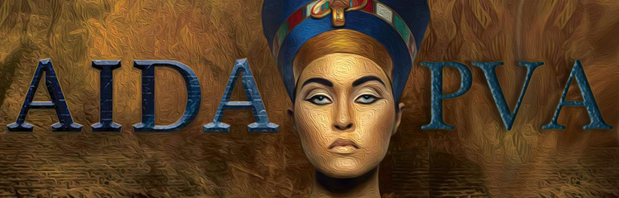

# AIDA-PVA

_AIDA-PVA_ is the latest version of the _AIDA_ (**Accelerator Independent Data Access**) framework. AIDA-PVA differs from AIDA classic by leveraging _EPIC 7's_
_PVAccess_ (**PVA**) communications layer to transport the requests to AIDA-PVA servers and the responses back to AIDA-PVA clients.

AIDA-PVA offers unprecedented ease of use as it leverages the EPICS connection protocol, PVAccess, to standardize its namespace
and streamline operations.  It is easy to implement new Channel Providers in this framework due to the new _AIDA-PVA Module_ in 
`AIDA_PVALIB` which removes the need for boilerplate code so developers can concentrate on the job of communicating with the back end
systems.  The capabilities and configurability of the framework have been extended, with greater flexibility in the types and complexity of 
arguments that can be passed, as well as dynamic channel configuration with pattern matching.  The integration with EPICS will allow clients
that already use EPICS to leverage existing code to allow AIDA-PVA to coexist with other EPICS data sources.

This version of AIDA involves a complete rewrite of the AIDA framework from the ground up, and notably includes some
changes to AIDA norms and operation.  For example, the typical `IN:STAN:CE//ATTRIBUTE` tuple that was used to address 
devices in previous versions has been replaced with an addressing scheme that is fully aligned with EPICS. 
Making requests has been greatly simplified, and there is a new client library . 

In order for the AIDA-PVA framework to function on legacy backend systems - including OpenVMS Alpha V8.3, with Java 1.5 and C98 -
EPICS 7 had to be back-ported to these operating systems and JVM versions.  As part of that effort a new component - the EPICS Forwarder - 
needed to be created to work around some platform limitations.

Finally, the AIDA service providers have been reimplemented, and rebranded AIDA-PVA _Channel Providers_,  in this new framework and 
there are significant changes, in the way they integrate with the Legacy AIDA Modules ( in `AIDASHR`), in the way they are deployed, and 
in the way they are launched.

For more information:

* [AIDA-PVA - User Guide](1_00_User_Guide.md)
* [AIDA-PVA - Channel Provider Programmer's Reference](2_0_Channel_Provider_Programmers_Reference.md)
* [AIDA-PVA - Platform Technical Reference](3_0_Platform_Technical_Reference.md)
* [AIDA-PVA - A DevOps Guide](4_0_A_DevOps_Guide_to_AIDA_PVA.md)

