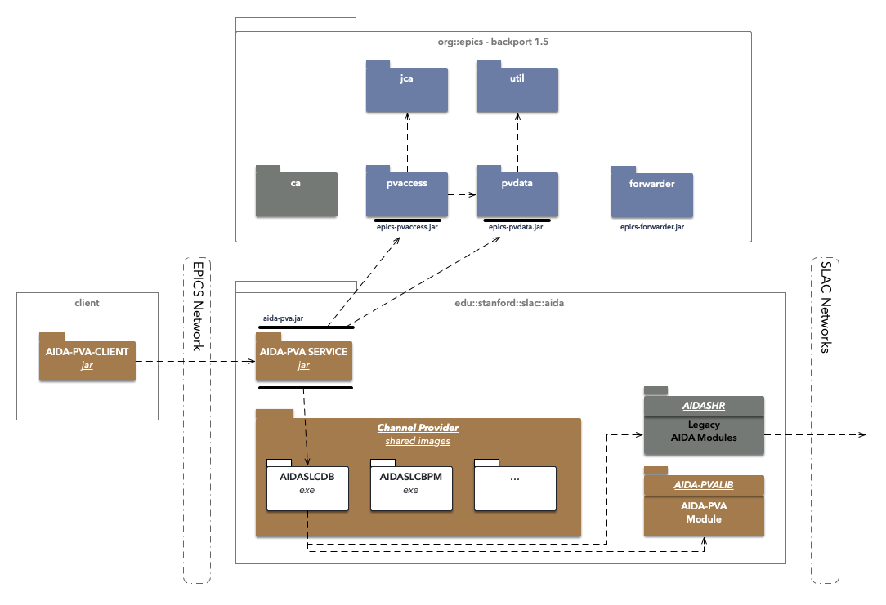

# Aida-PVA

AIDA-PVA is the latest version of the AIDA framework. AIDA-PVA differs from AIDA classic by leveraging EPIC 7's
pv-access communications layer to transport the requests to AIDA-PVA servers and the responses back to AIDA-PVA clients.

AIDA-PVA offers unprecedented ease of use as it leverages the EPICS connection protocol, PVAccess.  It is easy to implement
new Providers as the framework takes removes the need for any boilerplate code.  The capabilities and configurability of the framework
have been extended with greater flexibility in the types and complexity of arguments that can be passed, as well as 
dynamic channel configuration with pattern matching.  The integration with EPICS will allow clients that 
already use EPICS to leverage existing code to have AIDA-PVA access coexist with other EPICS data sources.

This version of AIDA involves a complete rewrite of the AIDA framework from the ground up, and notably includes some
changes to the AIDA norms and operations.  The typical `INSTANCE//ATTRIBUTE` tuple that was used to address 
devices in previous versions has been replaced with an addressing scheme that is fully compatible with EPICS. 
Making requests hase been simplified, although there are no longer any client libraries - example code not withstanding. 

In order for the AIDA-PVA framework to function on legacy systems including OpenVMS Alpha V8.3 with Java 1.5 and C98,
EPICS 7 had to be back-ported to these operating systems and JVM versions.  As part of that effort a new component - the EPICS Forwarder - 
needed to be created to work around some platform limitations.

Finally, the AIDA service providers have been reimplemented, and rebranded AIDA-PVA `Native Channel Providers`,  in this new framework and 
there are significant changes in the way they integrate with the Native Provider Modules in AIDASHR, and are deployed and launched.

For more information:

* [AIDA-PVA User Guide](UserGuide.md)
* [Writing an AIDA-PVA Service - Programmer's Reference Manual](ProviderReference.md)
* [AIDA-PVA Internals - Technical Reference Manual](Reference.md)
* [Deploying AIDA-PVA - A DevOps Guide](DevOps.md)

