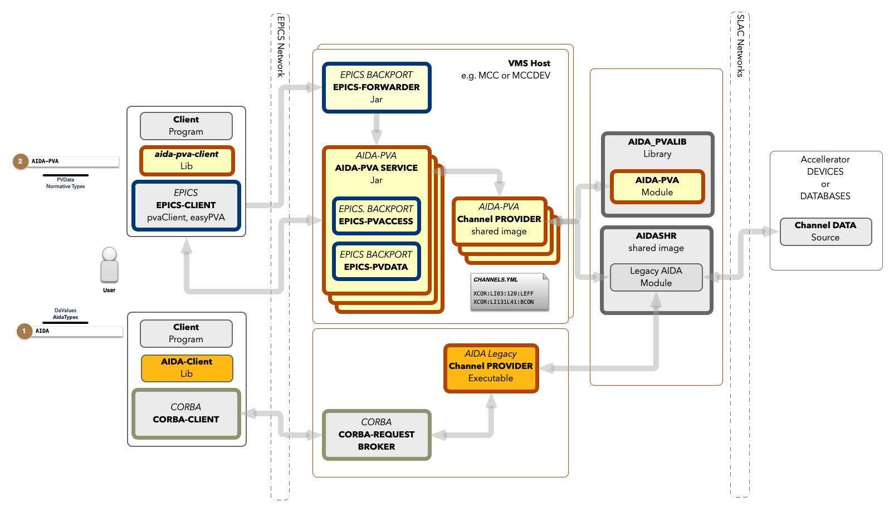

# User Guide to AIDA-PVA

This is the guide to using the AIDA-PVA system at Stanford National Laboratory. AIDA is the Accelerator Integrated Data
Access framework developed by SLAC in the early 2000s. AIDA-PVA is the latest version developed in the early 20s.

If you are already familiar AIDA you can jump to [Differences Between AIDA and AIDA-PVA](UserGuide4AidaUsers.md) without
reading all of the following sections. If you are already familiar with EPICS and just want to know how you can use it
to access AIDA-PVA data providers then check out [EPICS and AIDA-PVA](UserGuide4EpicsUsers.md).   
If you're new to both AIDA and EPICS then grab a coffee, and strap in, this may take some time :)

# Overview 
`AIDA-PVA` is the successor to AIDA a system for providing programmatic access to SLC Control System devices, data and services.  
Since its introduction in 2002 it has been used in other laboratories in the US and around the world.  It 
provides a naming convention to address all devices and their attributes, a way of specifying arguments for remote procedure calls 
and obtaining results in any format, including rich formats with including metadata.  Finally, it provides security, logging and 
reliability to allow it to be used in a variety of applications from logging, and monitoring, to modeling and control.

AIDA-PVA supersedes AIDA, but both AIDA and AIDA-PVA now co-exist, sharing many of the low level AIDA Native Provider Modules from AIDASHR, so
results obtained by using either version remain consistent.

Legacy AIDA uses CORBA to transport requests to the Data Providers, while AIDA-PVA uses EPICS-7's `PVAccess` mechanism.  
EPICS has become a staple for laboratories around the world, and leveraging its features allows scientists, and engineers
who are already familiar with programming on EPICS, to access AIDA-PVA data providers with very little effort.

# Components
As you can see clients using AIDA-PVA will look like any any other EPICS client.  AIDA-PVA data providers are implemented
inside the EPICS framework and so will appear to EPICs clients as just another EPICS service.  
In order to access an AIDA-PVA Provider you'll select a Channel Name that the Provider has published.  The EPICS framework
will find the service that serves requests for that Channel and will direct your request to it.

The AIDA-PVA Provider is made up of three parts 
 - there is the **AIDA-PVA jar** which is the runner that starts the Provider Process, 
 - the **Aida-PVA Module**, a glue that connects to the Native Chanel Provider shared library to the Channel Provider Module.
 - and, the **Native Chanel Provider** code itself.
 
# New naming conventions

In AIDA names consist of `INSTANCE//ATTRIBUTE` where `INSTANCE` can have other sub-parts typically delimited by colons. 
Though the `ATTRIBUTE` part is typically a single name, in rare cases it is also made up of parts, delimited by colons.

In AIDA-PVA names have the same components but are all separated by colons so `PRIM:MICR:UNIT//ATTR` becomes `PRIM:MICR:UNIT:ATTR` 
in AIDA-PVA.  In this way AIDA-PVA allows accessing services with the same naming conventions as EPICS.

Even though AIDA-PVA has an updated naming scheme to align with EPICs it is backwards compatible with AIDA and allows legacy style
names to be used.

# Call semantics
## Request
Requests (previously known as get in AIDA) request data from the specified Channel.  The requests can take optional arguments which are
simple name/alue pairs.  The value can be either a simple string, a scalar value, or some json that allows specifying arrays,
and objects.  The value can be set programmatically to allow complex types and arrays to be specified in any way required.
The interpretation of these arguments is deferred until the Native Channel Provider reads them - except `TYPE` and `VALUE` explained below.  
Each provider publishes the nanes of the arguments they accept for each of Channels they support, and describe the names, formats, requirements, defaults, and acceptable values of the parameters they support.

EPICS allows synchronous and Asynchronous call semantics so either can be used with AIDA-PVA.  The only EPICS protocol AIDA-PVA implements is RPC.

If an exception occurs in the Channel Provider Module, the Channel Provider Shared Library, or AIDA-PVA jar, the Exception will be propagated back up to the caller, and logged using the configured logger.

## Set and the VALUE argument
AIDA-PVA allows you to `set` values associated with channels.  These special requests are known as Setters.  To select 
a Setter request simply add an argument called `VALUE`.  All Setters have a value which is the value that the
Process Variable will be set to.  Other arguments can be specified as described by the provider.

## TYPE
When you need to specify the type of the response you can set the TYPE argument to one of the available types.  
e.g. `TYPE=FLOAT`
  * Scalar Types
    * {@link BOOLEAN}            to return a boolean
    * {@link BYTE}               to return a byte
    * {@link SHORT}              to return a short
    * {@link INTEGER}            to return an integer
    * {@link LONG}               to return a long
    * {@link FLOAT}              to return a float
    * {@link DOUBLE}             to return a double
    * {@link STRING}             to return a string
  * Scalar Array Types
    * {@link BOOLEAN_ARRAY}      to return a boolean array
    * {@link BYTE_ARRAY}         to return a byte array
    * {@link SHORT_ARRAY}        to return a short array
    * {@link INTEGER_ARRAY}      to return an integer array
    * {@link LONG_ARRAY}         to return a long array
    * {@link FLOAT_ARRAY}        to return a float array
    * {@link DOUBLE_ARRAY}       to return a double array
    * {@link STRING_ARRAY}       to return a string array
  * Tables
    * {@LINK TABLE}              to return an NT/TABLE

## TABLE_TYPE
If supported you can specify the type for rows in a table by providing the `TABLE_TYPE` argument.  The 
value can be any Scalar or Scalar Array type. eg. `TABLE_TYPE=FLOAT` for the SLC data provider will select a float for 
single row in the single column table returned from a request.

# Service Address 
In EPICs `//` is used to delimit the optional host or service name from the PV (Process Variable).  e.g. ...

# Using AIDA-PVA
## Important EPICS Environment variables
## From the command line
## From Java
## From Matlab
## From ...

