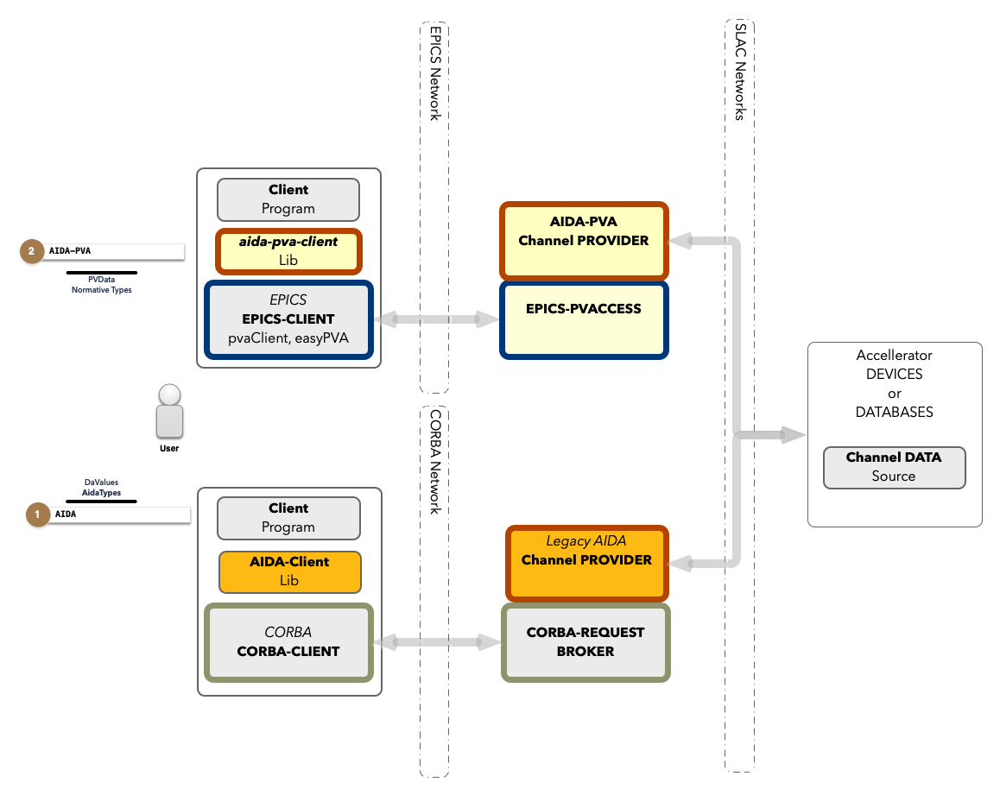

@tableofcontents
# Differences between AIDA and AIDA-PVA

## Overview

AIDA-PVA is the successor to AIDA a system for providing programmatic access to SLC Control System devices, data and services.
Since its introduction in 2002 it has been used in other laboratories in the US and around the world. It provides a naming convention to address all devices and their attributes, a way of specifying arguments for remote procedure calls and obtaining results in any format, including rich formats with including metadata. Finally, it provides security, logging and reliability to allow it to be used in a variety of applications from logging, and monitoring, to modeling and control.

AIDA-PVA supersedes AIDA, but both AIDA and AIDA-PVA now co-exist, sharing many of the low level AIDA Native Provider Modules from AIDASHR, so results obtained by using either version remain consistent.

Legacy AIDA uses CORBA to transport requests to the Data Providers, while AIDA-PVA uses EPICS-7's PVAccess mechanism.
EPICS has become a staple for laboratories around the world, and leveraging its features allows scientists, and engineers who are already familiar with programming on EPICS, to access AIDA-PVA data providers with very little effort.

## Components
AIDA-PVA differs from AIDA as shown below.

## Client Library
In AIDA there was a client library that helped programmers write code to access the AIDA framework.  In AIDA-PVA there is no need
for such a library because EPICS provides the access to the network.  There are many client libraries in a variety of different
languages available for EPICS.  e.g., EasyPVA, pvaClientJava, etc.  You can also use the code from out test suite framework
(AIDA-PVA-TESTS.md) as a library to help your write your frontend code.

## CORBA vs EPICS
In AIDA CORBA was used to shuttle requests around the network but that has been replaced with EPICS in AIDA-PVA.  This means
that all of the configuration that needed to be done for CORBA is no longer required.  

Instead, you need to configure 
EPICS to allow access to the services you need.  

### Configuring EPICS
The configuration of EPICS is important to make sure that your client application will connect to the correct Channel Provider. 
The full documentation is available [here](https://epics.anl.gov/EpicsDocumentation/AppDevManuals/ChannelAccess/cadoc_4.htm) but the main things to set to get you going are:
- `EPICS_PVA_ADDR_LIST` - this is the list of addresses to search for Channel Providers.  Set it to `mccdev.slac.stanford.edu` for testing against the development environment.
- `EPICS_PVA_AUTO_ADDR_LIST` - set this to `FALSE` so that EPICS won't try to automatically create your address list

## Changes to call semantics
### Getter vs Setter
In AIDA there was a separate api for getValue() and setValue().  In AIDA-PVA the call is always the same - an RPC request, but
it is the presence of the argument called `VALUE` that determines whether the call is a getter or setter.
### Return type
In AIDA there was an optional extra parameter to the getValue() api that could specify the type.  In AIDA-PVA the type is determined by
an argument called `TYPE`.  Set it to any supported AidaType to get get data back in that format.

## Types
AIDA => AIDA-PVA mapping - only differences:
- `Any` = `TABLE`
- `Char` => not available in AIDA-PVA use `BYTE`
- `WChar` => not available in AIDA-PVA use `BYTE`
- `WString` => not available in AIDA-PVA use `STRING`

## Compatibility
The underlying Channel Data is the same whether accessed via AIDA or AIDA-PVA.  So there should be no difference between them.

## Tools
It is expected that `aida-list` will be updated to data from AIDA-PVA however until that work is done it will continue to work as before.
